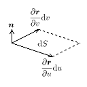

# 面積分

##  面積分とは

ある曲面S上で定義されるスカラー場Fに対し、

      <em>
        ∫<table class="integral" summary="integral"><tr><td class="intsup"> </td></tr><tr><td style="font-size:30%;"> </td></tr><tr><td class="intsub">S</td></tr></table>FdS
      </em>
    

をFのS上での<strong id="surfaceint" class="keyword">面積分</strong>といいます。
ここで、
        dS
      はS上の微小面積素です。
曲面Sが閉曲面の場合、

      ∮<table class="integral" summary="integral"><tr><td class="intsup"> </td></tr><tr><td style="font-size:30%;"> </td></tr><tr><td class="intsub">S</td></tr></table>FdS
    

と書きます。

##  ベクトル場の面積分

ベクトル場
        F
      を考えます。
曲面Sの単位法線ベクトルを
        n
      とすると

        F・n
      はスカラー場となります。
これをFとおいて面積分すると、

      ∫<table class="integral" summary="integral"><tr><td class="intsup"> </td></tr><tr><td style="font-size:30%;"> </td></tr><tr><td class="intsub">S</td></tr></table>FdS = ∫<table class="integral" summary="integral"><tr><td class="intsup"> </td></tr><tr><td style="font-size:30%;"> </td></tr><tr><td class="intsub">S</td></tr></table>F・ndS
    

となります。
ここで、
        dS = ndS
      とおくと上の式は

      <em>
        ∫<table class="integral" summary="integral"><tr><td class="intsup"> </td></tr><tr><td style="font-size:30%;"> </td></tr><tr><td class="intsub">S</td></tr></table>
        F・dS
      </em>
    

となります。
この
        dS
      を面積素ベクトルといいます。

物理学ではこのように曲面を貫くベクトル場の法線方向成分のみが問題となる場合が多いので、

        ∫<table class="integral" summary="integral"><tr><td class="intsup"> </td></tr><tr><td style="font-size:30%;"> </td></tr><tr><td class="intsub">S</td></tr></table>F・dS
      という形の式を、
単にベクトル場
        F
      の曲面S上での面積分ということもあります。

##  面積分の直交座標系での表現

曲面S上の点
        r
      は媒介変数を持ちいて
        r(u,v)=(
          x(u,v), y(u,v), z(u,v)
        )
      と言う風に表されます。ここで、uがごく小さい値
        du
      だけ変化したとき、
        r
      は

      <table class="frac" summary="fraction"><tr><td class="num">
          ∂r
        </td></tr><tr><td>∂u</td></tr></table>
      du
    

だけ変化します。同様にvが
        dv
      だけ変化したとき、
        r
      は

      <table class="frac" summary="fraction"><tr><td class="num">
          ∂r
        </td></tr><tr><td>∂v</td></tr></table>
      dv
    

だけ変化します。
このとき、
        <table class="frac" summary="fraction"><tr><td class="num">
            ∂r
          </td></tr><tr><td>∂u</td></tr></table>du
      および
        <table class="frac" summary="fraction"><tr><td class="num">
            ∂r
          </td></tr><tr><td>∂v</td></tr></table>dv
      はSの接ベクトルになっています。

図1のように
        <table class="frac" summary="fraction"><tr><td class="num">
            ∂r
          </td></tr><tr><td>∂u</td></tr></table>du
      および
        <table class="frac" summary="fraction"><tr><td class="num">
            ∂r
          </td></tr><tr><td>∂v</td></tr></table>dv
      はSと
        dS, n
      の間には

      (
        <table class="frac" summary="fraction"><tr><td class="num">
            ∂r
          </td></tr><tr><td>∂u</td></tr></table>
        du
      )×(
        <table class="frac" summary="fraction"><tr><td class="num">
            ∂r
          </td></tr><tr><td>∂v</td></tr></table>dv
      ) = ndS
    

という関係があります。よって
        dS
      は、

      dS = <table class="frac" summary="fraction"><tr><td class="num">
          ∂r
        </td></tr><tr><td>∂u</td></tr></table>×<table class="frac" summary="fraction"><tr><td class="num">
          ∂r
        </td></tr><tr><td>∂v</td></tr></table>dudv
    

となります。

<figure>

<figcaption>dS と du, dv の関係</figcaption>
</figure>

ここで
        <table class="frac" summary="fraction"><tr><td class="num">
            ∂r
          </td></tr><tr><td>∂u</td></tr></table>×<table class="frac" summary="fraction"><tr><td class="num">
            ∂r
          </td></tr><tr><td>∂v</td></tr></table>
      を座標成分ごとにあらわすと

      (
        <table class="frac" summary="fraction"><tr><td class="num">∂y</td></tr><tr><td>∂u</td></tr></table>
        <table class="frac" summary="fraction"><tr><td class="num">∂z</td></tr><tr><td>∂v</td></tr></table> −
        <table class="frac" summary="fraction"><tr><td class="num">∂z</td></tr><tr><td>∂u</td></tr></table><table class="frac" summary="fraction"><tr><td class="num">∂y</td></tr><tr><td>∂v</td></tr></table>,
        <table class="frac" summary="fraction"><tr><td class="num">∂z</td></tr><tr><td>∂u</td></tr></table><table class="frac" summary="fraction"><tr><td class="num">∂x</td></tr><tr><td>∂v</td></tr></table> −
        <table class="frac" summary="fraction"><tr><td class="num">∂x</td></tr><tr><td>∂u</td></tr></table><table class="frac" summary="fraction"><tr><td class="num">∂z</td></tr><tr><td>∂v</td></tr></table>,
        <table class="frac" summary="fraction"><tr><td class="num">∂x</td></tr><tr><td>∂u</td></tr></table><table class="frac" summary="fraction"><tr><td class="num">∂y</td></tr><tr><td>∂v</td></tr></table> −
        <table class="frac" summary="fraction"><tr><td class="num">∂y</td></tr><tr><td>∂u</td></tr></table><table class="frac" summary="fraction"><tr><td class="num">∂x</td></tr><tr><td>∂v</td></tr></table>
      )
    

となることと、

      dxdy =
      (
        <table class="frac" summary="fraction"><tr><td class="num">∂x</td></tr><tr><td>∂u</td></tr></table><table class="frac" summary="fraction"><tr><td class="num">∂y</td></tr><tr><td>∂v</td></tr></table> −
        <table class="frac" summary="fraction"><tr><td class="num">∂y</td></tr><tr><td>∂u</td></tr></table><table class="frac" summary="fraction"><tr><td class="num">∂x</td></tr><tr><td>∂v</td></tr></table>
      )dudv
    

      dydz =
      (
        <table class="frac" summary="fraction"><tr><td class="num">∂y</td></tr><tr><td>∂u</td></tr></table><table class="frac" summary="fraction"><tr><td class="num">∂z</td></tr><tr><td>∂v</td></tr></table> −
        <table class="frac" summary="fraction"><tr><td class="num">∂z</td></tr><tr><td>∂u</td></tr></table><table class="frac" summary="fraction"><tr><td class="num">∂y</td></tr><tr><td>∂v</td></tr></table>
      )dudv
    

      dzdx =
      (
        <table class="frac" summary="fraction"><tr><td class="num">∂z</td></tr><tr><td>∂u</td></tr></table><table class="frac" summary="fraction"><tr><td class="num">∂x</td></tr><tr><td>∂v</td></tr></table> −
        <table class="frac" summary="fraction"><tr><td class="num">∂x</td></tr><tr><td>∂u</td></tr></table><table class="frac" summary="fraction"><tr><td class="num">∂z</td></tr><tr><td>∂v</td></tr></table>
      )dudv
    

であることから、結局
        dS
      は

      dS = (
        dydz,dzdx,dxdy
      )
    

と表すことができます。
よって、
        F=(
          Fx,Fy,Fz
        )
      とおくと、
線積分は

      <em>
        ∫<table class="integral" summary="integral"><tr><td class="intsup"> </td></tr><tr><td style="font-size:30%;"> </td></tr><tr><td class="intsub">S</td></tr></table>
        F・dS = ∫∫<table class="integral" summary="integral"><tr><td class="intsup">  </td></tr><tr><td style="font-size:30%;"> </td></tr><tr><td class="intsub">S</td></tr></table>(
          Fxdydz+Fydzdx+Fzdxdy
        )
      </em>
    

となります。
