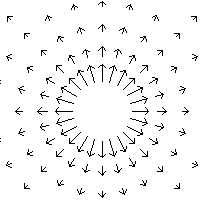
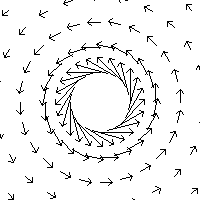

# 場

##  場とは

位置や時間の関数になっている物理量を<strong id="field" class="keyword">場</strong>または界(どちらも英語ではfield)と呼びます(それに対し、エネルギーや周波数の関数になっているものを<strong id="spectrum" class="keyword">スペクトル</strong>(spectrum)と呼びます)。

値がスカラーとなる場をスカラー場、ベクトルとなる場をベクトル場といいます。
例えば、電場や磁場、重力場などはベクトル場で、静電界のポテンシャルなどはスカラー場です。

例として、2次元空間上のベクトル場のイメージを以下に示します。
<table class="layout" summary="レイアウト用テーブル">
<tr><td markdown="1">
<figure>

<figcaption>場のイメージ1</figcaption>
</figure>

</td><td markdown="1">
<figure>

<figcaption>場のイメージ2</figcaption>
</figure>

</td></tr></table>

##  流線

ベクトル場をイメージ的に捉えるために、線上の各点における接線の方向がその点におけるベクトル場の方向と一致しているような曲線を描いてベクトル場を幾何学的に表示します。
このようにして描いた曲線群を<strong id="flow" class="keyword">流線</strong>または力線と呼びます。

流線というのは水の流れのようなものをイメージすると分かりやすいかもしれません。
ベクトル場の向きは水の流れる方向で、その大きさは流れの速さを表します。

##  流束

「[流線](#flow)」で説明したとおり、流線は水の流れをイメージして考えると分かりやすくなります。
ところで、水は細いところを流れるときには速く、広いところを流れるときには水は遅くなります。
そして、水の総量は変わらないわけですから、通り道の断面積と流れの速さの積は一定となるでしょう。

これと同じようにベクトル場の流線も広がるにつれ疎になっていきます。
そして流線の貫く面の断面積と流線の強さの積は、水の総量と同じように流線の総和(束)を表す量となります。
この流線の総和(束)のことを<strong id="flux" class="keyword">流束</strong>といいます。

このことを式で表すと、
ベクトル場
        f
      の曲面Sを貫く流束Φは

      Φ = ∫<table class="integral" summary="integral"><tr><td class="intsup"> </td></tr><tr><td style="font-size:30%;"> </td></tr><tr><td class="intsub">S</td></tr></table>f・dS
    

となります。
いいかげんな言い方をするとベクトル場を面積分（「[面積分とは](surfaceint.md#surfaceint)」参照）したものを流束と呼ぶわけです。

また、水の総量は常に一定なはずですから、内部に水が湧き出してくる点がなければ平曲面を貫く水の流束は常に0になっています(閉曲面を貫く流束は内部からの湧き出し量に等しい)。

このことはベクトル場の流束についても同様のことが言えます。
つまり、流線が湧き出してきたり吸い込まれていく特殊な点が存在しなければ、閉曲面を貫いく流束は0となります。
逆に、<em>閉曲面を貫く流束が0でないとき、その値は内部からの湧き出した流線の量だと考えることが出来ます</em>。
そして、閉曲面を貫いて外に出て行く流束のことを<strong id="divergence" class="keyword">湧き出し</strong>といい、流線が湧き出してくるような点のことを<em>湧出点</em>といいます。
逆に閉曲面内に入っていくような流束のことを負の湧き出しとか流入といい、流線が吸い込まれていく点のことを<em>流入点</em>といいます。

##  渦

水の流れには、水源(湧出点)から下流(流入点)まで一方向のみに流れる単純な流れの他に、同じ場所をぐるぐる回る渦があります。
同様にベクトル場にも湧出点から出て流入点に入る流線と、渦を巻く流線があります。

「[流束](#flux)」のところで述べたように、閉曲面を貫く流束を求めることでその内部にある湧出点からの湧き出しの量が求まります。それと同じように渦の強さも定量的に図ることが出来ます。

渦のない流れの上を動いてからまたもとの場所に戻ってくるとき、流れに沿って動いた分だけ必ず流れに逆らって動かなければもとの場所まで戻ることは出来ません。
しかし渦の上を動く場合、流れに沿ったままもとの場所まで戻ってくることが出来ます。

それと同じようにベクトル場の閉曲線上での線積分（「[線積分とは](lineint.md#lineint)」参照）は渦がなければ0になります。
逆に、<em>閉曲線上での線積分の値が0でないとき、その値は渦の強さだと考えることが出来ます</em>。

##  等位面

ベクトル場で流線を描いたように、スカラー場では、曲面上のスカラー場の値が一定(等位)となるような曲面を描いてスカラー場を幾何学的に表示します。
このようにして描いた曲面群を等位面と呼びます。
