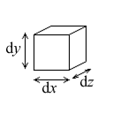

# 体積積分

##  体積積分とは

空間上のある領域V上で定義されるスカラー場fに対して

      <em>
        ∫<table class="integral" summary="integral"><tr><td class="intsup"> </td></tr><tr><td style="font-size:30%;"> </td></tr><tr><td class="intsub">V</td></tr></table>f dV
      </em>
    

をfのV上での<strong id="volumeint" class="keyword">体積積分</strong>という。
ここで
        dV
      は微小体積素です。

イメージ的にはfは空間密度で、
        ∫<table class="integral" summary="integral"><tr><td class="intsup"> </td></tr><tr><td style="font-size:30%;"> </td></tr><tr><td class="intsub">V</td></tr></table>f dV
      は領域V上でのfの総和という感じで捉えてください。

##  体積積分の直交座標系での表現

直交座標系における体積素
        dV
      は図1のようなものをイメージしてもらってかまいません。
そして、体積積分を直交座標を用いて表現すると

      <em>
        ∫∫∫<table class="integral" summary="integral"><tr><td class="intsup">  </td></tr><tr><td style="font-size:30%;"> </td></tr><tr><td class="intsub"></td></tr></table> fdxdydz
      </em>
    

となります。

<figure>
	
	<figcaption>体積素</figcaption>
</figure>
