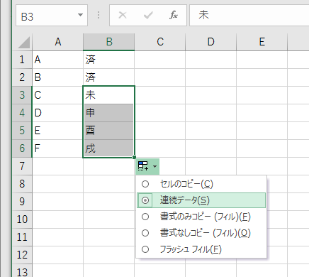

# test

test

https://github.com/ufcpp/UfcppSample/blob/master/BreakingChanges/VS2015_CS6/KatakanaMiddleDot.cs#L15-22

test

https://gist.github.com/ufcpp/03dd6fc45b643e580d20

test

<script src="https://gist.github.com/ufcpp/03dd6fc45b643e580d20.js"></script>

## <a id="sec-generated-title-1"></a>MathJax MathML

```xml
<math xmlns="http://www.w3.org/1998/Math/MathML">
    <mrow>
        <mrow>
            <munder>
                <mrow><mi mathvariant="normal">lim</mi></mrow>
                <mrow><mi>x</mi><mo>→</mo><mn>0</mn></mrow>
            </munder>
        </mrow>
        <mo>⁡</mo>
        <mrow>
            <mi>g</mi><mfenced separators="|"><mrow><mi>x</mi></mrow></mfenced>
        </mrow>
    </mrow>
    <mo>=</mo>
    <mn>0</mn>
</math>
```

↓

<math xmlns="http://www.w3.org/1998/Math/MathML">
    <mrow>
        <mrow>
            <munder>
                <mrow><mi mathvariant="normal">lim</mi></mrow>
                <mrow><mi>x</mi><mo>→</mo><mn>0</mn></mrow>
            </munder>
        </mrow>
        <mo>⁡</mo>
        <mrow>
            <mi>g</mi><mfenced separators="|"><mrow><mi>x</mi></mrow></mfenced>
        </mrow>
    </mrow>
    <mo>=</mo>
    <mn>0</mn>
</math>

<span>
<mml:math xmlns:mml="http://www.w3.org/1998/Math/MathML" xmlns:m="http://schemas.openxmlformats.org/officeDocument/2006/math"><mml:mrow><mml:mrow><mml:munder><mml:mrow><mml:mi mathvariant="normal">lim</mml:mi></mml:mrow><mml:mrow><mml:mi mathvariant="normal">n</mml:mi><mml:mo>→</mml:mo><mml:mi mathvariant="normal">∞</mml:mi></mml:mrow></mml:munder></mml:mrow><mml:mo>⁡</mml:mo><mml:mrow><mml:msup><mml:mrow><mml:mfenced separators="|"><mml:mrow><mml:mn>1</mml:mn><mml:mo>+</mml:mo><mml:mfrac><mml:mrow><mml:mn>1</mml:mn></mml:mrow><mml:mrow><mml:mi mathvariant="normal">n</mml:mi></mml:mrow></mml:mfrac></mml:mrow></mml:mfenced></mml:mrow><mml:mrow><mml:mi mathvariant="normal">n</mml:mi></mml:mrow></mml:msup></mml:mrow></mml:mrow></mml:math>
</span>

<span>
<mml:math xmlns:mml="http://www.w3.org/1998/Math/MathML"><mml:mrow><mml:mrow><mml:munder><mml:mrow><mml:mi mathvariant="normal">lim</mml:mi></mml:mrow><mml:mrow><mml:mi mathvariant="normal">n</mml:mi><mml:mo>→</mml:mo><mml:mi mathvariant="normal">∞</mml:mi></mml:mrow></mml:munder></mml:mrow><mml:mo>⁡</mml:mo><mml:mrow><mml:msup><mml:mrow><mml:mfenced separators="|"><mml:mrow><mml:mn>1</mml:mn><mml:mo>+</mml:mo><mml:mfrac><mml:mrow><mml:mn>1</mml:mn></mml:mrow><mml:mrow><mml:mi mathvariant="normal">n</mml:mi></mml:mrow></mml:mfrac></mml:mrow></mml:mfenced></mml:mrow><mml:mrow><mml:mi mathvariant="normal">n</mml:mi></mml:mrow></mml:msup></mml:mrow></mml:mrow></mml:math>
</span>

<span>
<math xmlns:mml="http://www.w3.org/1998/Math/MathML"><mrow><mrow><munder><mrow><mi mathvariant="normal">lim</mi></mrow><mrow><mi mathvariant="normal">n</mi><mo>→</mo><mi mathvariant="normal">∞</mi></mrow></munder></mrow><mo>⁡</mo><mrow><msup><mrow><mfenced separators="|"><mrow><mn>1</mn><mo>+</mo><mfrac><mrow><mn>1</mn></mrow><mrow><mi mathvariant="normal">n</mi></mrow></mfrac></mrow></mfenced></mrow><mrow><mi mathvariant="normal">n</mi></mrow></msup></mrow></mrow></math>
</span>


## <a id="sec-generated-title-2"></a>MathJax Tex

`$\displaystyle \lim_{x \to 0} g(x) = 0$`

↓

$\displaystyle \lim_{x \to 0} g(x) = 0$


## <a id="sec-generated-title-3"></a>Simple tables

a | b | c
--- | --- | ---
x | y | z

## <a id="sec-generated-title-4"></a>figures


^^^テスト用

## <a id="sec-generated-title-5"></a>embedded tags

<div>
<script async class="speakerdeck-embed" data-id="27b8ed9f16104ccaa98b2132e2e5306d" data-ratio="1.77777777777778" src="//speakerdeck.com/assets/embed.js"></script>
</div>

## <a id="sec-generated-title-6"></a>versions

元々 h5 使ってたけど

<h5 class="version version2">Ver. 2.0</h5>
<h5 class="version version3">Ver. 3.0</h5>
<h5 class="version version4">Ver. 4.0</h5>
<h5 class="version version5">Ver. 5.0</h5>
<h5 class="version version6">Ver. 6</h5>
<h5 class="version version7">Ver. 7</h5>
<h5 class="version version8">Ver. 8</h5>
<h5 class="version version9">Ver. 9</h5>
<h5 class="version version10">Ver. 10</h5>
<h5 class="version version11">Ver. 11</h5>
<h5 class="version version12">Ver. 12</h5>
<h5 class="version version13">Ver. 13</h5>

div に変えようかな。

<div class="version version2">Ver. 2.0</div>
<div class="version version3">Ver. 3.0</div>
<div class="version version4">Ver. 4.0</div>
<div class="version version5">Ver. 5.0</div>
<div class="version version6">Ver. 6.0</div>
<div class="version version7">Ver. 7.0</div>
<div class="version version7_1">Ver. 7.1</div>
<div class="version version7_2">Ver. 7.2</div>
<div class="version version7_3">Ver. 7.3</div>
<div class="version version8">Ver. 8.0</div>
<div class="version version9">Ver. 9.0</div>
<div class="version version10">Ver. 10</div>
<div class="version version11">Ver. 11</div>
<div class="version version12">Ver. 12</div>
<div class="version version13">Ver. 13</div>
<div class="version version14">Ver. 14</div>
<div class="version version15">Ver. 15</div>
<div class="version version16">Ver. 16</div>
<div class="version version17">Ver. 17</div>
<div class="version version18">Ver. 18</div>
<div class="version version19">Ver. 19</div>

### <a id="sec-generated-title-7"></a>source code

```csharp
var s = "abcあいう😊😀😁"u8;

foreach (var x in s[..8])
{
    Console.WriteLine($"{(int)x:X}");
}

readonly record struct S
{
    public static bool operator +(S x) => true;
}

sealed class C
{
    private int _x = 0;
    public int X => _x;
    public void M() { }
}

/// <summary>
/// abc
/// </summary>
class abc();

#if false
record R();
#endif
```


```csharp
class Program
{
    static void Main()
    {
        int xxxxxxxxx;

        int xxxxxxxxx;
    }

    int X { get; set; }
}
```

```csharp
using System;
using System.Text;
using static System.Text.Unicode.Utf8;

const double A = 1.2;

if (args.Length > 0)
{
    Console.WriteLine(A);

    var buffer = (stackalloc byte[256]);

    foreach (var x in args)
    {
        FromUtf16(x, buffer, out var read, out var writtern);
    }
}

Console.WriteLine($"""
    abc
    {123}
    """);

internal record class A();
internal record struct B();
internal class C
{
    public int PublicField;
    private int _privateField;

    public DateOnly Property1 { get; }
    public TimeSpan Property2 { get; }

    public string ComputedProperty => Property1 + $"{Property2}";

    public int Method(int p1, int p2, int p3)
    {
        var local = p1 + p2 + p3;
        return local + _privateField;
    }
}
internal readonly ref struct D { }
```

### <a id="sec-generated-title-8"></a>source code (抜粋)

Program.cs へのコピペで動くソースコードと、「一部分抜粋」でそれだけだと動かないやつ、css 変えようかな。

```csharp
namespace WinFormsApp1;

partial class Form1
{
    // 前略
    // この部分は手書きで書き換える想定。

    #region Windows Form Designer generated code

    /// <summary>
    ///  Required method for Designer support - do not modify
    ///  the contents of this method with the code editor.
    /// </summary>
    private void InitializeComponent()
    {
        this.components = new System.ComponentModel.Container();
        this.AutoScaleMode = System.Windows.Forms.AutoScaleMode.Font;
        this.ClientSize = new System.Drawing.Size(800, 450);
        this.Text = "Form1";
    }

    #endregion
}
```


## <a id="sec-generated-title-9"></a>Blazor (外部)

<div><iframe src="https://black-ocean-009cb0000.2.azurestaticapps.net/?a=quick&i=0&s=0&w=300" width="304" height="332"></iframe></div>

↑のソースコード: [https://github.com/ufcpp/StaticWebApps/tree/main/BlazorWasm/SortVisualizer](https://github.com/ufcpp/StaticWebApps/tree/main/BlazorWasm/SortVisualizer)
