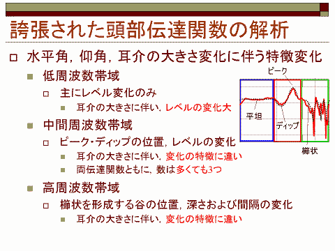
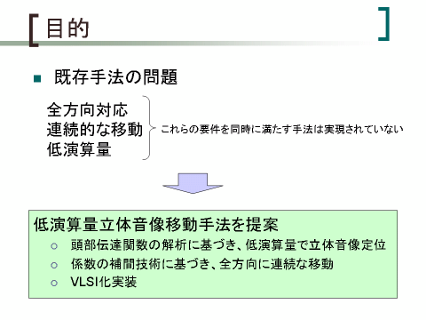
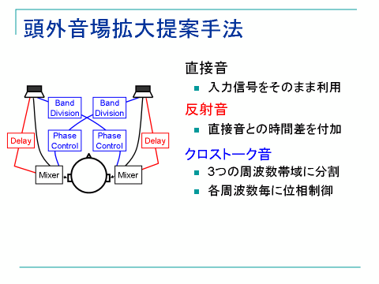
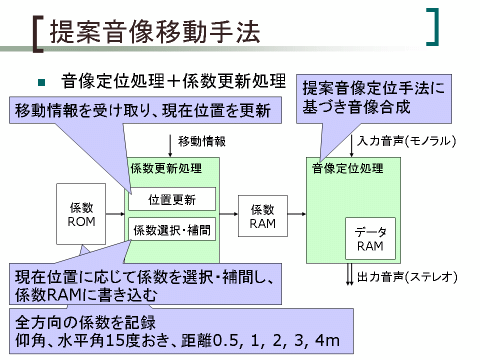
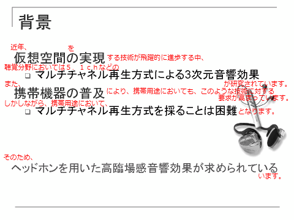
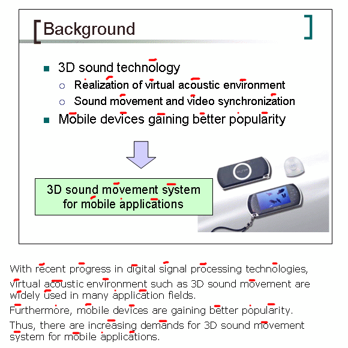

# 不慣れなうちの PowerPoint 資料作り

##  発表に不慣れなうちは・・・

PowerPoint 発表にも慣れてくると、
ほんとにキーワードと図だけ入った簡素なスライドで発表できるようになってくるんですが、
不慣れなうちはそうも行きません。
 
発表に不慣れなうちにありがちなのは、どうしても文字が多めになったり。
スライド中に文字が少ないと、
次に何をしゃべっていいのか分からなくなってしどろもどろになったり、
皆様、ご自身あるいは身の回りでそんな経験をした/見たことがおありじゃないでしょうか。
 
今回は、そういう不慣れな人向けに、
不慣れなりに多少なりとも発表をよく見せるためのコツみたいな話をしてみようかと。

##  文字が多すぎるとき

まあ、理想を言えば、
「図で説明できるなら図で。文字は極力少なめ。」
ってのがいいんですけど。
慣れてくれば、台詞もちゃんと覚えられるようになりますから頑張って！
といってしまっては元も子もないので、
そうなれるまでのごまかし方をいくつか。

###  限界

まず、ごまかすといっても物には限度があって、
いくらなんでも小さな字がびっしり詰まったスライドは論外。
 
なので、まず、
<em>使用するフォントサイズの下限を決めておきましょう</em>。
下限サイズの文字でもスライド中に収まりきらなくなった場合、
それはもう限界だということなので、
あきらめて文章を推敲すべきです。
 
ちなみに、僕が個人的に目安として使ってる下限は、
<em>本文中 24 ポイント、補足説明 18 ポイント</em>。
これもかなり甘い方だと思うんで、
出来れば 28/20 ポイントくらいを目安に。
補足説明ってのは、数字は出しといた方がいいけど、
口頭では説明しない/さらっと流す程度みたいな感じの文のことです。

###  強調

文字が多くなったなぁと思ったときに、
一番手っ取り早く見栄えをよくする方法は、
<em>キーワードの強調表示</em>。
（まあ、これは文字の多少に関らず有効な話ですけど。）
例えば、下図のような感じ。

<figure>

<figcaption>キーワードの強調</figcaption>
</figure>

まあ、説明不要だと思います。
ちなみに、口頭発表時には、
<em>普通の文は気持ち早め、強調部分だけゆっくりめに読むとメリハリが利いていい感じになります</em>。
ただ、気をつけないと、
「あれもこれも大事に思えてきて、気が付けばスライドの文字が真っ赤」ということもありうるので、
主張したいポイントはしっかりと絞りましょう。
 
あと、僕が好き好んでよくやるのは、
議論の<em>帰結・結果の部分</em>を四角で囲うやり方（下図）。

<figure>

<figcaption>四角で強調</figcaption>
</figure>

「そこで、・・・」とか「その結果、・・・」とかで説明する部分は、
たいてい強調した方がいい所なので、特に目立たせる。
四角を使うのは、
個人的な趣味で、文字色の強調よりも背景色の強調の方が好きだってのもあります
（この辺りは感性の問題ですけど）。

##  図の説明

図の説明をしたい。けども、図だけだと台詞が出てくる自信がない。
あるいは、図だけだとどうしても分かりにくい場合なんかもあります。
そんなときにはやっぱりスライド中に説明の台詞を入れておくわけですが、
文字を入れたせいで図が小さくなって見づらくなるのは嫌。
というときによく使っていた方法。

###  左に図、右に説明

あくまで図がメインにあって、そこに説明を足すとき、
僕は「左に図、右に説明」という構成にする事が多いです。
例えば、下図のような感じ。

<figure>

<figcaption>左に図、右に説明</figcaption>
</figure>

これのポイントは、
<em>アイテマイズの各項目の長さを短く</em>。
1つ1つの文章を簡潔にして説明するには、
図と説明を上下に分けるよりも、左右に分けたほうが収まりがよかったので、
結構この方式を愛用していた時期がありました。

###  ふきだし

もう1つ、図に説明を入れるときによく使うのは、<em>ふきだし</em>（下図）。

<figure>

<figcaption>ふきだしで説明</figcaption>
</figure>

これだと、図をど真ん中において、
周りの余白を使って説明できるので。
ちなみに、ふきだしは説明する順番にアニメーションで出していきます。
説明の終わったふきだしを消すかどうかは個人の好みかと。
個人的には、全部のふきだしが出てる状態でも一応ちゃんと図が見えるようにふきだしを配置するのが好きです。

##  発表練習

台詞を覚えられないならスライドに書く、
といっても、一字一句全部書くのは流石にやりすぎね。
 
そんなときによくやってたのが、
下図みたいに<em>手書きで台詞を足して、それを読みながら練習</em>。
（赤色の文字は手書きで入れる部分。）

<figure>

<figcaption>手書きで台詞を追加</figcaption>
</figure>

スライドとは別に台詞を書いておくよりも、
スライド中に直接書き込んで練習した方が効率的。
どこを読むときにどういう台詞をしゃべるか、対応がはっきりするので、
だいぶ台詞を覚えやすくなります。
 
ちなみに、スライドにこういう台詞を入れて流れができない場合、
スライドのストーリーラインがちゃんとできていないということなので、
スライドの構成自体を一度見直してみた方がいいかも。

###  英語発表

英語発表の場合、尚のこと大変なわけですが、
まあ、1つポイントを。
 
英語ってのは、[強勢アクセント](http://ja.wikipedia.org/wiki/%E3%82%A2%E3%82%AF%E3%82%BB%E3%83%B3%E3%83%88)言語なのね。
大げさなくらい音に強弱を付けてしゃべる方がいい。
l と r の違いとか b と v の違いを気をつけるよりも、
音の強弱に気をつけたほうがよっぽど通じます。
 
で、じゃあ、どうするといいかというと、下図のように印刷してアクセントの位置に印を付けて、
それを見ながら練習。

<figure>

<figcaption>アクセントを書き込んでおく</figcaption>
</figure>

これ、2・3度やると、英語のアクセントの付き方のパターンがなんとなく体に染み付いてくるんで、
英語スピーキングの勉強の意味でもお勧め。
 
ちなみに、英語のアクセント位置は、大雑把に言うと、

* 基本的には、接頭語（de- とか co- とか）を除いて一番前

* 動詞を名詞化する語尾（-ation とか -ity, -ology とか）が付くときには、その前に移る

例外も結構ありますが、
気にせずこのルールで発音しても案外大丈夫。
分からないからといってアクセントなく発音するよりは、
間違ったアクセントでもいいから強弱があった方がいい。
「なんか、なまってるなぁ」くらいにしか思われないので、自信を持って。
 
ちなみに、
日本語にも4拍子とか5・7・5みたいな、
聞いてて綺麗なリズムってのがありますが、
英語の場合はアクセントの位置でリズムを作ります。
アクセントを 強, 弱, 弱, 強, 弱, 弱, ・・・ と言うように3拍子に並べたり。
（理系の発表ではあんまり意味ないけど）
詩的な美しさを出したい場合は意識してみるといいかも。
