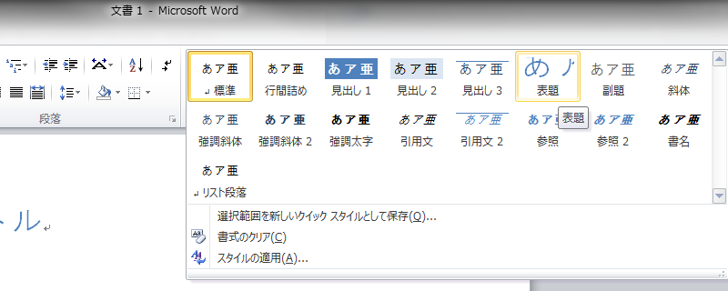
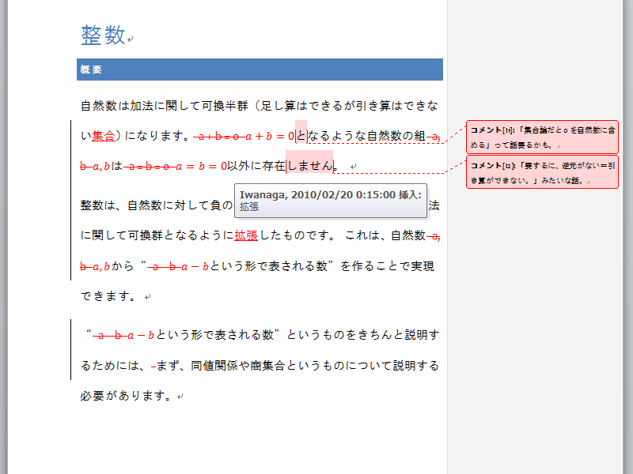
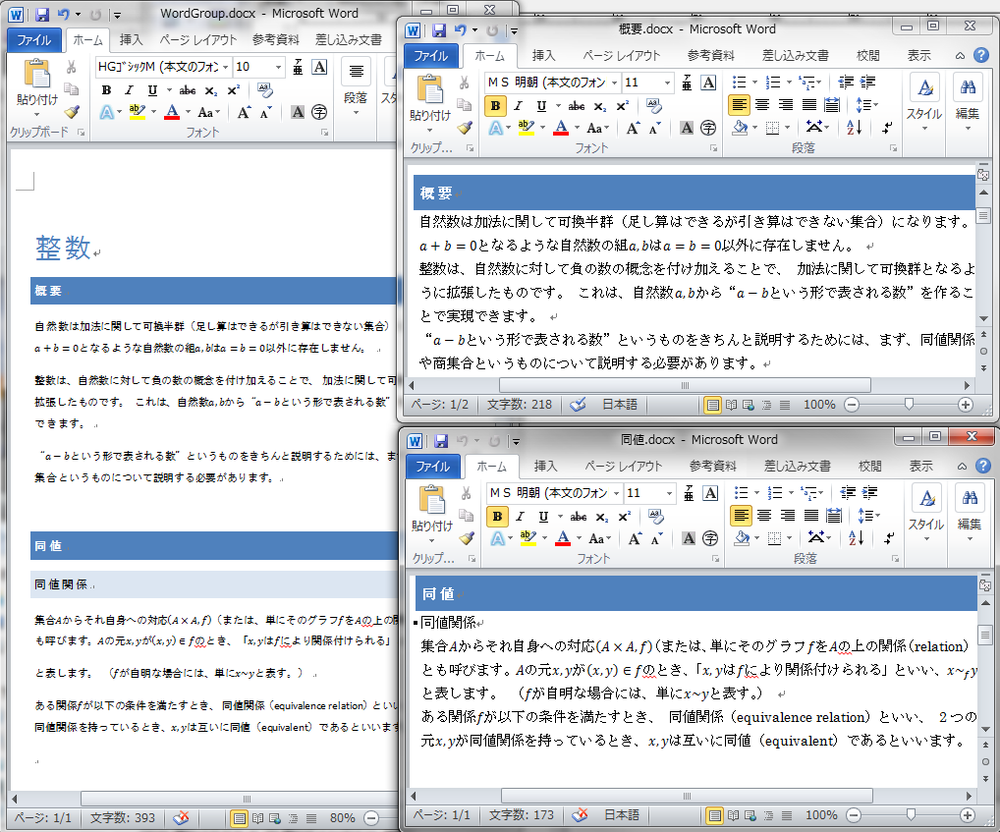

# Word 2007、Word 2010

##  概要

Word 批判する人があまりにも古いバージョンの Word 基準なので、むしゃくしゃしてやった。
後悔はしていない。

##  スタイル

昔の Word は確かに章レベルとかスタイルとか設定するのが大変でした。
が、2007 以降は数クリックでできます。
<iframe width="480" height="390" src="http://www.youtube.com/embed/2PBTtZrS1f4" frameborder="0" allowfullscreen=""></iframe>
Word 2010 なら、アウトラインのナビゲーションもいい感じになりました（動画の左側）。
文書作成アプリの他にアウトラインツールの類を使ったりする必要性も低くなりました。

##  表

もちろん、表を書くのも簡単です。
<iframe width="480" height="390" src="http://www.youtube.com/embed/slraM70-1dY" frameborder="0" allowfullscreen=""></iframe>

##  リボン UI

あなたはテレビや携帯のマニュアルを読みますか？読まない人が多いと思います。僕は読みません。
読む人もいらっしゃると思いますが、そういう方はメーカーにとって本当に上客だと思います。

多くの場合、「パッと見で見つからない機能」と「存在しない機能」は同義語です。
いまどきのアプリは UI 自体がマニュアルになっている必要があります。
でなければ、どんなにすばらしい機能を持っていようとも使ってもらえないという現実があります。
<em>優れた UI は、優れた作業環境であると同時に優れた学習環境でなければいけません。</em>

これが、Microsoft がリボン UI を導入した理由です。
「以前のバージョンからいきなり UI が変わって使いにくい」なんて言う人もいますが、
リボン UI にはそれ以上のメリットがあります。
「入門」とか言いながら凶器になりそうな分厚さの本なんて読まなくても、
眺めているだけで一通りの機能が解ります。

<figure>

<figcaption>リボン UI</figcaption>
</figure>

##  校閲

他人の書いた文章を校正した経験をお持ちの方はどの程度いらっしゃいますでしょうか。

校正の際よくやるのは、印刷したものに文字通り赤ペンを入れる昔ながらの方法です。
でも、この方法では、遠隔地から校正するのに困ります。
他大学との共同研究や、同大中であってもキャンパスをまたぐことも珍しくありません。
企業でもそうですね。
オフィスが世界規模で分散しているところもあるでしょう。
産学連携で、企業・大学間をまたいで論文の執筆・校正なんて話もあります。

そういうとき、一度印刷して赤ペンを入れた後、スキャナーにかけて画像化して送り返すなんていう手を使っていた人も知っています。
ですが、結構面倒な作業になりますし、元のテキスト情報が失われてしまうという難点もあります。

（まあ、そもそも、手書きは往々にして、修正点の反映し忘れや、文字が汚くて読めないなどの問題を引き起こします。）

一方、Word には様々な校閲機能が入っています。
変更履歴やコメントは非常に便利です。
自分の修正点だけでなく、他人の修正点も、誰がいつ修正したものなのか情報が残ります。
修正を反映させずに、元に戻すのも簡単です。

<figure>

<figcaption>校閲機能</figcaption>
</figure>

##  グループ文書・サブ文書

Word はこんな風によく言われます、
「複数人で1つの文章を編集するときに困る」って。
そりゃまあ、同時編集がしづらいですし、コピペで文章を1つにつなげようとすると結構レイアウトが崩れます。

が、Word はちゃんと複数人での編集を想定した機能を持っています。
グループ文書・サブ文書というやつで、
1つの文書を、複数のファイルに分けて管理するための機能です。

* 参考：[グループ文書とサブ文書を作成する](http://office.microsoft.com/ja-jp/word/HP051870021041.aspx)

<figure>

<figcaption>グループ文書・サブ文書</figcaption>
</figure>

##  数式

Word 2007 では数式エディターもずいぶん進化しました。
参考： 「[数式入力](wordmath.md)」。

こんな感じ↓。
<iframe width="480" height="390" src="http://www.youtube.com/embed/15mTBajM9QM" frameborder="0" allowfullscreen=""></iframe><iframe width="480" height="390" src="http://www.youtube.com/embed/k5dxDqpz0qs" frameborder="0" allowfullscreen=""></iframe>
ちなみに、Office 2007 の場合は Word のみこいつですが、
Office 2010 からは PowerPoint も同じ数式エディターに変更されます。
これからはプレゼンと文書で同じ数式を2度書く必要はなくなります。
