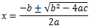
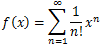

# 数式入力

##  概要

Word 2007 以降の数式エディターは結構優秀。
数式入力で TeX を駆逐できる日も近いかもしれない。

ちなみに、行形式に関しては別途 Word で資料を書いたので、参考にしてみてください。

* [Word の数式の基本](http://cid-5c622397e11c979d.skydrive.live.com/self.aspx/ufcpp/MsOffice/WordMath.docx)（docx 形式）
    * [XPS 版](http://cid-5c622397e11c979d.skydrive.live.com/self.aspx/ufcpp/MsOffice/WordMath.xps)

    * [PDF 版](http://cid-5c622397e11c979d.skydrive.live.com/self.aspx/ufcpp/MsOffice/WordMath.pdf)

* [ASCII → Unicode 変換表](http://cid-5c622397e11c979d.skydrive.live.com/self.aspx/ufcpp/MsOffice/WordMathAcl.xlsx)（xlsx 形式）

##  デモ： キーボードだけで入力可能

マウスで数式入力するのってなんであんなにストレスフルなんでしょうね。
でも、安心を。
Word 2007 で一新された数式エディターは、キーボードだけで数式を入力できます。

入力しているところを撮影した動画↓。
<iframe width="480" height="390" src="http://www.youtube.com/embed/15mTBajM9QM" frameborder="0" allowfullscreen=""></iframe><iframe width="480" height="390" src="http://www.youtube.com/embed/k5dxDqpz0qs" frameborder="0" allowfullscreen=""></iframe>

##  行形式

Word 2007 以降の数式エディターでは、<strong id="linear_format" class="keyword">行形式</strong>（linear format）と呼ばれる素のテキストで数式を入力することができます。
行形式は以下のような特徴を持っています。

* Unicode を使って1行で書ける。
    * 数式以外との混在が可能。 TeX のように $ 記号で数式とその他の区切る必要がない。

* Word の入力補助によって、\ 記号やスペースを駆使することで ASCII 文字だけで入力できる。

* 入力しやすさ、テキストとして表示したときの可読性、組版した結果の正確さのバランス重視。
    * 数式の意味を厳密に取り扱うには MathML の方が適切と思われる。

例として、二次方程式の解と指数関数のテイラー展開式を入力すると、以下の表のようになります。

<table summary="Word の数式入力の例">
	<caption>
		Word の数式入力の例
	</caption>
	<tr>
		<td markdown="1"></td>
		<th>Word 上での入力</th>
		<th>行形式</th>
		<th>組版結果</th>
	</tr>
	<tr>
		<th>二次方程式の解</th>
		<td markdown="1">x=(-b+-\sqrt (b^2 -4ac) )/2a </td>
		<td markdown="1">x=(-b±√(b^2-4ac))/2a</td>
		<td markdown="1">
<figure>
	

</figure>

</td>
	</tr>
	<tr>
		<th>指数関数のテイラー展開式</th>
		<td markdown="1">f(x) =\sum _(n=0)^\infty  1/n! x^n </td>
		<td markdown="1">f(x)=∑_(n=1)^∞▒〖1/n! x^n 〗</td>
		<td markdown="1">
<figure>
	

</figure>

</td>
	</tr>
</table>

注： 「Word 上での入力」の列の青色の部分でスペースを入力します。
また、テイラー展開式の行形式の ▒ となっているところは Unicode の MEDIUM SHADE 文字（U+2592）です。

##  今風の LaTeX

この行形式ですが、結構 TeX っぽいと思うかもしれません。
割とその通りで、かなり LaTeX を研究して作っているそうです。

ちなみに、LaTeX の開発者である [Leslie Lamport](http://ja.wikipedia.org/wiki/%E3%83%AC%E3%82%B9%E3%83%AA%E3%83%BC%E3%83%BB%E3%83%A9%E3%83%B3%E3%83%9D%E3%83%BC%E3%83%88) 氏は[今、Microsoft にお勤めだそうです](http://research.microsoft.com/en-us/um/people/lamport/)。

##### Unicode で書き直した LaTeX

ただ、LaTeX っぽい記述を、対応する Unicode 文字に変換してしまうところが実はポイント。
元の ASCII テキストが残らないのを嫌う人もいるとは思いますが、\alpha/\beta よりは α/β の方が、行形式の可読性高いよねという。
大元の発想は、「TeX って Unicode 文字使って書き直したら可読性高くなるんじゃね？」ということらしいです。

ちなみに、\alpha を α に変換する処理は、数式エディターの機能というか、実は Office のオートコレクト機能だったりします。
興味のある方はユーザーフォルダー以下にある、 "AppData\Roaming\Microsoft\Office\MSO0127.acl" を見てみてください。
（acl ＝ Auto Correct List。）
これの中に変換される文字一覧が入っています。

##### ヒューリスティック

LaTeX だと厳密に {} 指定しないといけないのが結構面倒なんですよね。
Word のは、経験則に則って、() を省略した時の挙動が文脈で変わるようにできてて、
それが（余計なお世話と感じるかもしれないけど）慣れると案外気持ちよく数式書けるようになります。

例えば、∫の後ろの () は消えなくて、/ の前後の () は消える。
それは、実際に数式を書くとき、そう書くことが多いから。

##### リアルタイムレンダリング

あと、やっぱり一番大きいのはこれですかね。打ってるそばから変換されていくところ。
書いてるところと表示されてるところが離れてると、なんだかんだ言ってストレスですからねぇ。

##  参考

1. [Unicode Nearly Plain-Text Encoding of Mathematics](http://www.unicode.org/notes/tn28/UTN28-PlainTextMath-v2.pdf)（数式エディター開発者が Unicode コンソーシアムで発表した論文）

2. [Murray Sargent: Math in Office](http://blogs.msdn.com/murrays/)（数式エディター開発者ブログ）
