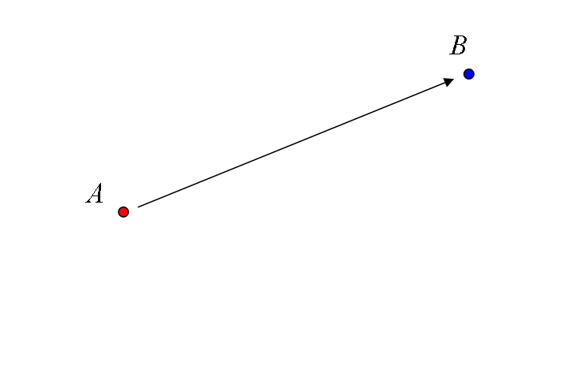
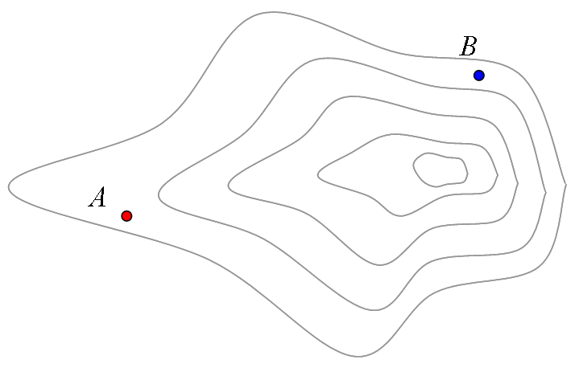
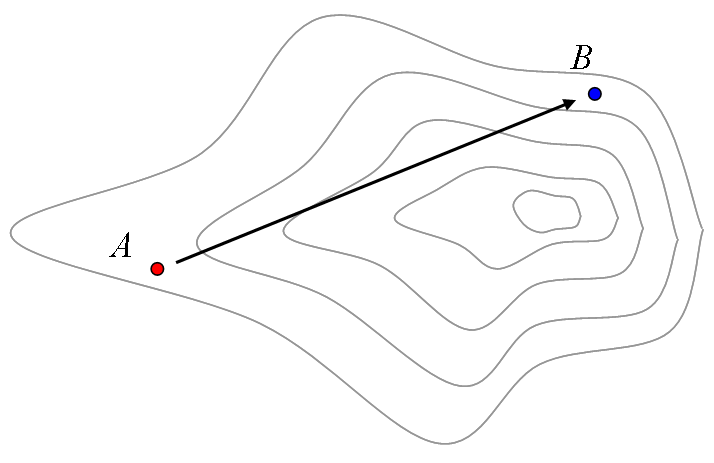
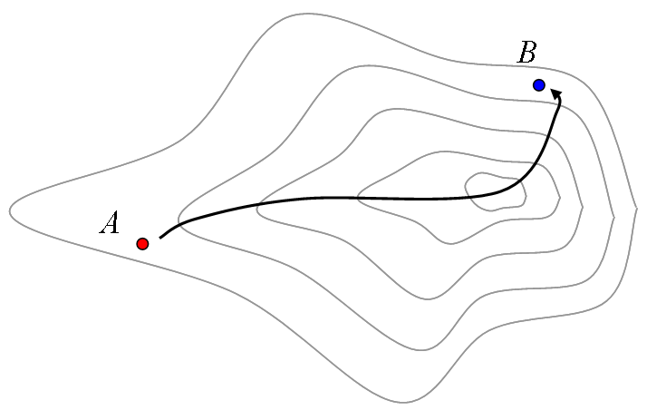
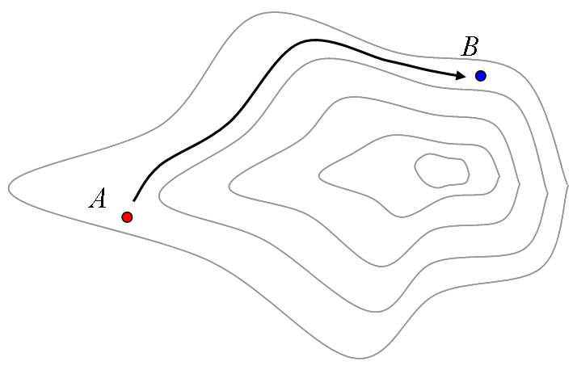

# 最小作用の原理

##  概要

解析力学なんかを習うと、「最小作用の原理」なんて物が出てきます。
ここから出発して、変分法を使うと、
ラグランジュ形式の運動方程式という、
どんな座標系を使っても同じ偏微分方程式で記述できる運動法則が導かれます。
 
でも、作用ってのがなんなのかは書いてないことが多いんですよね。
いや、位置エネルギーと運動エネルギーの差 L = T − V が作用（の密度）だという定義式は書いてあるんですが、
なんでそんなものを最小にするのかが良く分からない。
 
もちろん、「L = T − V が作用」なんじゃなくて、
「作用になるものを探したら L = T − V だった」
というのが正しいんですよ。
でも、じゃあ、一体、作用ってなんなんでしょう？

##  労力的に最短

まず、図1を見てください。

<figure>

<figcaption>最短経路 ＝ 直線</figcaption>
</figure>

何もない平面に2点 A と B があります。
A から B まで進めといわれたら、
普通は図中の矢印のようにまっすぐ進みますね。
何せそれが最短ですから。
 
中には、ひねくれてて、まっすぐ進まない人もいるかもしれませんが、
物理学の法則によると、
物体は最短経路を進むとされています。
自然の法則は素直です。
いわゆる、「慣性の法則」というやつで、
動いている物質は、特に力とかを受けなければ、
そのままのスピードでまっすぐ進み続けます。
 
じゃあ、次は、平面でない場合を考えて見ましょう。
図2のように、等高線を引いてみます。

<figure>

<figcaption>平面じゃなくしてみた</figcaption>
</figure>

まあ、こうなると、
A から B への行き方は人によるかもしれませんね。
例えば、高さをものともしない人の場合、等高線は無視して相変わらず直線経路をとるかもしれません（図3）。
尾根道を通るのが楽だという人なら、図4のような経路になるでしょう。
あるいは、高さが苦手だと（例えば、上り下りが全くできない乗り物があったとして、それに乗るとすると）図5のような経路を取らざるを得ません。

<figure>

<figcaption>高さをものともしない場合</figcaption>
</figure>

<figure>

<figcaption>尾根道好きの人</figcaption>
</figure>

<figure>

<figcaption>上り下りができない乗り物にでも乗ると</figcaption>
</figure>

まあ、人によって経路は違いますが、
いずれも、その当人にとっては労力が最小の経路だと思ってください。
進む位置や方向によって移動コストが違う。
で、地図上の最短経路の変わりに、労力的に最短な経路を通る。
 
で、物理法則上、物体はこの
「労力が最小の経路」を進むわけです。
ここでは口語的に「労力」って言い方しましたが、
物理用語としては、作用（action）と言います。
これが「<strong id="minaction" class="keyword">最小作用の原理</strong>」。
物体はオーバーアクションせずに、最小のアクションで動くんですね。
実に省エネです。

##  平面上の最短経路 ＝ 直線

物体は最小作用の原理に従う、
すなわち、
労力的に最短な経路を通ります。
例えば、何の力も働いてないまっ平らな空間だと、直線になるわけですね。
だから物体はまっすぐ進む（慣性の法則）。
 
で、まずはこの「平面上の最短経路 ＝ 直線」という話を、
数学的に考察しなおしてみましょう。
経路長というのは、解析学（微分・積分）の言葉で書くなら、

      L
      =
      ∫<table class="integral" summary="integral"><tr><td class="intsup"> </td></tr><tr><td style="font-size:30%;"> </td></tr><tr><td class="intsub"></td></tr></table>
      ds

となるので、
これを最小化する問題になります。
簡単化のため2次元で考えて、
物体が経路 (x(t), y(t)) 上を動くものとした場合、
x, y の時間微分を ' で表すものとして
（時間微分は文字の上に・を書く記法の方が一般的ですが、
表示上の都合でここでは ' を使います）、

      d
      s
      =
      √
x'2+
y'2
      dt

なので、

      L
      (x, y)
      =
      ∫<table class="integral" summary="integral"><tr><td class="intsup"> </td></tr><tr><td style="font-size:30%;"> </td></tr><tr><td class="intsub"></td></tr></table>
      √
x'2+
y'2
      dt

を最小にする t の関数 x, y を求めることになります。

x, y がただの変数じゃなくて、
t の関数だということに注意してください。
こういう問題は、変分問題と呼ばれていて、
かなりしっかりと解き方が研究されています（「[変分学](variation.md)」参照）。
で、この変分学の知識を使えば、

      <table class="frac" summary="fraction"><tr><td class="num">
          d
          2
        </td></tr><tr><td>
          dt2</td></tr></table>
x
=0
,
<table class="frac" summary="fraction"><tr><td class="num">d2</td></tr><tr><td>dt2</td></tr></table>
y
=0

という条件に書き直すことが出来て、
これを解くと、結局、直線が最短経路な事が分かります。

##  歪んだ空間での最短経路

前節での説明どおり、
何の力も働いていない平面上では、物体は
L(x, y)=∫<table class="integral" summary="integral"><tr><td class="intsup"> </td></tr><tr><td style="font-size:30%;"> </td></tr><tr><td class="intsub"></td></tr></table>√
x'2+
y'2dt

を最小にするような経路を通ります。
 
ところが、力が働いていると、空間が歪みます。
平面の場合には、
物体が空間上のどこにいても、移動には同じだけのコスト
√
x'2+
y'2
掛かっていたわけですが、
これに空間の歪みが加わって、
√
x'2+
y'2+
u(x, y)
になると思ってください。
（関数 u の具体的な形は後々求めます。）
すなわち、

      L
      (x, y)
      =
      ∫<table class="integral" summary="integral"><tr><td class="intsup"> </td></tr><tr><td style="font-size:30%;"> </td></tr><tr><td class="intsub"></td></tr></table>
      √
x'2+
y'2+
u(x, y)
      dt

の最小化問題。
ところで、この式中、平方根がちょっとうっとうしいですね。
平方根がからむと、計算が面倒になります。
 
実はこの平方根はなくすことができます。
簡単化のために平方根の中身を L と書くとき、
L がある良好な性質を持っているとき、
L=∫<table class="integral" summary="integral"><tr><td class="intsup"> </td></tr><tr><td style="font-size:30%;"> </td></tr><tr><td class="intsub"></td></tr></table>√
L
dt

の最小化問題と、

I
=∫<table class="integral" summary="integral"><tr><td class="intsup"> </td></tr><tr><td style="font-size:30%;"> </td></tr><tr><td class="intsub"></td></tr></table>
L
dt

の最小化問題は同値な事が示せます。
（「[弧長とエネルギー](variation.md#energy)」。）
したがって、

I
(x, y)=∫<table class="integral" summary="integral"><tr><td class="intsup"> </td></tr><tr><td style="font-size:30%;"> </td></tr><tr><td class="intsub"></td></tr></table>(
x'2+
y'2+
u(x, y))dt

の最小化問題を考えることになります。
で、この

I

を<strong id="action" class="keyword">作用</strong>（action）、
L を<strong id="actiond" class="keyword">作用密度</strong>（action density）と呼びます。
 
さて、変分学の知識から、
この変分問題は、以下のような微分方程式に置き換えられます。

      <table class="frac" summary="differential"><tr><td class="num">d</td></tr><tr><td>dt</td></tr></table>
      <table class="frac" summary="fraction"><tr><td class="num">
          ∂
        </td></tr><tr><td>
          ∂x'</td></tr></table>
L
−<table class="frac" summary="fraction"><tr><td class="num">∂</td></tr><tr><td>∂x</td></tr></table>
L
=0

（y についても同様。）
これに、

L
=
x'2+
y'2+
u(x, y)
を代入すれば、
以下の式が得られます。

      2
      <table class="frac" summary="fraction"><tr><td class="num">
          d
          2
        </td></tr><tr><td>
          dt2</td></tr></table>
x
+<table class="frac" summary="fraction"><tr><td class="num">∂</td></tr><tr><td>∂x</td></tr></table>
u
=0

（これも、y についても同様。）
ニュートンの運動方程式

m
<table class="frac" summary="fraction"><tr><td class="num">d2</td></tr><tr><td>dt2</td></tr></table>
x
=
f

と比べると、
<table class="frac" summary="fraction"><tr><td class="num">∂</td></tr><tr><td>∂x</td></tr></table>
u
=<table class="frac" summary="fraction"><tr><td class="num">2</td></tr><tr><td>m</td></tr></table>f

とすれば、
上述の変分問題で運動の法則を表せることが分かります。
特に、f が保存場の場合、
ポテンシャル V が存在して、

u
=−<table class="frac" summary="fraction"><tr><td class="num">2</td></tr><tr><td>m</td></tr></table>
V

となります。
 
要するに、

L
=
x'2+
y'2−<table class="frac" summary="fraction"><tr><td class="num">2</td></tr><tr><td>m</td></tr></table>
V

。
ちょこっと定数倍して、

L
=<table class="frac" summary="fraction"><tr><td class="num">1</td></tr><tr><td>2</td></tr></table>
m
(
x'2+
y'2)−
V

としてもいい。
よく見てみると、これは、
運動エネルギーを T とすると、

L
=
T
−
V

になっています。
 
結局、
「

L
=
T
−
V

を作用密度とする変分問題（作用最小化問題）を解くと、
ニュートンの運動方程式を解いたのと同じ結果が得られる」
ということになります。
 
あと、この考察は同時に、ポテンシャルという物をどう解釈すればいいのかも示唆しています。
ここで示した内容から察するに、
ポテンシャルというのは、
空間の歪みによる「移動に掛かるコスト」の変化なわけです。

##  まとめ

要するに、

* 作用というのは物体が運動するときにかかる労力。

* 「最小作用の原理」というのは、「物体は労力的にみて最短な経路を通ろうとする」ということ。

* ニュートンの運動法則を満たす作用密度を探してみたら、
L
=
T
−
V
だった。

ということになります。
 
ちなみに、ここで書いた内容、
歴史的に見ると順序が逆なんですけどね。
最初は、「仮想仕事の原理」というのから出発して作用積分が導出されていました。
そのころは「最小作用 ＝ 距離の最短化」という明確な認識はなかったと思います。
あとになって、作用積分の意味を考えてみた結果、
距離の類似概念として捉えるとうまくいくことが分かった。
 
あと、本当のことをいうと、“最小”作用というのは不正確だったりします。
実際には微分・変分が 0 というだけ、
要するに、極大・極小・鞍点（合わせて停留点と言う）の可能性もある。
中には、「停留作用の原理と呼ぶべきなのかもしれない」なんて言う人も。
