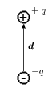
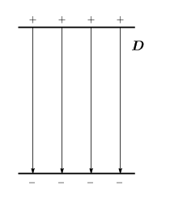
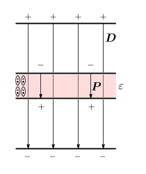
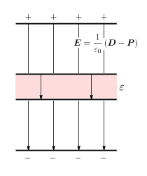

# 電場と電束密度

##  電場と電束密度

電荷の作る場には、電場と電束密度という2つのものがあります。
どっちも似たようなものなのに、なぜ2つあるのかって疑問をもたれるかたもいるかと思います。
あと、似ているようで微妙に違ってて混乱したりも。
そういうわけでここでは<strong id="elefield" class="keyword">電場</strong>と<strong id="eledensity" class="keyword">電束密度</strong>について解説していきます。

<em>電場というのは、2つの電荷の間に働く力を近接作用で考える(つまり、電荷が存在するところには何らかの場が発生して、その場が他の電荷に力を加えると考える)際に利用する場</em>です。
すなわち、電荷の周りには電場が発生し、電場
        <a href="variable.md#E" title="電場ベクトル">E</a>
      の中に電荷qをおくと、

      F = q<a href="variable.md#E" title="電場ベクトル">E</a>
    

という力が発生するするというものです。

一方で、<em>
        電束密度は自由電荷を湧出点とする「[流束](../../math/vector_analysis/v_field.md#flux)」
      </em>です。
つまり、自由電荷密度分布が
        <a href="variable.md#rho" title="電荷密度">ρ</a>
      のとき、

      ∇・
      <a href="variable.md#D" title="電束密度ベクトル">D</a> = <a href="variable.md#rho" title="電荷密度">ρ</a>
    

を満たすような場
        <a href="variable.md#D" title="電束密度ベクトル">D</a>
      が電束密度です。

そして、この2つの量の間には比例関係が成り立ちますから、比例係数
        <a href="variable.md#eps0" title="真空中の誘電率">ε0</a>
      を定義して

      <em>
        <a href="variable.md#D" title="電束密度ベクトル">D</a> = <a href="variable.md#eps0" title="真空中の誘電率">ε0</a><a href="variable.md#E" title="電場ベクトル">E</a>
      </em>
    

という関係が成り立ちます。
ここで用いた比例係数
        <a href="variable.md#eps0" title="真空中の誘電率">ε0</a>
      を<em>
        真空中の<strong id="permittivity" class="keyword">誘電率</strong>
      </em>といいます。

##  誘電体

誘電体とは、電場をかけると分極を起こして分極電荷の現れる物質のことです。

<figure>

<figcaption>分極</figcaption>
</figure>

分極とは、誘電体中に負電荷(電子)と正電荷(原子核)の位置が微妙にずれたもの(これを電気双極子という。左図参照。)が分布した状態のことを言います。
誘電体に電場をかけることで、原子核と電子の位置がずれ、このような状態が生じます。
このような、電気双極子の分布によって電荷の分布が生じます。
この分極によって生じる電荷分布を分極電荷といい、
分極の変化によって生じる電流密度分布を分極電流密度といいます。

電気双極子に対して、<strong id="moment" class="keyword">電気双極子モーメント</strong>
        <a href="variable.md#dipole_e" title="電気双極子モーメント">p</a>
      というものを定義し、

      <em>
        <a href="variable.md#dipole_e" title="電気双極子モーメント">p</a> = qd
      </em>
    

で表します。
ここで、qは双極子を作る電荷の電気量で、
        d
      は正負の電荷の間の位置の差を表すベクトルです。
なぜこの式で電気双極子を表すかというと、このような電気双極子に対して電場
        <a href="variable.md#E" title="電場ベクトル">E</a>
      をかけると、電気双極子を電場と同じ向きに向けようとするトルク(偶力)
        T
      がはたらき、<em>
        
          T = <a href="variable.md#dipole_e" title="電気双極子モーメント">p</a>×<a href="variable.md#E" title="電場ベクトル">E</a>
        
      </em>と表せるからです。

次に、分極は電気双極子の密度ですから、電気双極子の分布密度をNとすると、
<strong id="polarization" class="keyword">分極密度</strong>
        <a href="variable.md#P" title="分極ベクトル">P</a>
      は

      <a href="variable.md#P" title="分極ベクトル">P</a> = N<a href="variable.md#dipole_e" title="電気双極子モーメント">p</a>
    

となります。

そして、分極によって生じる分極電荷
        <a href="variable.md#rho" title="電荷密度">ρ</a>
        p
      は

      <em>
        <a href="variable.md#rho" title="電荷密度">ρ</a>
        p = -∇・<a href="variable.md#P" title="分極ベクトル">P</a>
      </em>
    

となり、分極の変化によって生じる分極電流密度
        <a href="variable.md#J" title="電流密度ベクトル">J</a>
        p
      は

      <em>
        <a href="variable.md#J" title="電流密度ベクトル">J</a>
        p = <table class="frac" summary="differential"><tr><td class="num">∂</td></tr><tr><td>∂t</td></tr></table><a href="variable.md#P" title="分極ベクトル">P</a>
      </em>
    

となります。(電束密度と電荷、電流の関係とは符号が逆なのに注意。)

##  誘電体中の電場・電束密度

電束密度
        <a href="variable.md#D" title="電束密度ベクトル">D</a>
      は自由電荷(つまり、誘電体に生じた分極電荷は考慮に入れない)から湧き出してくる流束です。
要するに、<em>電束密度は誘電体中でもその値は変わりません</em>。
また、誘電体に電場をかけると分極
        <a href="variable.md#P" title="分極ベクトル">P</a>
      が生じます。
この様子を下図1、2に示します。

一方、電場
        <a href="variable.md#E" title="電場ベクトル">E</a>
      は、電荷にかかる正味の力をあらわすものですから、
誘電体に生じた分極の分まで考慮に入れる必要があります。
すなわち、<em>誘電体中では電場は変化し、</em>

      <em>
        <a href="variable.md#E" title="電場ベクトル">E</a> = <table class="frac" summary="fraction"><tr><td class="num">1</td></tr><tr><td>
          <a href="variable.md#eps0" title="真空中の誘電率">ε0</a>
        </td></tr></table>(
          <a href="variable.md#D" title="電束密度ベクトル">D</a> − <a href="variable.md#P" title="分極ベクトル">P</a>
        )
      </em>
    

という関係が成り立ちます。
この様子を下図に示します。
<table class="layout" summary="レイアウト用テーブル">
<tr><td>
<figure>

<figcaption>電荷から生じる電束密度</figcaption>
</figure>

</td><td>
<figure>

<figcaption>誘電体をはさんだ場合</figcaption>
</figure>

</td><td>
<figure>

<figcaption>同じく、電場</figcaption>
</figure>

</td></tr></table>

さて、ここで分極密度が誘電体にかけた電場に等方線形時不変で比例すると仮定します(この仮定はどんな誘電体に対しても出来るわけではありませんが、たいていは出来るものとみなして大丈夫です)。
この仮定の元、
        <a href="variable.md#E" title="電場ベクトル">E</a> = <a href="variable.md#chi_e" title="分極率">χe</a><a href="variable.md#eps0" title="真空中の誘電率">ε0</a><a href="variable.md#P" title="分極ベクトル">P</a>
      と置くと、

      <em>
        <a href="variable.md#D" title="電束密度ベクトル">D</a> = <a href="variable.md#eps0" title="真空中の誘電率">ε0</a>(
          1+<a href="variable.md#chi_e" title="分極率">χe</a>
        )<a href="variable.md#E" title="電場ベクトル">E</a> = <a href="variable.md#eps" title="物質中の誘電率">ε</a><a href="variable.md#E" title="電場ベクトル">E</a>
      </em>
    

となります。
ここで用いた比例係数
        <a href="variable.md#chi_e" title="分極率">χe</a>
      を<strong id="polarizability" class="keyword">分極率</strong>といい、
        <a href="variable.md#eps" title="物質中の誘電率">ε</a>
      を(誘電体中の)<em>誘電率</em>といいます。
また、
        <a href="variable.md#eps_r" title="比誘電率">εr</a> = 1+<a href="variable.md#chi_e" title="分極率">χe</a>
      というものを定義し(
        <a href="variable.md#eps" title="物質中の誘電率">ε</a> = <a href="variable.md#eps_r" title="比誘電率">εr</a><a href="variable.md#eps0" title="真空中の誘電率">ε0</a>
      )、これを<em>比誘電率</em>といいます。
