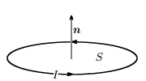
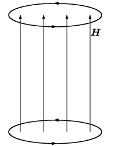
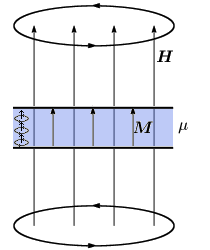
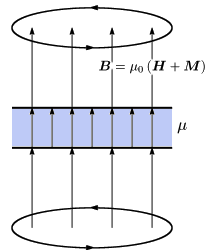

# 磁場と磁束密度

##  磁場と磁束密度

電場と電束密度と同じように、磁気に関する場にも、<strong id="magfield" class="keyword">磁場</strong>と<strong id="magdensity" class="keyword">磁束密度</strong>の2つのものがあります。
磁荷(磁気単極子)というものが存在するなら電場と同じように磁場を説明出来るのですが、
残念ならが磁荷というものは存在しません。
電場が電荷から生じるように、
磁場というものは電場の変化や、電荷の運動によって生じます。
それでは磁場と磁束密度について解説していきます。

<em>
        磁場というのは自由電流の周りに生じる渦状の場（「[渦](../../math/vector_analysis/v_field.md#vortex)」）です
      </em>。
渦の強さは電流の大きさに比例し、渦の回転軸は電流の向きを向いています。
すなわち、自由電流密度
        <a href="variable.md#J" title="電流密度ベクトル">J</a>
      の周りに、

      ∇×
      <a href="variable.md#H" title="磁場ベクトル">H</a> = <a href="variable.md#J" title="電流密度ベクトル">J</a>
    

を満たすように生じる場
        <a href="variable.md#H" title="磁場ベクトル">H</a>
      が磁場です。

一方で、<em>磁束密度は2本の電流の間に働く力を近接作用で考える(つまり、電流が存在するところには何らかの場が発生して、その場が他の電流に力を加えると考える)際に利用する場</em>です。
すなわち、電流の周りには磁束密度が発生し、磁束密度
        <a href="variable.md#B" title="磁束密度ベクトル">B</a>
      の中に速度
        v
      で動く電荷qをおくと、

      F = qv×<a href="variable.md#B" title="磁束密度ベクトル">B</a>
    

という力が発生するするというものです。

そして、この2つの量の間には比例関係が成り立ちますから、比例係数
        <a href="variable.md#mu0" title="真空中の透磁率">μ0</a>
      を定義して

      <em>
        <a href="variable.md#B" title="磁束密度ベクトル">B</a> = <a href="variable.md#mu0" title="真空中の透磁率">μ0</a><a href="variable.md#H" title="磁場ベクトル">H</a>
      </em>
    

という関係が成り立ちます。
ここで用いた比例係数
        <a href="variable.md#mu0" title="真空中の透磁率">μ0</a>
      を<em>
        真空中の<strong id="permeability" class="keyword">透磁率</strong>
      </em>といいます。

##  磁性体

磁性体とは、磁場をかけると磁化を起こして磁化電流の現れる物質のことです。

<figure>

<figcaption>磁化</figcaption>
</figure>

磁化とは、磁性体中にある電子の角運動量やスピンによって生じる電流の微小ループ(これを磁気双極子という。左図参照。)の向きがそろって分布している状態のことを言います。
磁性体に磁場をかけることで、磁性対中の電子のスピンや角運動量の向きがそろい、このような状態が生じます。
このような、磁気双極子の分布によって磁性体中に電流の分布が生じます。
この磁化によって生じる電流密度分布を磁化電流密度といいます。

磁気双極子に対して、<strong id="moment" class="keyword">磁気双極子モーメント</strong>
        <a href="variable.md#dipole_m" title="磁気双極子モーメント">m</a>
      というものを定義し、

      <em>
        <a href="variable.md#dipole_m" title="磁気双極子モーメント">m</a> = ISn
      </em>
    

で表します。
ここで、Iは電流の強さで、Sは電流の流れるループの内部の面積、
        n
      はこの面の法線ベクトルです。
なぜこの式で磁気双極子を表すかというと、このような磁気双極子に対して磁束密度
        <a href="variable.md#B" title="磁束密度ベクトル">B</a>
      をかけると、磁気双極子を磁束密度と同じ向きに向けようとするトルク(偶力)
        T
      がはたらき、<em>
        
          T = <a href="variable.md#dipole_m" title="磁気双極子モーメント">m</a>×<a href="variable.md#B" title="磁束密度ベクトル">B</a>
        
      </em>と表せるからです。

次に、磁化は磁気双極子の密度ですから、磁気双極子の分布密度をNとすると、
<strong id="magnetization" class="keyword">磁化密度</strong>
        <a href="variable.md#M" title="磁化ベクトル">M</a>
      は

      <a href="variable.md#M" title="磁化ベクトル">M</a> = N<a href="variable.md#dipole_m" title="磁気双極子モーメント">m</a>
    

となります。

そして、磁化によって生じる磁化電流
        <a href="variable.md#J" title="電流密度ベクトル">J</a>
        m
      は

      <em>
        <a href="variable.md#J" title="電流密度ベクトル">J</a>
        m = ∇×<a href="variable.md#M" title="磁化ベクトル">M</a>
      </em>
    

となります。

##  磁性体中の磁場・磁束密度

磁場
        <a href="variable.md#H" title="磁場ベクトル">H</a>
      は自由電流密度(つまり、磁性体に生じた磁化電流密度は考慮に入れない)から発生する<em>渦</em>です。
要するに、<em>磁場は磁性体中でもその値は変わりません</em>。
また、磁性体に磁場をかけると磁化
        <a href="variable.md#M" title="磁化ベクトル">M</a>
      が生じます。
この様子を下図1、2に示します。

一方、磁束密度
        <a href="variable.md#B" title="磁束密度ベクトル">B</a>
      は、動いている電荷にかかる正味の力をあらわすものですから、
磁性体に生じた磁化の分まで考慮に入れる必要があります。
すなわち、<em>磁性体中では磁場は変化し、</em>

      <em>
        <a href="variable.md#B" title="磁束密度ベクトル">B</a> = <a href="variable.md#mu0" title="真空中の透磁率">μ0</a>(
          <a href="variable.md#H" title="磁場ベクトル">H</a> + <a href="variable.md#M" title="磁化ベクトル">M</a>
        )
      </em>
    

という関係が成り立ちます。
この様子を下図3に示します。
<table class="layout" summary="レイアウト用テーブル">
<tr><td markdown="1">
<figure>

<figcaption>ループ電流から生じる磁場</figcaption>
</figure>

</td><td markdown="1">
<figure>

<figcaption>磁性体をはさんだ場合</figcaption>
</figure>

</td><td markdown="1">
<figure>

<figcaption>同じく、磁束密度</figcaption>
</figure>

</td></tr></table>

さて、ここで磁化密度が磁性体にかけた磁場に等方線形時不変で比例すると仮定します(この仮定はどんな磁性体に対しても出来るわけではありませんが、たいていは出来るものとみなして大丈夫です。ただ、磁性体には磁場をかけなくても磁化したままになる強磁性体というものも存在します)。
この仮定の元、
        <a href="variable.md#H" title="磁場ベクトル">H</a> = <a href="variable.md#chi_m" title="磁化率">χm</a><a href="variable.md#M" title="磁化ベクトル">M</a>
      と置くと、

      <em>
        <a href="variable.md#B" title="磁束密度ベクトル">B</a> = <a href="variable.md#mu0" title="真空中の透磁率">μ0</a>(
          1+<a href="variable.md#chi_m" title="磁化率">χm</a>
        )<a href="variable.md#H" title="磁場ベクトル">H</a> = <a href="variable.md#mu" title="物質中の透磁率">μ</a><a href="variable.md#H" title="磁場ベクトル">H</a>
      </em>
    

となります。
ここで用いた比例係数
        <a href="variable.md#chi_m" title="磁化率">χm</a>
      を<em>磁化率</em>といい、
        <a href="variable.md#mu" title="物質中の透磁率">μ</a>
      を(磁性体中の)<strong id="permeability" class="keyword">透磁率</strong>といいます。
また、
        <a href="variable.md#mu_r" title="比透磁率">μr</a> = 1+<a href="variable.md#chi_m" title="磁化率">χm</a>
      というものを定義し(
        <a href="variable.md#mu" title="物質中の透磁率">μ</a> = <a href="variable.md#mu_r" title="比透磁率">μr</a><a href="variable.md#mu0" title="真空中の透磁率">μ0</a>
      )、これを<em>比透磁率</em>といいます。

##  E⇔H対応とE⇔B対応

もし、単磁荷(磁気双極子)というものが存在するのなら、
        <a href="variable.md#E" title="電場ベクトル">E</a>
      ⇔
        <a href="variable.md#H" title="磁場ベクトル">H</a>
      、
        <a href="variable.md#D" title="電束密度ベクトル">D</a>
      ⇔
        <a href="variable.md#B" title="磁束密度ベクトル">B</a>
      という対応が最も自然なものとなるでしょう。
そこで、このような単磁荷が存在するものと仮定し、
2つの電荷
        q1, q2
      に電場に関するクーロンの法則

        F = <table class="frac" summary="fraction"><tr><td class="num">
            q1q2
          </td></tr><tr><td>
            4<pi></pi><a href="variable.md#eps0" title="真空中の誘電率">ε0</a>r2
          </td></tr></table>
      
が成り立つことに対し、
2つの磁荷
        m1, m2
      に磁場に関するクーロンの法則

        F = <table class="frac" summary="fraction"><tr><td class="num">
            m1m2
          </td></tr><tr><td>
            4<pi></pi><a href="variable.md#mu0" title="真空中の透磁率">μ0</a>r2
          </td></tr></table>
      
が成り立つとして電磁理論を構成する考え方もあります(高校の教科書に出てくる電磁理論はまさにこれ)。
このように、
        <a href="variable.md#E" title="電場ベクトル">E</a>
      と
        <a href="variable.md#H" title="磁場ベクトル">H</a>
      を対比させて考える方法を<em>E⇔H対応</em>と言います。

単磁荷というものは存在しませんが、
電気双極子(電場をかけると
        T = <a href="variable.md#dipole_e" title="電気双極子モーメント">p</a>×<a href="variable.md#E" title="電場ベクトル">E</a>
      というトルクが発生する)と
磁気双極子(磁場をかけると
        T = <a href="variable.md#dipole_m" title="磁気双極子モーメント">m</a>×<a href="variable.md#mu" title="物質中の透磁率">μ</a><a href="variable.md#H" title="磁場ベクトル">H</a>
      というトルクが発生する)が式の上で非常に似ていることと、
誘電体中では分極によって
        <a href="variable.md#rho" title="電荷密度">ρ</a>p = −∇・<a href="variable.md#P" title="分極ベクトル">P</a>
      という分極電荷密度が発生することから、
磁性体中には仮想的に

        <a href="variable.md#rho" title="電荷密度">ρ</a>m = −∇・<a href="variable.md#mu0" title="真空中の透磁率">μ0</a><a href="variable.md#M" title="磁化ベクトル">M</a>
      
という磁荷密度が発生すると考えることができます。

しかし、実際には磁気は電流によって生じるものですし、
電気では「電荷によって電束密度が生じ、電場中に電荷を置くと力を受ける」と考えますが、
磁気では「電流によって磁場が生じ、磁束密度中で電荷を動かすと力を受ける」と考えたほうが、わざわざ磁荷という存在しない仮想的な量を考えなくて済む分、
分かりやすいので、普通はこのように
        <a href="variable.md#E" title="電場ベクトル">E</a>
      と
        <a href="variable.md#B" title="磁束密度ベクトル">B</a>
      を基本として理論を立てます。
このような考え方を<em>E⇔B対応</em>と言います。
