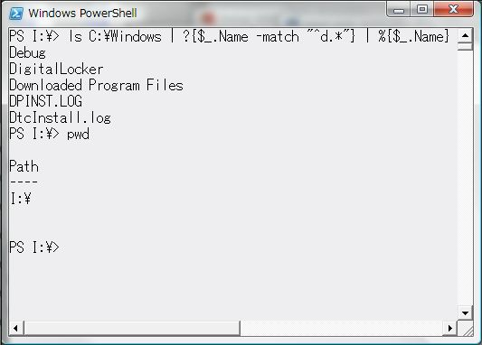

# 基礎知識

## <a id="sec-generated-title-1"></a> <a id="abst"></a>概要

まず、Windows PowerShell の構文の基礎的な部分について説明します。


## <a id="sec-generated-title-2"></a> <a id="case"></a>大文字小文字

PowerShell では、アルファベットの大文字・小文字を区別しません。
get-location と Get-Location、
$a と $A は同じコマンド・変数になります。


## <a id="sec-generated-title-3"></a> <a id="command"></a>コマンド実行

シェル言語なので、
本分はコマンドの実行です。
コマンド実行にいちいち
<code>WSH.Run(command)</code> とかいうように書かなきゃいけないようだと、
シェル言語としてはちょっと不便です。

ということで、
とりえあず、コマンド名を打てばそれだけでコマンドが実行されます。

```console {title="コマンド実行の例"}
>  Get-Location

Path
----
C:\Users\john\Desktop\temp
```


コマンドとして実行できるものには以下のようなものがあります。

1. PowerShell 用の<strong id="cmdlet" class="keyword">Cmdlet</strong>（コマンドレットと読む）

2. function で定義した関数

3. 外部スクリプト

4. Windows コンソールアプリ/バッチファイル（*.exe, *.com, *.bat）


詳しくはそれぞれ別項で説明します。
1～3 に関しては、「[オブジェクトパイプライン](../intro/abstract.md#pipeline)」で説明したように、
.NET オブジェクトベースのパイプラインニングが可能です。
4 は、既存の資産の活用のために備わっている機能ですが、
既存のコンソールアプリ相手のパイプラインは、残念ながら、文字列ベースのものになります。

もちろん、コマンドには引数を与えることができます。

```console {title="コマンド実行の例"}
>  Get-Command p* -CommandType Cmdlet

CommandType     Name             Definition
-----------     ----             ----------
Cmdlet          Pop-Location     Pop-Location [-PassThru] [-Stack...
Cmdlet          Push-Location    Push-Location [[-Path] <String>]...
```


また、コマンドには<strong id="alias" class="keyword">エイリアス</strong>（alias: 別名）を付けることもできます。

例えば Get-ChildItem は、
MS-DOS でいうところの dir、
Unix でいうとろこの ls にあたるコマンドですが、
dir と ls の両方の名前でエイリアスが設定されていて、
これらの名前で実行可能です。

```console {title="エイリアスの例"}
>  dir

Mode                LastWriteTime     Length Name
----                -------------     ------ ----
d----        2007/05/19     18:36            doc
d----        2007/05/19      0:40            sample
-a---        2007/05/19     18:34        186 test.ps1


>  ls

Mode                LastWriteTime     Length Name
----                -------------     ------ ----
d----        2007/05/19     18:36            doc
d----        2007/05/19      0:40            sample
-a---        2007/05/19     18:34        186 test.ps1
```


ちなみに、エイリアスの設定は Set-Alias コマンドで行います
（詳細は別途）。

あと、セミコロン ; で区切ることで、
1行に複数のコマンドを書くこともできます。

```console {title="1行に複数のコマンド"}
>  pushd C:\Users\Public; ls; popd

Mode                LastWriteTime     Length Name
----                -------------     ------ ----
d-r--        2006/11/02     22:02            Documents
d-r--        2006/11/02     21:50            Downloads
d-r--        2006/11/02     21:50            Music
d-r--        2006/11/02     21:50            Pictures
d-r--        2006/11/02     21:50            Videos
```


## <a id="sec-generated-title-4"></a> <a id="pipeline"></a>パイプライン

コマンドとコマンドの間を | で繋ぐと、
前のコマンドの出力を次のコマンドの入力として与えることができます。

```console {title="パイプラインの例"}
Get-Command | more
```


Get-Command は、利用できるコマンド
（登録されている Cmdlet や、path の通った場所にある Windows コンソールアプリ）
を取得するコマンドです。
more は、出力が1画面に収まらないときに、1ページずつ表示するコマンドです。
何も引数を与えずに Get-Command を実行すると、
利用可能なコマンド全てが表示されますが、
かなり量が多いので、more コマンドで受けて1ページずつ表示します。


## <a id="sec-generated-title-5"></a> <a id="redirect"></a>リダイレクト

Windows のコマンドプロンプトや Unix 系のシェルで言うところのリダイレクト
（command &lt; input.txt &gt; output.txt とかすると、
input.txt の中身を command に食わせて、
出力結果を output.txt に書き出す機能）は出力側（&gt; の方）のみ対応しています。
（&lt; を使うと「まだサポートされていません」と表示されるので、
そのうちサポートするつもりっぽい。）
&lt; に相当する機能を使いたければ、
Get-Content コマンドとパイプラインを使います。

```console {title="ファイルの中身をパイプラインに渡す"}
Get-Content input.txt | command
```


出力の方も、Set-Content コマンドを使って同じことができます。

```console {title="出力もパイプラインで"}
Get-Content input.txt | command | Set-Content output.txt
```


出力リダイレクトに関しては、ファイル上書きの &gt; に加えて、
追記の &gt;&gt; も使えます。

```console {title="追記リダイレクト"}
>  echo "test 1" > test.txt
>  echo "test 2" >> test.txt
>  echo "test 3" >> test.txt
>  Get-Content test.txt
test 1
test 2
test 3
>  echo "test 1" > test.txt
>  Get-Content test.txt
test 1
```


その他、リダイレクトには以下のようなものがあります。

<table summary="リダイレクト記号">
	<caption>
		リダイレクト記号
	</caption>
	<tr>
		<td markdown="1">2&gt;&amp;1</td>
		<td markdown="1">結果にエラーを追加</td>
	</tr>
	<tr>
		<td markdown="1">1&gt;&amp;2</td>
		<td markdown="1">エラーに結果を追加</td>
	</tr>
	<tr>
		<td markdown="1">&gt;&gt;</td>
		<td markdown="1">ファイルの最後に結果を追加</td>
	</tr>
	<tr>
		<td markdown="1">&gt;</td>
		<td markdown="1">結果でファイルを作成、以前のファイルの内容は上書き</td>
	</tr>
	<tr>
		<td markdown="1">&lt;</td>
		<td markdown="1">入力 (未対応)</td>
	</tr>
	<tr>
		<td markdown="1">2&gt;&gt;</td>
		<td markdown="1">ファイルの最後にエラーを追加</td>
	</tr>
	<tr>
		<td markdown="1">2&gt;</td>
		<td markdown="1">指定のファイルに処理エラーを書き込み、以前のファイルの内容は上書き</td>
	</tr>
</table>


## <a id="sec-generated-title-6"></a> <a id="expression"></a>式

行頭がアルファベットで始まると、
最初の1単語はコマンド名とみなされてコマンドが実行されるのに対して、
" や ' などの文字列の開始を表す記号や、
数字から始まると式とみなされて、
1 + 1 などといった計算や、
"this is " + "a test" などといった文字列操作（この場合は連結）ができます。

```console {title="式"}
>  1+1
2
>  "this is " + "a test"
this is a test
```


また、
$a とか $x というように、
頭に $ を付けると変数とみなされて、これも式になります。

変数名に続けて = を書けば、代入式になります。
また、変数だけ書くと、変数の中身が表示されます。

```console {title="代入式と値の表示"}
>  $a = 1 + 1
>  $a
2
```


= の直後がアルファベットから始まっている場合、
= 直後の単語はコマンドとみなされて、
コマンドの実行結果が変数に代入されます。

```console {title="コマンド実行結果の代入"}
>  $a = Get-Location
>  $a

Path
----
C:\Users\john\Desktop\temp
```


= とか + 以外に、どういう式が書けるかとかは別項で説明予定。


## <a id="sec-generated-title-7"></a> <a id="comment"></a>コメント

コマンドの実行や式計算とは無関係なコメントを入れることもできます。
コメントは # で始めて、行末までがコメントになります。
当然のことながら、"" や '' （要するに文字列）中の # はコメントにはなりません。

```console {title="コメント"}
>  ls C:\Users\Public # comment
```


```console {title="非コメント"}
>  echo "# not comment"
# not comment
```


## <a id="sec-generated-title-8"></a> <a id="mode"></a>式モードとコマンドモード

PowerShell の構文解析には、
<strong id="expressionmode" class="keyword">式モード</strong>（expression mode）と<strong id="commandmode" class="keyword">コマンドモード</strong>（command mode）という2つのモードがあります。
（command modeの日本語訳、
「コマンドモード」と「引数モード」の2つあるみたい。）

前節・前々節で、
「アルファベットから始まったらコマンド」
「数字、文字列（"" もしくは ''）、変数（$a とか）から始まったら式」という話をしました。
で、PowerShell では、
コマンドと解釈されるか式と解釈されるかによって微妙に構文解析の仕方が違います。

まあ、例を挙げてみましょう。

```console {title="式モードとコマンドモード（１）"}
>  $a = 1 + 1
>  echo $a
2
>  echo 1 + 1
1
+
1
```


まあ、見ての通り、<code>1 + 1</code> の解釈の仕方が違います。
$a への代入式の方では、1 + 1 がちゃんと式とみなされて、
加算結果の 2 が $a に代入されています。
一方、echo の方は、echo コマンドに対して3つの引数 1, "+", 1 が渡されています。

要するに、これが式モードとコマンドモードに違いです。
コマンドと解釈された場合には（コマンドモード）、以下のような挙動になります。

* 数字以外は "" や '' でくくらなくても文字列になる（数字は数字として解釈される）

* スペース区切りの引数になる


もう1つ、例として、1+1 の間のスペースをつめてみましょう。

```console {title="式モードとコマンドモード（２）"}
>  $a = 1+1
>  echo $a
2
>  echo 1+1
1+1
```


こっちの場合、$a への代入の方は同じ結果です。
式として解釈された場合、スペースの有無は関係ありません。
しかしながら、コマンドモードでは、
要するに、<code>echo "1+1"</code> と解釈されています。

ちなみに、"" や '' でくくった部分も式モード中の文字列と同じ扱いで、
"" や '' の中身だけになります。
「"test"」というような文字列を作りたい場合は、
'"test"' とか "'test'" と書きます。

```console {title="クオート記号の表示"}
>  echo 'test'
test
>  echo "test"
test
>  echo '"test"'
"test"
>  echo "'test'"
'test'
```


コマンドに関しても同様で、
代入式の = の後ではコマンドとして実行されて、
コマンドの後ろは単なる文字列とみなされます。

```console {title="式モードとコマンドモード（３）"}
>  $a = Get-Location
>  echo $a
Path
----
C:\Users\john\Desktop\temp

>  echo Get-Location
Get-Location
```


ちなみに、コマンドモードでも、() でくくられた部分は式あるいはコマンドとして評価されます。

```console {title="（）でくくった部分は式"}
>  echo (1 + 1)
2
>  echo (Get-Location)
Path
----
C:\Users\john\Desktop\temp
```


## <a id="sec-generated-title-9"></a> <a id="host"></a>対話型ホスト

PowerShell には、
対話型ホスト（コマンドラインインターフェース）と、
スクリプトファイルの実行機能があります。
で、スクリプトの話は次節でするとして、
ホストプログラムの話を少し。

PowerShell には、
以下のような対話型ホストプログラムが付属しています。
PowerShell をインストールすると、スタートメニューに
[Windows PowerShell 1.0] → [Windows PowerShell] という項目が追加されているはずなので、
これをクリックすると対話型ホストが起動します。
（背景色は変えて使ってます。
標準だと、確か紺色。）

<figure>

[](../../../../assets/media/ufcpp2000/powershell/fig/host.jpg)

<figcaption>PowerShell の対話型ホスト</figcaption>
</figure>


で、この対話型ホスト、結構操作性がよくて快適です。
システム管理以外の用途でも、
コマンドプロンプトや Cygwin（Unix 系ツールの Windows への移植版）のシェル（デフォルトでは bash）を使うよりも快適。
（ただ、XP だと起動が少し遅くていらつくかも。
メモリをしっかりと積んだ Vista なら SuperFetch が効いてて快適。）

この対話型ホストプログラムの操作をいくつか、以下に挙げます。

<table summary="">

	<tr>
		<th>ユーザの操作</th>
		<th>動作</th>
	</tr>
	<tr>
		<th colspan="2">基本操作</th>
	</tr>
	<tr>
		<td markdown="1">[→], [←] キー</td>
		<td markdown="1">カーソルを左右に移動。</td>
	</tr>
	<tr>
		<td markdown="1">[ctrl]＋[→], [ctrl]＋[←] キー</td>
		<td markdown="1">単語単位でカーソルを移動。</td>
	</tr>
	<tr>
		<td markdown="1">[ctrl]＋[End]</td>
		<td markdown="1">カーソル位置とそれより後の文字を削除。</td>
	</tr>
	<tr>
		<td markdown="1">[ctrl]＋[Home]</td>
		<td markdown="1">カーソル位置より前の文字を削除。</td>
	</tr>
	<tr>
		<td markdown="1">[Tab] キー</td>
		<td markdown="1">コマンドを補完する。（例えば、「Set-L」まで打って [Tab] キーを押すと、「Set-Location」に補完してくれる。Cmdlet に関しては、コマンド名だけでなくて、オプションの補完も可能。）</td>
	</tr>
	<tr>
		<td markdown="1">[Back space] キー</td>
		<td markdown="1">カーソル位置の直前の文字を削除。</td>
	</tr>
	<tr>
		<td markdown="1">[Delete] キー</td>
		<td markdown="1">カーソル位置の文字を削除。</td>
	</tr>
	<tr>
		<td markdown="1">[Insert] キー</td>
		<td markdown="1">挿入/上書きモードの切り替え。</td>
	</tr>
	<tr>
		<th colspan="2">履歴</th>
	</tr>
	<tr>
		<td markdown="1">（何も入力していない状態で）[→] キー</td>
		<td markdown="1">直前のコマンドの途中までを入力。</td>
	</tr>
	<tr>
		<td markdown="1">[↑], [↓] キー</td>
		<td markdown="1">コマンドの履歴をたどる。</td>
	</tr>
	<tr>
		<td markdown="1">[Page Up] キー</td>
		<td markdown="1">記憶している限り一番古い履歴コマンドを表示。</td>
	</tr>
	<tr>
		<td markdown="1">[Page Down] キー</td>
		<td markdown="1">直前のコマンドを表示。</td>
	</tr>
	<tr>
		<td markdown="1">[F7] キー</td>
		<td markdown="1">履歴ウィンドウみたいなのを出す。</td>
	</tr>
	<tr>
		<td markdown="1">[F8] キー</td>
		<td markdown="1">コマンドを何文字か途中まで打った後で [F8] を押すと、 コマンド履歴中で打ちかけのコマンドに合致する物を表示する。 [F8] を押すたびに合致するコマンドを過去にたどる。</td>
	</tr>
	<tr>
		<td markdown="1">[F9] キー</td>
		<td markdown="1">番号で履歴を参照するウィンドウみたいなのを出す。 番号は [F7] で出てくる履歴一覧に振られた番号を使う。</td>
	</tr>
	<tr>
		<th colspan="2">テキスト選択・コピー・貼り付け</th>
	</tr>
	<tr>
		<td markdown="1">マウスでドラッグ</td>
		<td markdown="1">ウィンドウ内のテキストを選択。</td>
	</tr>
	<tr>
		<td markdown="1">ダブルクリック</td>
		<td markdown="1">ダブルクリックした位置にある単語を選択。</td>
	</tr>
	<tr>
		<td markdown="1">（テキスト選択中に）右クリック（もしくは [Enter] キー）</td>
		<td markdown="1">選択中のテキストをクリップボードにコピー。</td>
	</tr>
	<tr>
		<td markdown="1">（通常時に）右クリック</td>
		<td markdown="1">クリップボードの内容を貼り付け。</td>
	</tr>
</table>


## <a id="sec-generated-title-10"></a> <a id="extern"></a>スクリプトファイル

対話型で1行1行コマンドを入力していく方法に加えて、
スクリプト（要するにテキストファイル）に処理内容を記述しておいて、
そのスクリプトを呼び出すこともできます。


### <a id="sec-generated-title-11"></a> <a id="policy"></a>スクリプトの実行ポリシー

ただ、
（過去に VBScript を使ったウィルスなんかもあったし、
当然流れなのかもしれないけど、）
セキュリティの観点から、
実行ポリシーが少し厳しかったりもします。
（主としてシステム管理を意図しているので、
どうしても厳しいポリシーにせざるを得ない。）

具体的には、インストール直後の状態だと、
スクリプトを実行できません。
ちゃんと信頼できるデジタル署名のあるスクリプトも実行できないし、
自分で作ったスクリプトすらも実行できない状態です。

で、これだと流石に不便なので、
普通は、
「インターネットからダウンロードしたスクリプトファイルには署名が必要」
というポリシーに設定しなおしてから使います。
実行ポリシーの変更は Set-ExecutionPolicy コマンドを使って、以下のようにします。

```console {title="実行ポリシーを変更"}
> Set-ExecutionPolicy RemoteSigned
```


（他にどういう実行ポリシーが設定できるかは、
Set-ExecutionPolicy のヘルプを参照。）

で、この設定、レジストリの HKEY_LOCAL_MACHINE （コンピュータ全体に設定が適用される。管理者しか変更できない）に保存されるみたいなんですよね。
要するに、
PowerShell を「管理者として実行」しておかないと Set-ExecutionPolicy でポリシーを変更できないし、
ユーザごとにポリシーを変えるということはできない。
この辺り、あくまでシステム管理用で、
better コマンドプロンプトとして使う意図をあまり考えてなくて、
ちょっと不便だったりします。
（改善を望む声はあるんで、将来的には変わるかも。）


### <a id="sec-generated-title-12"></a> <a id="execute"></a>スクリプトの実行

実行ポリシーを RemoteSigned にしたなら、
早速スクリプトを実行してみましょう。

PowerShell スクリプトファイルには、
拡張子 ps1 を付けます。
（3文字目は L の小文字じゃなくて、数字の 1。）
ps1 ファイルの中に実行したいコマンドを書いておいて、
実行はただ単にファイル名を打つだけです。

```console {title="スクリプトファイルの実行"}
>  'echo "test"' | Set-Content a.ps1
>  Get-Content .\a.ps1
echo "test"
>  .\a.ps1
test
```


1つ注意が必要で、
カレントフォルダ内にあるスクリプトファイルであっても、
カレントフォルダを示す .\ を付けてやらないと、
スクリプトが実行できません。

スクリプトファイルの実行も引数を与えたり、パイプライン化することが可能です。
そのやり方は関数とほぼ同様なので、
関数の説明とあわせて別項で説明予定。

ちなみに、Windows の関連付けとしては、
ps1 はメモ帳に関連付けられています。
なので、エクスプローラ上で ps1 ファイルをダブルクリックして実行したりはできません。
（これもセキュリティの関連からすると妥当な処置かも。）


## <a id="sec-generated-title-13"></a> <a id="help"></a>ヘルプ

Get-Help コマンド名

Get-Help about_* で構文関係のヘルプも。

署名関係
Get-Help Set-AuthenticodeSignature
Get-Help about_signing
