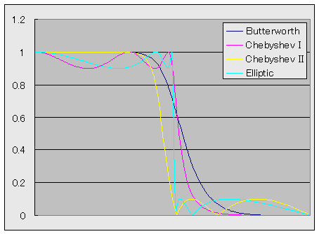
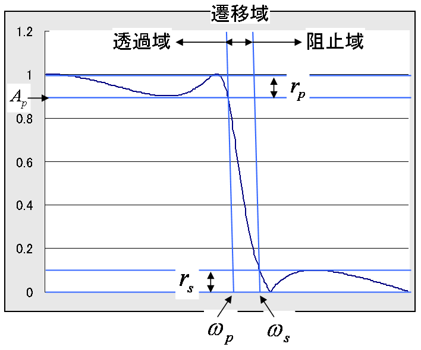
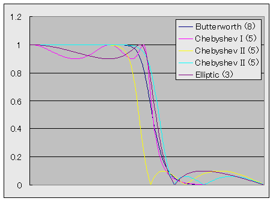
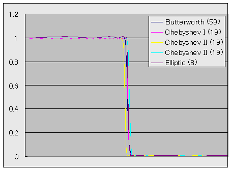

# アナログフィルタ設計に基づく IIR LPF 設計

##  概要

信号処理の分野において、最もよく用いられるフィルタの1つに、
ローパス・ハイパス・バンドバスフィルタなどの、
周波数帯域分割フィルタがあります。
このうちで、ローパスフィルタさえ設計することができれば、
残りのハイパス・バンドパスフィルタは周波数変換を用いて得ることができます。
したがって、ローパスフィルタ設計手法の需要は高く、
アナログ信号処理の時代からさまざまな手法が確立されてきました。
 
s → z 変換を用いることで、
アナログ領域で設計したフィルタをディジタル領域に変換することができますので、
アナログローパスフィルタ設計に関する知識は、
そのままディジタルローパス帯域分割フィルタの設計に用いることができます。

##  アナログ LPF

アナログローパスフィルタ（以下 アナログ LPF）の設計手法には、
以下に挙げる4つの有名な手法があります。

<table summary="アナログ LPF">
	<caption>
		アナログ LPF
	</caption>
	<tr>
		<th>名前</th>
		<th>特徴</th>
	</tr>
	<tr>
		<td markdown="1">バターワース（Butterworth）フィルタ</td>
		<td markdown="1">リプルがない。単純。位相が線形に近い。</td>
	</tr>
	<tr>
		<td markdown="1">チェビシェフ（Chebyshev type I）フィルタ</td>
		<td markdown="1">透過域にリプルがある。 Butterworth と同程度のカットオフ特性を、半分～3分の1程度の次数で実現。</td>
	</tr>
	<tr>
		<td markdown="1">逆チェビシェフ（Chebyshev type II）フィルタ</td>
		<td markdown="1">阻止域にリプルがある。 Butterworth と同程度のカットオフ特性を、半分～3分の1程度の次数で実現。</td>
	</tr>
	<tr>
		<td markdown="1">楕円（Elliptic）フィルタ</td>
		<td markdown="1">透過域と阻止域の両方にリプルがある。 Butterworth と同程度のカットオフ特性を、8分の1程度の次数で実現。</td>
	</tr>
</table>

図1に、これらのフィルタの周波数振幅特性を示します。
フィルタの次数はいずれも5次です。

<figure>

<figcaption>アナログ LPF の振幅特性</figcaption>
</figure>

これらのフィルタの詳細は別ページにて説明します。

* 「[バターワースフィルタ](butterworth.md)」

* 「[チェビシェフフィルタ](chebyshev.md)」

* 「[逆チェビシェフフィルタ](chebyshev2.md)」

* 「[楕円フィルタ](elliptic.md)」

##  LPF の設計仕様

通常、LPF の設計仕様は、図2に示すようなパラメータを用いて表します。

* rp… 透過域リプル（pass-band ripple）（rpの代わりにAp ＝ 1 － rpを使うことも）

* rs… 阻止域リプル（stop-band ripple）

* ωp… 透過域周波数（pass-band frequency）

* ωs… 阻止域周波数（stop-band frequency）

<figure>

<figcaption>LPF の設計仕様</figcaption>
</figure>

図3に、
rp ＝ rs ＝ 0.1、
ωp ＝ 0.8,  ωs ＝ 1.2
として設計した LPF を示します。
また、
図4に、
rp ＝ rs ＝ 0.01、
ωp ＝ 0.95,  ωs ＝ 1.05
として設計した LPF を示します。
凡例中の()の中の数字は、この仕様により得られたフィルタの次数です。

<figure>

<figcaption>仕様を満たすように設計した LPF (1)</figcaption>
</figure>

<figure>

<figcaption>仕様を満たすように設計した LPF (2)</figcaption>
</figure>
