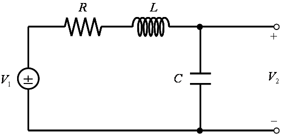
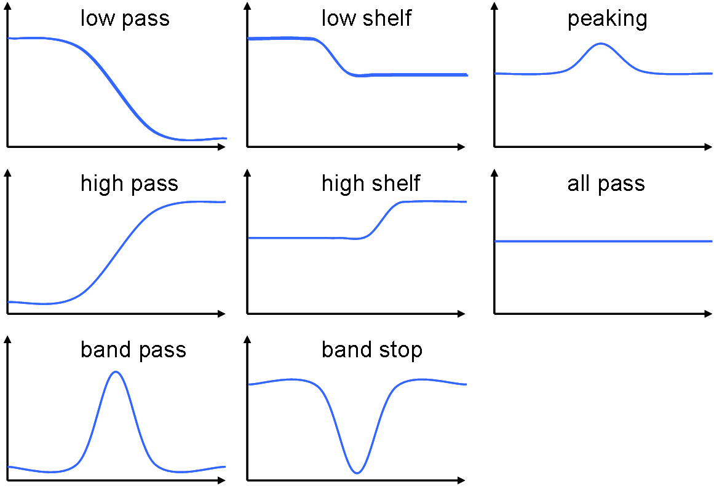

# 双2次フィルタ

##  概要

分母・分子がともに2次のIIRフィルタを双2次フィルタと呼びます。
双2次フィルタは、以下のような理由から、非常によく利用されています。

* 単純。

* 設計手法が確立している。

* 直列に繋ぐことでさまざまな特性を作ることができる。

##  LCR 回路

以下のような LCR 回路でローパスフィルタが作れます。

<figure>

<figcaption>LCR 回路の例</figcaption>
</figure>

この回路の伝達特性 T(s) は、

T(s) ＝
<table class="frac" summary="fraction"><tr><td class="num">V1</td></tr><tr><td>V2</td></tr></table>
＝
<table class="frac" summary="fraction"><tr><td class="num">1 / sC</td></tr><tr><td>R + sL + 1 / sC</td></tr></table>
＝
<table class="frac" summary="fraction"><tr><td class="num">1 / LC</td></tr><tr><td>s2 ＋ (R / L) s + 1 / LC</td></tr></table>

となります。
ここで、
ω0 ＝ √<table class="frac" summary="fraction"><tr><td class="num">1</td></tr><tr><td>LC</td></tr></table>
（無損失（R ＝ 0）時の共振周波数）、
Q ＝ <table class="frac" summary="fraction"><tr><td class="num">L</td></tr><tr><td>R</td></tr></table> ω0
 ＝ <table class="frac" summary="fraction"><tr><td class="num">1</td></tr><tr><td>R</td></tr></table>√<table class="frac" summary="fraction"><tr><td class="num">L</td></tr><tr><td>C</td></tr></table>
（クオリティファクタ（LCR 回路でコイルの損失率を表すパラメータ））
と置くと、

T(s)
＝
<table class="frac" summary="fraction"><tr><td class="num">ω02</td></tr><tr><td>s2 ＋ (ω0 / Q) s + ω02</td></tr></table>

と表すことができます。
この伝達関数の周波数特性は、
ω0 を境にして減衰を始めるローパス特性になっています。
すなわち、このような RCL 回路を用いて、ローパスフィルタを作ることが出来ます。
ちなみに、クオリティファクタ Q を変えると、カットオフ特性のなだらかさなどが変化します。
 
ここではローパスフィルタを例に挙げましたが、
RCL の配置をいろいろと変えることで、さまざまな特性を作ることができます。

##  双2次フィルタ

伝達関数の分母・分子ともに2次のフィルタを<strong id="d33e162" class="keyword">双2次フィルタ</strong>（biquadratic filter、あるいは biquad filter）といいます。
（余談ですが、quad- という接頭語は“4”という意味を表します。
quadratic は“四角形の”という意味合いから“2次元の”という意味で使われる言葉です。
ついでに、bi- は“2”を表す接頭語です。
biquadratic は文字通り解釈すると、“2つの2次元”なわけですが、“4次元の”という意味と、“分母・分子ともに2次元”という意味で使われることがあります。
4（quad）なのに2次、
2×4（biquad）でもやっぱり2次だったり。）
 
先ほど示したように、RCL 回路を用いてアナログの双2次フィルタを作ることができます。
分母・分子ともに2次という制限の元でも結構いろんなことができます（図2）。
また、双2次フィルタの組み合わせ（直列に繋ぐ）によって、より複雑な特性を作り出すことも出来ます。

<figure>

<figcaption>双2次元フィルタの特性いろいろ</figcaption>
</figure>

フィルタ設計が容易であることや、設計手法が確立されたものであることなどから、
双2次フィルタは非常によく利用されています。
 
Robert Bristow-Johnson という方が、
ネット上で（オーディオ用に）双2次フィルタの設計時に使う公式をまとめたものを公開しています
（通称、RBJ Audio-EQ-Cookbook、参考 URL: http://www.harmony-central.com/Computer/Programming/Audio-EQ-Cookbook.txt）。
以下、この RBJ Cookbook の内容について簡単に説明します（和訳しただけの部分も多いですが）。
<h4>設計手法概要</h4>
双2次フィルタの設計では、
まず、アナログの双2次伝達関数を作ります。
このとき、フィルタの特性周波数を 1 として伝達関数を作ります。
そして、「[周波数変換](transform.md)」で説明したような手法を用いて、周波数変換およびアナログ→ディジタル変換を行います。
双1次変換を用いてアナログ→ディジタル変換を行うと、
フィルタの次数は変わらないので、ディジタルの双2次フィルタを作ることができます。
 
双2次フィルタを設計する際には、以下のようなパラメータを用います。

* Fs… ディジタル信号のサンプリング周波数。

* f0… 特性周波数。要するに、ローパスフィルタならカットオフ周波数、ピーキングフィルタなら中心周波数。

* gain… ピーキングフィルタやシェルフフィルタの利得[dB]。

* Q… RCL 回路で説明したクオリティファクタに相当するパラメータ。ローパス・ハイパスフィルタのカットオフ特性や、ピーキングフィルタのピークの鋭さが変わる。

Q に関しては、ピーキングフィルタではピークの幅 BW を、シェルフフィルタではシェルフスロープに関するパラメータ S, a を与えて Q を計算することも多いです。
 
また、中間的なパラメータとして、以下のようなものを用います。

* ω0 ＝ 2 π f0 / Fs… 特性周波数を2πで正規化したもの。

* 
          sin ω0 , cos ω0… 下の説明参照

* α ＝ <table class="frac" summary="fraction"><tr><td class="num">sin ω0</td></tr><tr><td>Q</td></tr></table>

* A ＝ √10gain / 20… ピーキングフィルタやシェルフフィルタの利得[dB]をリニア値にしたものの平方根。

以下のような式を用いると、周波数変換と双1次変換を同時に行うことができます。

s
＝
<table class="frac" summary="fraction"><tr><td class="num">1</td></tr><tr><td>tan ω0/2</td></tr></table><table class="frac" summary="fraction"><tr><td class="num">1 － z－1</td></tr><tr><td>1 ＋ z－1</td></tr></table>

ただし、ω0 は特性周波数 f0を正規化した角周波数です。
tan<table class="frac" summary="fraction"><tr><td class="num">ω0</td></tr><tr><td>2</td></tr></table> およびその2乗は、
sin ω0 , cos ω0 を使って書き換えることができるので、
中間パラメータとして sin ω0 , cos ω0 が頻繁に出てくることになります。
 
以下、具体的な双2次フィルタの話になりますが、
元となるアナログ伝達関数 H(s) と、
ディジタルフィルタの係数 a0 , a1 , a2 , b0 , b1 , b2 のみを示します。
係数の意味は以下の通りです。

H(z) ＝
<table class="frac" summary="fraction"><tr><td class="num">b0 ＋ b1 z－1 ＋ b2 z－2</td></tr><tr><td>a0 ＋ a1 z－1 ＋ a2 z－2</td></tr></table>

ちなみに、
次節以降で結果だけ示す伝達関数の導出方法ですが、
例えばローパスフィルタなら、
f(0)= 1, f'(0)= 0, f(∞)= 0, f'(∞)= 1
というような条件から係数を計算します。
<h4>ローパスフィルタ（low-pass filter）</h4>
低域透過フィルタ。
低周波数信号のみを通すフィルタ。

H(s)
＝
<table class="frac" summary="fraction"><tr><td class="num">1</td></tr><tr><td>s2 ＋ <table class="frac" summary="fraction"><tr><td class="num">1</td></tr><tr><td>Q</td></tr></table>s ＋ 1</td></tr></table>

b0
＝
<table class="frac" summary="fraction"><tr><td class="num">1 － cos ω0</td></tr><tr><td>2</td></tr></table>

b1
＝
1 － cos ω0

b2
＝
<table class="frac" summary="fraction"><tr><td class="num">1 － cos ω0</td></tr><tr><td>2</td></tr></table>

a0
＝
1 ＋ α

a1
＝
－2 cos ω0

a2
＝
1 － α

<h4>ハイパスフィルタ（high-pass filter）</h4>
高域透過フィルタ。
高周波数信号のみを通すフィルタ。

H(s)
＝
<table class="frac" summary="fraction"><tr><td class="num">s2</td></tr><tr><td>s2 ＋ <table class="frac" summary="fraction"><tr><td class="num">1</td></tr><tr><td>Q</td></tr></table>s ＋ 1</td></tr></table>

b0
＝
<table class="frac" summary="fraction"><tr><td class="num">1 ＋ cos ω0</td></tr><tr><td>2</td></tr></table>

b1
＝
－(1 ＋ cos ω0)

b2
＝
<table class="frac" summary="fraction"><tr><td class="num">1 ＋ cos ω0</td></tr><tr><td>2</td></tr></table>

a0
＝
1 ＋ α

a1
＝
－2 cos ω0

a2
＝
1 － α

<h4>バンドパスフィルタ（band-pass filter）</h4>
帯域透過フィルタ。
特定の帯域信号のみを通すフィルタ。
Q によって透過域の利得が変わる（帯域幅一定）ものと、
帯域幅が変わる（利得は Q で一定）のものがある。
 
帯域幅一定版

H(s)
＝
<table class="frac" summary="fraction"><tr><td class="num">s</td></tr><tr><td>s2 ＋ <table class="frac" summary="fraction"><tr><td class="num">1</td></tr><tr><td>Q</td></tr></table>s ＋ 1</td></tr></table>

b0
＝
<table class="frac" summary="fraction"><tr><td class="num">sin ω0</td></tr><tr><td>2</td></tr></table>
＝
Q α

b1
＝
0

b2
＝
－
<table class="frac" summary="fraction"><tr><td class="num">sin ω0</td></tr><tr><td>2</td></tr></table>
＝
－Q α

a0
＝
1 ＋ α

a1
＝
－2 cos ω0

a2
＝
1 － α

利得一定版

H(s)
＝
<table class="frac" summary="fraction"><tr><td class="num"><table class="frac" summary="fraction"><tr><td class="num">1</td></tr><tr><td>Q</td></tr></table>s</td></tr><tr><td>s2 ＋ <table class="frac" summary="fraction"><tr><td class="num">1</td></tr><tr><td>Q</td></tr></table>s ＋ 1</td></tr></table>

b0
＝
α

b1
＝
0

b2
＝
－α

a0
＝
1 ＋ α

a1
＝
－2 cos ω0

a2
＝
1 － α

<h4>バンドストップフィルタ（band-stop filter）</h4>
帯域阻止フィルタ。
特定の帯域信号のみを通さないフィルタ。
ノッチ（notch）フィルタともいう。

H(s)
＝
<table class="frac" summary="fraction"><tr><td class="num">s2 ＋ 1</td></tr><tr><td>s2 ＋ <table class="frac" summary="fraction"><tr><td class="num">1</td></tr><tr><td>Q</td></tr></table>s ＋ 1</td></tr></table>

b0
＝
1

b1
＝
－2 cos ω0

b2
＝
1

a0
＝
1 ＋ α

a1
＝
－2 cos ω0

a2
＝
1 － α

<h4>オールパスフィルタ（all-pass filter）</h4>
全域透過フィルタ。
振幅特性はそのまま（全域透過、all-pass）で、
位相特性のみを変化させるフィルタ。

H(s)
＝
<table class="frac" summary="fraction"><tr><td class="num">s2 － <table class="frac" summary="fraction"><tr><td class="num">1</td></tr><tr><td>Q</td></tr></table>s ＋ 1</td></tr><tr><td>s2 ＋ <table class="frac" summary="fraction"><tr><td class="num">1</td></tr><tr><td>Q</td></tr></table>s ＋ 1</td></tr></table>

b0
＝
1 － α

b1
＝
－2 cos ω0

b2
＝
1 ＋ α

a0
＝
1 ＋ α

a1
＝
－2 cos ω0

a2
＝
1 － α

<h4>ピーキングフィルタ（peaking filter）</h4>
振幅特性にピークやディップ（山や谷）を作るフィルタ。
周波数ごとの音量調整に使えるので、音響分野では特によく使われる（いわゆる、イコライザ）。
なので、分野によってはピーキングイコライザ（peaking equalizer）と呼ぶ。

H(s)
＝
<table class="frac" summary="fraction"><tr><td class="num">s2 ＋ <table class="frac" summary="fraction"><tr><td class="num">A</td></tr><tr><td>Q</td></tr></table>s ＋ 1</td></tr><tr><td>s2 ＋ <table class="frac" summary="fraction"><tr><td class="num">1</td></tr><tr><td>A Q</td></tr></table>s ＋ 1</td></tr></table>

b0
＝
1 ＋ α A

b1
＝
－2 cos ω0

b2
＝
1 － α A

a0
＝
1 ＋ α A

a1
＝
－2 cos ω0

a2
＝
1 － α A

あるいは、

H(s)
＝
<table class="frac" summary="fraction"><tr><td class="num">s2 ＋ <table class="frac" summary="fraction"><tr><td class="num">A2</td></tr><tr><td>Q</td></tr></table>s ＋ 1</td></tr><tr><td>s2 ＋ <table class="frac" summary="fraction"><tr><td class="num">1</td></tr><tr><td>Q</td></tr></table>s ＋ 1</td></tr></table>
または

H(s)
＝
<table class="frac" summary="fraction"><tr><td class="num">s2 ＋ <table class="frac" summary="fraction"><tr><td class="num">1</td></tr><tr><td>Q</td></tr></table>s ＋ 1</td></tr><tr><td>s2 ＋ <table class="frac" summary="fraction"><tr><td class="num">1</td></tr><tr><td>A2 Q</td></tr></table>s ＋ 1</td></tr></table>
というように、
A を分母または分子に集中させる場合もある。
（通常、
A が1以上（gain [dB] が正）のとき分母に、
A が1以下（gain [dB] が負）のとき分子に集中させる。）
<h4>ローシェルフフィルタ（low-shelf filter, low-shelving filter）</h4>
振幅特性の低域に棚状の利得をかける。
ローブースト（low-boost）フィルタともいう。

H(s)
＝
A
<table class="frac" summary="fraction"><tr><td class="num">s2 ＋ <table class="frac" summary="fraction"><tr><td class="num">√A</td></tr><tr><td>Q</td></tr></table>s ＋ A</td></tr><tr><td>A s2 ＋ <table class="frac" summary="fraction"><tr><td class="num">√A</td></tr><tr><td>Q</td></tr></table>s ＋ 1</td></tr></table>

b0
＝
A
((A ＋ 2)
－
(A － 2)cos ω0
＋
2 √A α
)

b1
＝
－2 A
((A － 2)
－
(A ＋ 2)cos ω0)

b2
＝
A
((A ＋ 2)
－
(A － 2)cos ω0
－
2 √A α
)

a0
＝
(A ＋ 2)
＋
(A － 2)cos ω0
＋
2 √A α

a1
＝
2
((A － 2)
＋
(A ＋ 2)cos ω0)

a2
＝
(A ＋ 2)
＋
(A － 2)cos ω0
－
2 √A α

<h4>ハイシェルフフィルタ（high-shelf filter, high-shelving filter）</h4>
振幅特性の高域に棚状の利得をかける。
ハイブースト（high-boost）フィルタともいう。

H(s)
＝
A
<table class="frac" summary="fraction"><tr><td class="num">A s2 ＋ <table class="frac" summary="fraction"><tr><td class="num">√A</td></tr><tr><td>Q</td></tr></table>s ＋ 1</td></tr><tr><td>s2 ＋ <table class="frac" summary="fraction"><tr><td class="num">√A</td></tr><tr><td>Q</td></tr></table>s ＋ A</td></tr></table>

b0
＝
A
((A ＋ 2)
＋
(A － 2)cos ω0
＋
2 √A α
)

b1
＝
2 A
((A － 2)
＋
(A ＋ 2)cos ω0)

b2
＝
A
((A ＋ 2)
＋
(A － 2)cos ω0
－
2 √A α
)

a0
＝
(A ＋ 2)
－
(A － 2)cos ω0
＋
2 √A α

a1
＝
－2
((A － 2)
－
(A ＋ 2)cos ω0)

a2
＝
(A ＋ 2)
－
(A － 2)cos ω0
－
2 √A α

