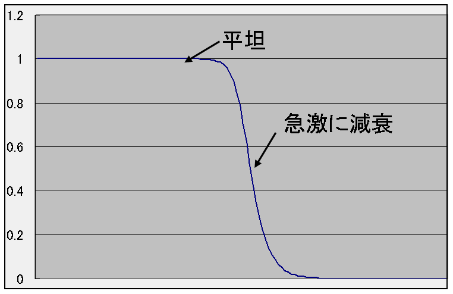
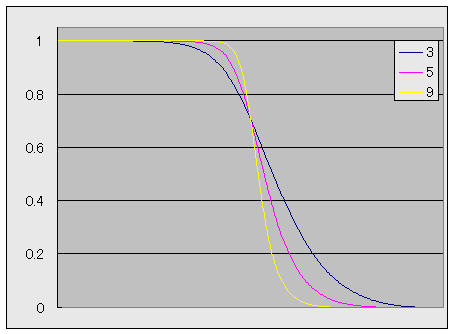
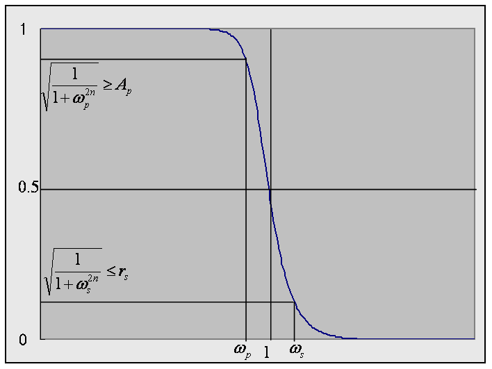

# バターワースフィルタ

## 概要
<strong id="butterworth" class="keyword">バターワースフィルタ</strong>（Butterworth filter）は、
通過域で最大平坦な振幅特性を示すローパスフィルタです。
位相特性も線形に近いという特徴があります。

<figure>
	
	<figcaption>バターワースフィルタの周波数特性</figcaption>
</figure>

## 周波数特性
バターワースフィルタは以下のような周波数特性を持ちます。

|H(ω)|2
＝
<table class="frac" summary="fraction"><tr><td class="num">1</td></tr><tr><td>1 ＋ ω2n</td></tr></table>

この特性はω＞1で急激に減衰していきます。
ωの変わりにω/ωcを代入することでカットオフ周波数ωcを任意に設定できます。
また、この伝達関数は1階から2n－1階までの全ての導関数がω ＝ 0において0であるという性質を持っています。
この性質を最大平坦と呼びます。
 
図2に、例として、3次、5次、9次のバターワースフィルタの振幅特性を示します。

<figure>
	
	<figcaption>3～9次のバターワースフィルタの周波数特性</figcaption>
</figure>

## アナログプロトタイプの設計
### 極配置
|H(ω)|2の分母は2n次の多項式なので、
|H(ω)|2は2n個の極を持ちます。
この2n個の極は、
ω2n ＝ －1より、以下のようになります。

ω ＝
exp(i<table class="frac" summary="fraction"><tr><td class="num">2k ＋ 1</td></tr><tr><td>2n</td></tr></table>π)

この2n個の中から安定なn個の極を選び、
バターワースフィルタの極 s にします。
<em>

s ＝
－
cos<table class="frac" summary="fraction"><tr><td class="num">n － 2k － 1</td></tr><tr><td>2n</td></tr></table>π
± i
sin<table class="frac" summary="fraction"><tr><td class="num">n － 2k － 1</td></tr><tr><td>2n</td></tr></table>π

</em>
ただし、kは0～(n－1) / 2までの整数です。

### アナログプロトタイプ伝達関数
決定された極配置から、バターワースフィルタの伝達関数H(s)は以下のようになります。

H(s)
＝
<table class="sigma" summary="product"><tr><td class="sigmasub"><table class="frac" summary="fraction"><tr><td class="num">n</td></tr><tr><td>2</td></tr></table> － 1</td></tr><tr><td class="sigma">∏</td></tr><tr><td class="sigmasub">k＝0</td></tr></table><table class="frac" summary="fraction"><tr><td class="num">1</td></tr><tr><td>s2 ＋ αk s ＋ 1</td></tr></table>
　　　（nが偶数のとき）

H(s)
＝
<table class="frac" summary="fraction"><tr><td class="num">1</td></tr><tr><td>s ＋ 1</td></tr></table><table class="sigma" summary="product"><tr><td class="sigmasub"><table class="frac" summary="fraction"><tr><td class="num">n－1</td></tr><tr><td>2</td></tr></table></td></tr><tr><td class="sigma">∏</td></tr><tr><td class="sigmasub">k＝0</td></tr></table><table class="frac" summary="fraction"><tr><td class="num">1</td></tr><tr><td>s2 ＋ αk s ＋ 1</td></tr></table>
　　　（nが奇数のとき）

ただし、αk は以下の式で表される値です。

αk
＝
2
cos(<table class="frac" summary="fraction"><tr><td class="num">n － 2 k － 1</td></tr><tr><td>2 n</td></tr></table>π)

### 設計仕様
透過域/阻止域の周波数/リプル
（Ap, rs, ωp, ωs）
を仕様として与えたとき、
仕様を満たす最小の次数 N を求める方法について説明します。

<figure>
	
	<figcaption>バターワースフィルタの設計仕様</figcaption>
</figure>

このような次数 N を求めるためには、
図3に示すように、

Ap2
≦
<table class="frac" summary="fraction"><tr><td class="num">1</td></tr><tr><td>
1
＋
ωp2 N</td></tr></table>
, 　
rp2
≧
<table class="frac" summary="fraction"><tr><td class="num">1</td></tr><tr><td>
1
＋
ωs2 N</td></tr></table>

という条件を満たすような最小の N を求めます。
これらの式から、

N ≧
<table class="frac" summary="fraction"><tr><td class="num">log(<table class="frac" summary="fraction"><tr><td class="num">1</td></tr><tr><td>Ap2</td></tr></table>
   －
   1
  )</td></tr><tr><td>
  2
  log
  ωp</td></tr></table>
, 　
N ≧
<table class="frac" summary="fraction"><tr><td class="num">log(<table class="frac" summary="fraction"><tr><td class="num">1</td></tr><tr><td>rs2</td></tr></table>
   －
   1
  )</td></tr><tr><td>
  2
  log
  ωs</td></tr></table>

という式が得られるので、
これらの最大値を選ぶことにより、
<em>

N ≧
Max(<table class="frac" summary="fraction"><tr><td class="num">log(<table class="frac" summary="fraction"><tr><td class="num">1</td></tr><tr><td>Ap2</td></tr></table>
   －
   1
  )</td></tr><tr><td>
  2
  log
  ωp</td></tr></table>
, 
<table class="frac" summary="fraction"><tr><td class="num">log(<table class="frac" summary="fraction"><tr><td class="num">1</td></tr><tr><td>rs2</td></tr></table>
   －
   1
  )</td></tr><tr><td>
  2
  log
  ωs</td></tr></table>)
</em>
という式が得られます。
この不等式を満たすような最小の N を選びます。

## ディジタルフィルタ設計
「[アナログプロトタイプの設計](#analog)」で得られた式を、
カットオフ周波数ωcで双1次変換することで以下の式が得られます。

c ＝ cos ωc , 
s ＝ sin ωc

H(z)
＝
<table class="sigma" summary="product"><tr><td class="sigmasub"><table class="frac" summary="fraction"><tr><td class="num">n</td></tr><tr><td>2</td></tr></table>－1</td></tr><tr><td class="sigma">∏</td></tr><tr><td class="sigmasub">k＝0</td></tr></table><table class="frac" summary="fraction"><tr><td class="num">(<table class="frac" summary="fraction"><tr><td class="num">1－c</td></tr><tr><td>2</td></tr></table>)(
1 ＋ 2 z－1 ＋ z－2)</td></tr><tr><td>(1＋αk, n)
－
2 c z－1
＋
(1－αk, n)
z－2</td></tr></table>
, 
　　
（nが偶数のとき）

H(z)
＝
<table class="frac" summary="fraction"><tr><td class="num">s (1 ＋ z－1)</td></tr><tr><td>(s ＋ c + 1) ＋ (s － c － 1) z－1</td></tr></table>
×
<table class="sigma" summary="product"><tr><td class="sigmasub"><table class="frac" summary="fraction"><tr><td class="num">n－1</td></tr><tr><td>2</td></tr></table></td></tr><tr><td class="sigma">∏</td></tr><tr><td class="sigmasub">k＝0</td></tr></table><table class="frac" summary="fraction"><tr><td class="num">(<table class="frac" summary="fraction"><tr><td class="num">1－c</td></tr><tr><td>2</td></tr></table>)(
1 ＋ 2 z－1 ＋ z－2)</td></tr><tr><td>(1＋αk, n)
－
2 c z－1
＋
(1－αk, n)
z－2</td></tr></table>
　　
（nが奇数のとき）

ただし、αk, n は以下の式で表される値です。 

αk, n
＝
s cos(<table class="frac" summary="fraction"><tr><td class="num">n － 2k ＋ 1</td></tr><tr><td>2n</td></tr></table>π)

## ハイパスフィルタ
「[周波数変換](transform.md)」で説明したように、
ローパスフィルタのアナログ伝達関数の変数 s を s → <table class="frac" summary="fraction"><tr><td class="num">1</td></tr><tr><td>s</td></tr></table> に入れ替えると、
ハイパスフィルタになります。
したがって、
ハイパスバターワースフィルタのアナログプロトタイプ伝達関数は以下のようになります。

H(s)
＝
<table class="sigma" summary="product"><tr><td class="sigmasub"><table class="frac" summary="fraction"><tr><td class="num">n</td></tr><tr><td>2</td></tr></table> － 1</td></tr><tr><td class="sigma">∏</td></tr><tr><td class="sigmasub">k＝0</td></tr></table><table class="frac" summary="fraction"><tr><td class="num">s2</td></tr><tr><td>s2 ＋ αk s ＋ 1</td></tr></table>
　　　（nが偶数のとき）

H(s)
＝
<table class="frac" summary="fraction"><tr><td class="num">s</td></tr><tr><td>s ＋ 1</td></tr></table><table class="sigma" summary="product"><tr><td class="sigmasub"><table class="frac" summary="fraction"><tr><td class="num">n－1</td></tr><tr><td>2</td></tr></table></td></tr><tr><td class="sigma">∏</td></tr><tr><td class="sigmasub">k＝0</td></tr></table><table class="frac" summary="fraction"><tr><td class="num">s2</td></tr><tr><td>s2 ＋ αk s ＋ 1</td></tr></table>
　　　（nが奇数のとき）

この式の分母は、ローパス伝達関数の分母と全く同じものになっています。
（バターワースフィルタの伝達関数は、分母の定数項と2次の係数が同じなのでこうなる。）
その結果、ディジタルフィルタ伝達関数も、以下のように、
ローパス伝達関数と分母が全く同じものになります。

H(z)
＝
<table class="sigma" summary="product"><tr><td class="sigmasub"><table class="frac" summary="fraction"><tr><td class="num">n</td></tr><tr><td>2</td></tr></table>－1</td></tr><tr><td class="sigma">∏</td></tr><tr><td class="sigmasub">k＝0</td></tr></table><table class="frac" summary="fraction"><tr><td class="num">(<table class="frac" summary="fraction"><tr><td class="num">1＋c</td></tr><tr><td>2</td></tr></table>)(
1 － 2 z－1 ＋ z－2)</td></tr><tr><td>(1＋αk, n)
－
2 c z－1
＋
(1－αk, n)
z－2</td></tr></table>
　　
（nが偶数のとき）

H(z)
＝
<table class="frac" summary="fraction"><tr><td class="num">(1<em>＋</em>c)(1 <em>－</em> z－1)</td></tr><tr><td>(s ＋ c + 1) ＋ (s － c － 1) z－1</td></tr></table>
×
<table class="sigma" summary="product"><tr><td class="sigmasub"><table class="frac" summary="fraction"><tr><td class="num">n－1</td></tr><tr><td>2</td></tr></table></td></tr><tr><td class="sigma">∏</td></tr><tr><td class="sigmasub">k＝0</td></tr></table><table class="frac" summary="fraction"><tr><td class="num">(<table class="frac" summary="fraction"><tr><td class="num">1<em>＋</em>c</td></tr><tr><td>2</td></tr></table>)(
1 <em>－</em> 2 z－1 ＋ z－2)</td></tr><tr><td>(1＋αk, n)
－
2 c z－1
＋
(1－αk, n)
z－2</td></tr></table>
　　
（nが奇数のとき）

この式を、ローパス伝達関数と見比べてみると、
分母が同じなだけでなく、
分子も似たものになっています。
式中で強調表示している部分の符号が異なっているだけです。
このことから、同じカットオフ周波数のローパス・ハイパスフィルタは、
その処理の大部分を共通化することができます。
