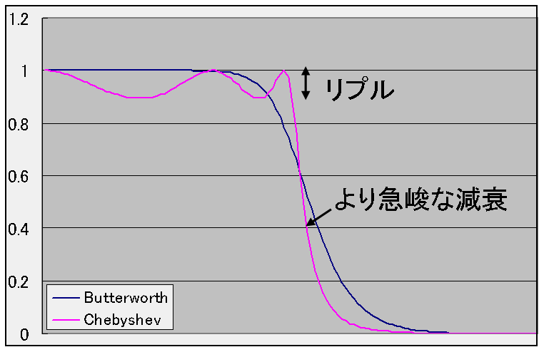
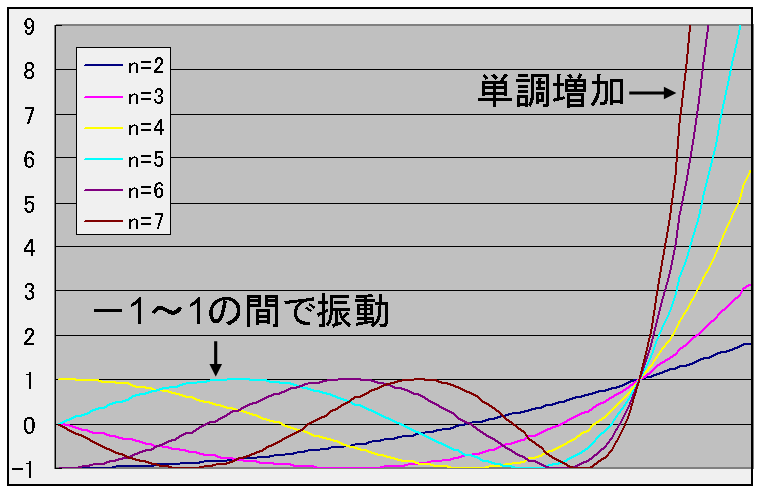
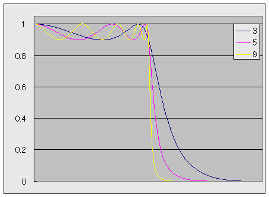
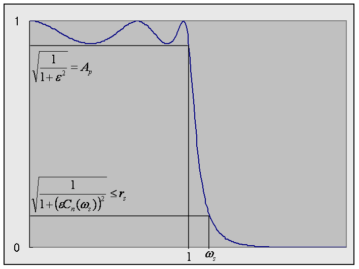

# チェビシェフフィルタ

##  概要

<strong id="chebyshev" class="keyword">チェビシェフフィルタ</strong>（Chebyshev filter）は、
通過域で等リプルとなるようなローパスフィルタです。
リプルを許容することで急峻なカットオフ特性を得ることができます。

<figure>

<figcaption>リプルの許容</figcaption>
</figure>

##  基本アイディア

「[バターワースフィルタ](butterworth.md#butterworth)」は通過域で平坦な周波数特性を示すローパスフィルタでした。
これに対して、通過域での平坦性を犠牲にし、リプルを許容することによって、
少ない誤差および急峻なカットオフ特性を持つフィルタを得ることができます。

このようなフィルタの設計手法について説明する前に
まず、バターワースフィルタの振幅特性式を以下のように一般化して考えてみます。

      |H(ω)|
      2
＝
<table class="frac" summary="fraction"><tr><td class="num">1</td></tr><tr><td>1 ＋ F(ω)2</td></tr></table>

F(ω) ＝ ωnの場合がバターワースフィルタにあたります。
バターワースフィルタでは、
ωnがω＝1を境にして急激に増加するため、
フィルタの振幅特性<table class="frac" summary="fraction"><tr><td class="num">1</td></tr><tr><td>1 ＋ ω2n</td></tr></table>は
ω＜1のとき1に近い値を、
ω＞1のとき0に近い値を取りました。
これと同様に、
F(ω)として、
ω＜1のときに極力小さい値を、
ω＞1のときに極力大きい値を持つような多項式を選べば、
|H(ω)|2がローパス特性になります。

##  チェビシェフ多項式

前節で述べたローパス特性において、
F(ω)として、
ω＜1の範囲での最大値が最も小さくなるような多項式を選ぶことで、
|H(ω)|2の通過域（ω＜1）における誤差を最小にすることができます。
すなわち、最高次の係数が1であるようなn次多項式pn(x)のうちで、
<table class="sigma" summary="statement under a function"><tr><td>max</td></tr><tr><td class="sigmasub">x＜1</td></tr></table>
pn(x)
となるようなものを選び、
F(ω) ＝ a pn(ω)（aは定数）とします。
 
このような性質をもつ多項式として、<strong id="chebyshev-poly" class="keyword">チェビシェフ多項式</strong>（Chebyshev polynomial）というものがあります。
n次のチェビシェフ多項式Cn(x)は、
x ≦ 1に対して以下のように定義されます。
<em>
      

Cn(x)
＝
cos(n cos－1 x)

    </em>
この式は一見すると複雑に見えますが、
x ＝ cosθとおくと、

Cn＋1(x)
＋
Cn－1(x)
＝
cos((n ＋ 1)θ)
＋
cos((n － 1)θ)

　
＝
2
cos(nθ)cos(θ)
＝
2 x cos(n cos－1 x)
＝
2 x Cn(x)

となるので、以下の漸化式で表されるn次の多項式になります。
<em>
      

Cn＋1(x)
＝
2 x Cn(x)
－
Cn－1(x)

      

C1(x)
＝
x

      

C0(x)
＝
1

    </em>
x ＞ 1に対しては、

Cn(x)
＝
cosh(n cosh－1 x)

と定義することでまったく同じ漸化式が得られます。
 
チェビシェフ多項式Cn(x)は、
先ほど述べた
<table class="sigma" summary="statement under a function"><tr><td>max</td></tr><tr><td class="sigmasub">x＜1</td></tr></table>
pn(x)
を満たすようなn次多項式pn(x)を2n － 1倍したものになります。
また、定義から分かるように、
チェビシェフ多項式はx ≦ 1のとき、－1 ≦ Cn(x) ≦ 1の範囲で振動し、x ＞ 1のとき、単調増加します。
以下に2次～7次までのチェビシェフ多項式の係数およびグラフを示します。

C2(x)
＝
2 x2 － 1

C3(x)
＝
4 x3 － 3 x

C4(x)
＝
8 x4 － 8 x2 ＋ 1

C5(x)
＝
16 x5 － 20 x3 ＋ 5 x

C6(x)
＝
32 x6 － 48 x4 ＋ 18 x2 － 1

C7(x)
＝
64 x7 － 112 x5 ＋ 56 x3 － 7 x

<figure>

<figcaption>チェビシェフ多項式のグラフ</figcaption>
</figure>

この式を見ると、
Cn(x)
の最高次の係数は 2n － 1 になっていることが分かります。
すなわち、x の値が大きいとき、
Cn(x)
の増加率は、
xn
の 2n － 1 になります。

##  周波数特性

「[基本アイディア](#idea)」で述べたローパス特性の式中のF(ω)を、チェビシェフ多項式Cn(x)と任意定数εを用いて
F(ω) ＝ ε Cn(ω)
と置いたものを<em>チェビシェフフィルタ</em>と呼びます。
 
すなわち、チェビチェフフィルタは以下のような周波数特性を持つローパスフィルタです。

      |H(ω)|
      2
＝
<table class="frac" summary="fraction"><tr><td class="num">1</td></tr><tr><td>1 ＋ (ε Cn(ω))2</td></tr></table>

チェビシェフ多項式の性質から、
この特性はω ≦ 1のとき1 ～ <table class="frac" summary="fraction"><tr><td class="num">1</td></tr><tr><td>1 ＋ ε2</td></tr></table>の間で振動し、
ω＞1のときバターワースフィルタのε 2n－1倍のペースで急激に減衰していきます。
εの値が小さければ、リプルが大きいい代わりに急峻な減衰を示し、
逆に、εの値が大きければ、リプルが小さく、減衰が緩やかになります。
また、リプルの高さが1 ～ <table class="frac" summary="fraction"><tr><td class="num">1</td></tr><tr><td>1 ＋ ε2</td></tr></table>の間で一定なので、
<em>等リプルフィルタ</em>（equiripple filter）とも呼ばれています。
 
図3に、例として、3次、5次、9次のチェビシェフフィルタの振幅特性を示します。
この例では、リプル幅は 0.1 で設計しています。

<figure>

<figcaption>3～9次のチェビシェフフィルタの周波数特性</figcaption>
</figure>

##  アナログプロトタイプの設計

###  極配置

バターワースフィルタのときと同様に、
|H(ω)|2の分母は2n次の多項式であり、
2n個の極の中から安定なn個の極を選び、
H(ω)の極にすることでフィルタを設計します。

          |H(ω)|
          2
        の極は

        (ε Cn(ω))
        2 ＝ －1

すなわち、

        cos n cos－1ω ＝ ±i <table class="frac" summary="fraction"><tr><td class="num">1</td></tr><tr><td>ε</td></tr></table>

を満たします。
この式を満たすωを求めるために、
まず、cosω ＝ w ＝ u ＋ i v と置き、
u, v に付いて解きます。
cos(x ＋ i y)
＝
cosx coshy － i sinx sinhy

となるので、
上式は以下のように表すことができます。

        {<table class="branch" summary="conditional"><tr><td>
              cos n u cosh n v ＝ 0  </td><td>()</td></tr><tr><td>
              sin n u sinh n v ＝ ±<table class="frac" summary="fraction"><tr><td class="num">1</td></tr><tr><td>ε</td></tr></table>  </td><td>()</td></tr></table>
      

第一式において、cosh n vは常にcosh n v ＞ 1を満たすので、cos n u ＝ 0になり、これを解くことで、

u = <table class="frac" summary="fraction"><tr><td class="num">2 k ＋ 1</td></tr><tr><td>2 n</td></tr></table>π

が得られます。（ただし、kは0 ～ 2 n － 1の範囲の整数。）
このとき、sin n u ＝ ±1であり、
sinh n v ＝ ±<table class="frac" summary="fraction"><tr><td class="num">1</td></tr><tr><td>ε</td></tr></table>となります。
これを解くことにより、

v = <table class="frac" summary="fraction"><tr><td class="num">1</td></tr><tr><td>n</td></tr></table>sinh－1(<table class="frac" summary="fraction"><tr><td class="num">1</td></tr><tr><td>ε</td></tr></table>)

が得られます。
 
以上のことから、ωは

ω ＝ cos(u ＋ i v)
＝
cosh v cos<table class="frac" summary="fraction"><tr><td class="num">2 k ＋ 1</td></tr><tr><td>2 n</td></tr></table>π
± i
sinh v sin<table class="frac" summary="fraction"><tr><td class="num">2 k ＋ 1</td></tr><tr><td>2 n</td></tr></table>π

となります。
 
この中から安定極のみを選ぶことで、伝達関数の極 s ＝ σ ＋ i ω は以下のようになります。
<em>
        

s ＝ σ ＋ i ω
＝
－
sinh v cos<table class="frac" summary="fraction"><tr><td class="num">n － 2 k － 1</td></tr><tr><td>2 n</td></tr></table>π
± i
cosh v sin<table class="frac" summary="fraction"><tr><td class="num">n － 2 k － 1</td></tr><tr><td>2 n</td></tr></table>π

      </em>
ただし、kは0～(n－1) / 2までの整数です。
 
三角関数の性質から、

        (
          <table class="frac" summary="fraction"><tr><td class="num">σ</td></tr><tr><td>
              sinh v</td></tr></table>
        )
        2
＋
(<table class="frac" summary="fraction"><tr><td class="num">ω</td></tr><tr><td>cosh v</td></tr></table>)2
＝
1

となります。
すなわち、チェビシェフフィルタの極は複素数平面の楕円上に分布しています。

###  アナログプロトタイプ伝達関数

決定された極配置から、チェビシェフフィルタの伝達関数H(s)は以下のようになります。

H(s)
＝
<table class="sigma" summary="product"><tr><td class="sigmasub"><table class="frac" summary="fraction"><tr><td class="num">n</td></tr><tr><td>2</td></tr></table> － 1</td></tr><tr><td class="sigma">∏</td></tr><tr><td class="sigmasub">k＝0</td></tr></table><table class="frac" summary="fraction"><tr><td class="num">βk</td></tr><tr><td>s2 ＋ αk s ＋ βk</td></tr></table>
　　　（nが偶数のとき）

H(s)
＝
<table class="frac" summary="fraction"><tr><td class="num">β</td></tr><tr><td>s ＋ β</td></tr></table><table class="sigma" summary="product"><tr><td class="sigmasub"><table class="frac" summary="fraction"><tr><td class="num">n－1</td></tr><tr><td>2</td></tr></table></td></tr><tr><td class="sigma">∏</td></tr><tr><td class="sigmasub">k＝1</td></tr></table><table class="frac" summary="fraction"><tr><td class="num">βk</td></tr><tr><td>s2 ＋ αk s ＋ βk</td></tr></table>
　　　（nが奇数のとき）

ただし、αk, βk は以下の式で表される値です。

β
＝
sinh v
＝
sinh<table class="frac" summary="fraction"><tr><td class="num">1</td></tr><tr><td>n</td></tr></table>sinh－1(<table class="frac" summary="fraction"><tr><td class="num">1</td></tr><tr><td>ε</td></tr></table>)
＝
<table class="frac" summary="fraction"><tr><td class="num">t2 － 1</td></tr><tr><td>2 t</td></tr></table>
,
t ＝ (<table class="frac" summary="fraction"><tr><td class="num">1＋(ε2 ＋ 1)1/2</td></tr><tr><td>ε</td></tr></table>)1/n

αk
＝
2 β
cos(<table class="frac" summary="fraction"><tr><td class="num">n － 2 k － 1</td></tr><tr><td>2 n</td></tr></table>π)

βk
＝
β<table class="subsup" summary="sub / sup"><tr><td>2</td></tr><tr><td style="font-size:30%;"> </td></tr><tr><td></td></tr></table>
＋
sin2(<table class="frac" summary="fraction"><tr><td class="num">n － 2 k － 1</td></tr><tr><td>2 n</td></tr></table>π)

###  設計仕様

透過域/阻止域の周波数/リプル
（Ap, rs, ωs）
を仕様として与えたとき、
仕様を満たす最小の次数 N とパラメータ ε を求める方法について説明します。
（ωp は 1 で固定。）

<figure>

<figcaption>チェビシェフフィルタの設計仕様</figcaption>
</figure>

まず、透過域リプルから ε を決定します。
図4に示すように、
<table class="frac" summary="fraction"><tr><td class="num">1</td></tr><tr><td>
1 ＋ ε2</td></tr></table>
＝
Ap2
なので、
<em>
        

ε
＝
√<table class="frac" summary="fraction"><tr><td class="num">1</td></tr><tr><td>Ap2</td></tr></table>
－
1

      </em>
が得られます。
 
また、
<table class="frac" summary="fraction"><tr><td class="num">1</td></tr><tr><td>
1
＋
(
ε CN(ωs)2)</td></tr></table>
≦
rs2
より、

CN(ωs)
≧
<table class="frac" summary="fraction"><tr><td class="num">√<table class="frac" summary="fraction"><tr><td class="num">1</td></tr><tr><td>rs2</td></tr></table> － 1
  </td></tr><tr><td>
  ε
 </td></tr></table>
が得られます。
これに、チェビシェフ多項式の定義

Cn(x)
＝
cos(n cos－1 x)
を代入することで、
<em>
        

N
≧
<table class="frac" summary="fraction"><tr><td class="num">cosh－1<table class="frac" summary="fraction"><tr><td class="num">√<table class="frac" summary="fraction"><tr><td class="num">1</td></tr><tr><td>rs2</td></tr></table> － 1
  </td></tr><tr><td>
  ε
 </td></tr></table></td></tr><tr><td>cosh－1
  ωs</td></tr></table>

      </em>
が得られます。
この式を満たすような最小の N を選びます。

##  ディジタルフィルタ設計

「[アナログプロトタイプの設計](#analog)」で得られた式を、
カットオフ周波数ωcで双1次変換することで以下の式が得られる。

H(z)
＝
<table class="sigma" summary="product"><tr><td class="sigmasub"><table class="frac" summary="fraction"><tr><td class="num">n</td></tr><tr><td>2</td></tr></table></td></tr><tr><td class="sigma">∏</td></tr><tr><td class="sigmasub">k＝1</td></tr></table><table class="frac" summary="fraction"><tr><td class="num">
bk(
1 ＋ 2 z－1 ＋ z－2)</td></tr><tr><td>
ak,0
＋
ak,1
z－1
＋
ak,2
z－2</td></tr></table>
　　
（nが偶数のとき）

H(z)
＝
<table class="frac" summary="fraction"><tr><td class="num">
b0(
1 ＋ z－1)</td></tr><tr><td>
a0,0
＋
a0,1
z－1</td></tr></table><table class="sigma" summary="product"><tr><td class="sigmasub"><table class="frac" summary="fraction"><tr><td class="num">n－1</td></tr><tr><td>2</td></tr></table></td></tr><tr><td class="sigma">∏</td></tr><tr><td class="sigmasub">k＝1</td></tr></table><table class="frac" summary="fraction"><tr><td class="num">
bk(
1 ＋ 2 z－1 ＋ z－2)</td></tr><tr><td>
ak,0
＋
ak,1
z－1
＋
ak,2
z－2</td></tr></table>
　　
（nが奇数のとき）

ただし、ak,0 , ak,1 , ak,2 , b は以下の式で表される値です。 

c ＝ cos ωc , 
s ＝ sin ωc

a0,0
＝
β
s
＋
(1 ＋ c)

a0,1
＝
β
s
－
(1 ＋ c)

b0
＝
β
s

ak,0
＝
(1 ＋ c)
＋
βk(1 － c)
＋
αk s

ak,1
＝
2
((1 ＋ c)
 －
 βk(1 － c))

ak,2
＝
 (1 ＋ c)
 ＋
 βk(1 － c)
 －
 αk s

bk
＝
βk(1－c)

