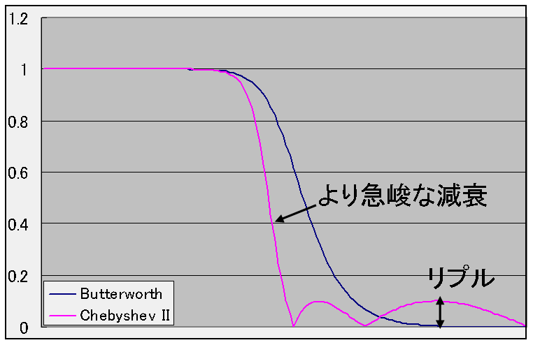
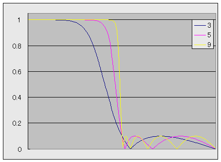
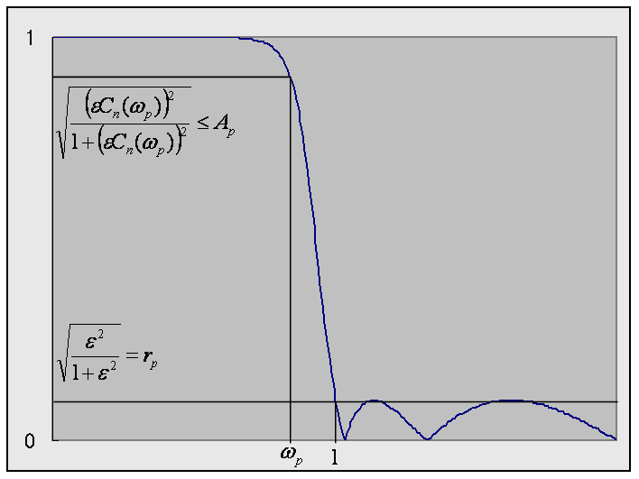
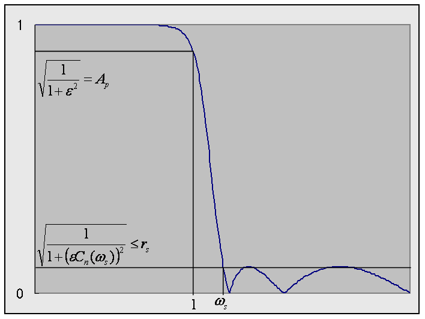

# 逆チェビシェフフィルタ

##  概要

<strong id="chebyshev2" class="keyword">逆チェビシェフフィルタ</strong>（inverse Chebyshev filter）は、
「[チェビシェフフィルタ](chebyshev.md#chebyshev)」とは逆で、
阻止域で等リプルとなるようなローパスフィルタです。
 
チェビシェフフィルタのことをチェビシェフI型フィルタ、
逆チェビシェフフィルタのことをチェビシェフII型フィルタと呼ぶこともあります。

<figure>

<figcaption>阻止域に等リプル</figcaption>
</figure>

##  周波数特性

チェビシェフ特性は以下のような特徴を持っていました。

      |H(ω)|
      2
＝
<table class="frac" summary="fraction"><tr><td class="num">1</td></tr><tr><td>1 ＋ (ε Cn(ω))2</td></tr></table>

このチェビシェフ多項式およびチェビシェフ特性の要点をまとめると、表1のようになります。

<table summary="チェビシェフ特性の要点">
	<caption>
		チェビシェフ特性の要点
	</caption>
	<tr>
		<td markdown="1"></td>
		<td markdown="1">Cn(ω)</td>
		<td markdown="1">
            |H(ω)|
            2
          </td>
	</tr>
	<tr>
		<td markdown="1">ω ≦ 1のとき</td>
		<td markdown="1">n個の零点を持っていて、－1 ～ 1の間で振動</td>
		<td markdown="1">1 ～ <table class="frac" summary="fraction"><tr><td class="num">1</td></tr><tr><td>1 ＋ ε2</td></tr></table>の間で振動</td>
	</tr>
	<tr>
		<td markdown="1">ω ＞ 1のとき</td>
		<td markdown="1">急激に単調増加</td>
		<td markdown="1">急激に単調減少</td>
	</tr>
</table>

チェビシェフ特性に対して、
ε Cn(ω)
を
1 / (ε Cn(1/ω))
で置き換えた物が逆チェビシェフ特性です。

      |HI(ω)|
      2
＝
<table class="frac" summary="fraction"><tr><td class="num">1</td></tr><tr><td>1 ＋ (1 / (ε Cn(1/ω)))2</td></tr></table>
＝
<table class="frac" summary="fraction"><tr><td class="num">(ε Cn(1/ω))2</td></tr><tr><td>1 ＋ (ε Cn(1/ω))2</td></tr></table>

1 / (ε Cn(1/ω))
および逆チェビシェフ特性の要点は表2のようになります。

<table summary="逆チェビシェフ特性の要点">
	<caption>
		逆チェビシェフ特性の要点
	</caption>
	<tr>
		<td markdown="1"></td>
		<td markdown="1">1 / (Cn(ω))</td>
		<td markdown="1">
            |HI(ω)|
            2
          </td>
	</tr>
	<tr>
		<td markdown="1">ω ≦ 1のとき</td>
		<td markdown="1">緩やかに単調増加</td>
		<td markdown="1">緩やかに単調減少(1に近い値)</td>
	</tr>
	<tr>
		<td markdown="1">ω ＞ 1のとき</td>
		<td markdown="1">n個の極を持っていて、 絶対値が1 ～ ∞の間で振動</td>
		<td markdown="1">0 ～ <table class="frac" summary="fraction"><tr><td class="num">1</td></tr><tr><td>1 ＋ 1/ε2</td></tr></table>の間で振動</td>
	</tr>
</table>

ちなみに、
チェビシェフ特性を HC、
逆チェビシェフ特性を HI とすると、
両者の間には、
|HI(ω)|2
＝
1
－
|HC(1/ω)|2
という関係が成り立ちます。
すなわち、
「逆チェビシェフ特性(ローパス) ＝ 1 － チェビシェフ特性(ハイパス)」となっています。

逆チェビシェフ特性を持つようなフィルタを<em>逆チェビシェフフィルタ</em>と呼びます。
チェビシェフフィルタおよび逆チェビシェフフィルタは、
それぞれチェビシェフI型(Chebyshev type I)フィルタ、
チェビシェフII型(Chebyshev type II)フィルタと呼ぶこともあります。
 
以下の図に、例として、3次、5次、9次の逆チェビシェフフィルタの振幅特性を示します。
この例では、リプル幅は 0.1 で設計しています。

<figure>

<figcaption>3～9次のチェビシェフフィルタの周波数特性</figcaption>
</figure>

##  アナログプロトタイプの設計（阻止域周波数固定型）

###  零極配置

逆チェビシェフフィルタの極は、
チェビシェフフィルタの極の逆数になっています。
 
また、逆チェビシェフフィルタの零点は、

CN(<table class="frac" summary="fraction"><tr><td class="num">1</td></tr><tr><td>ω</td></tr></table>) ＝ 0

の解となります。
この解は、

        <table class="frac" summary="fraction"><tr><td class="num">1</td></tr><tr><td>ω</td></tr></table>
＝
cos<table class="frac" summary="fraction"><tr><td class="num">2k ＋ 1</td></tr><tr><td>2n</td></tr></table>
π

となります。
ラプラス変数 s ＝ i ω で表すと、
伝達関数の零点 s は以下のようになります。
<em>
        

          <table class="frac" summary="fraction"><tr><td class="num">1</td></tr><tr><td>s</td></tr></table>
＝
± i
sin<table class="frac" summary="fraction"><tr><td class="num">n － 2k － 1</td></tr><tr><td>2n</td></tr></table>
π

      </em>
ただし、kは0～(n－1) / 2までの整数です。

###  アナログプロトタイプ伝達関数

決定された極配置から、チェビシェフフィルタの伝達関数H(s)は以下のようになります。

H(s)
＝
<table class="sigma" summary="product"><tr><td class="sigmasub"><table class="frac" summary="fraction"><tr><td class="num">n</td></tr><tr><td>2</td></tr></table> － 1</td></tr><tr><td class="sigma">∏</td></tr><tr><td class="sigmasub">k＝0</td></tr></table><table class="frac" summary="fraction"><tr><td class="num">γk s2 ＋ 1</td></tr><tr><td>βk s2 ＋ αk s ＋ 1</td></tr></table>
　　　（nが偶数のとき）

H(s)
＝
<table class="frac" summary="fraction"><tr><td class="num">1</td></tr><tr><td>β s ＋ 1</td></tr></table><table class="sigma" summary="product"><tr><td class="sigmasub"><table class="frac" summary="fraction"><tr><td class="num">n－1</td></tr><tr><td>2</td></tr></table></td></tr><tr><td class="sigma">∏</td></tr><tr><td class="sigmasub">k＝0</td></tr></table><table class="frac" summary="fraction"><tr><td class="num">γk s2 ＋ 1</td></tr><tr><td>βk s2 ＋ αk s ＋ 1</td></tr></table>
　　　（nが奇数のとき）

ただし、αk, βk, γk は以下の式で表される値です。
（αk, βk は（I 型）チェビシェフフィルタのものと同じ。）

β
＝
sinh v
＝
sinh<table class="frac" summary="fraction"><tr><td class="num">1</td></tr><tr><td>n</td></tr></table>sinh－1(<table class="frac" summary="fraction"><tr><td class="num">1</td></tr><tr><td>ε</td></tr></table>)
＝
<table class="frac" summary="fraction"><tr><td class="num">t2 － 1</td></tr><tr><td>2 t</td></tr></table>
,
t ＝ (<table class="frac" summary="fraction"><tr><td class="num">1＋(ε2 ＋ 1)1/2</td></tr><tr><td>ε</td></tr></table>)1/n

αk
＝
2 β
cos(<table class="frac" summary="fraction"><tr><td class="num">n － 2 k － 1</td></tr><tr><td>2 n</td></tr></table>π)

βk
＝
β<table class="subsup" summary="sub / sup"><tr><td>2</td></tr><tr><td style="font-size:30%;"> </td></tr><tr><td></td></tr></table>
＋
sin2(<table class="frac" summary="fraction"><tr><td class="num">n － 2 k － 1</td></tr><tr><td>2 n</td></tr></table>π)

γk
＝
sin2(<table class="frac" summary="fraction"><tr><td class="num">n － 2 k － 1</td></tr><tr><td>2 n</td></tr></table>π)

###  設計仕様

透過域/阻止域の周波数/リプル
（Ap, rs, ωp）
を仕様として与えたとき、
仕様を満たす最小の次数 N とパラメータ ε を求める方法について説明します。
（ωs は 1 で固定。）

<figure>

<figcaption>逆チェビシェフフィルタの設計仕様1</figcaption>
</figure>

まず、阻止域リプルから ε を決定します。
図4に示すように、
<table class="frac" summary="fraction"><tr><td class="num">
ε2</td></tr><tr><td>
1 ＋ ε2</td></tr></table>
＝
rs2
なので、
<em>
        

ε
＝
√<table class="frac" summary="fraction"><tr><td class="num">rs2</td></tr><tr><td>
1
－
rs2</td></tr></table>

      </em>
が得られます。
 
また、
<table class="frac" summary="fraction"><tr><td class="num">
ε CN(1 / ωp)2</td></tr><tr><td>
1
＋
(
ε CN(1 / ωp)2)</td></tr></table>
≦
Ap2
より、

CN(1 / ωp)
≧
<table class="frac" summary="fraction"><tr><td class="num">1</td></tr><tr><td>ε</td></tr></table>√<table class="frac" summary="fraction"><tr><td class="num">
  Ap2</td></tr><tr><td>
  1
  －
  Ap2</td></tr></table>
が得られます。
これに、チェビシェフ多項式の定義

Cn(x)
＝
cos(n cos－1 x)
を代入することで、
<em>
        

N
≧
<table class="frac" summary="fraction"><tr><td class="num">cosh－1<table class="frac" summary="fraction"><tr><td class="num">1</td></tr><tr><td>ε</td></tr></table>√<table class="frac" summary="fraction"><tr><td class="num">
  Ap2</td></tr><tr><td>
  1
  －
  Ap2</td></tr></table></td></tr><tr><td>cosh－1
  1 / ωp</td></tr></table>

      </em>
が得られます。
この式を満たすような最小の N を選びます。

##  アナログプロトタイプの設計（透過域周波数固定型）

「[アナログプロトタイプの設計（阻止域周波数固定型）](#analog)」で説明した伝達関数では、
阻止域周波数が 1 で固定になります。
透過域周波数の方を固定にして設計するために、
<table class="frac" summary="fraction"><tr><td class="num">(ε Cn(1/ω))2</td></tr><tr><td>1 ＋ (ε Cn(1/ω))2</td></tr></table>
という伝達関数の代わりに、

      |HI(ω)|
      2
＝
<table class="frac" summary="fraction"><tr><td class="num">(Cn(ωs/ω))2</td></tr><tr><td>(Cn(ωs/ω))2
 ＋
 (ε Cn(ωs))2</td></tr></table>

という式を使う手法もあります。

###  零極配置

阻止域周波数固定型の「[零極配置](#zp)」を元に、
ε および零点・極を以下のように置き換えます。

ε
→
<table class="frac" summary="fraction"><tr><td class="num">1</td></tr><tr><td>ε Cn(ωs)</td></tr></table>
零点・極
→
<table class="frac" summary="fraction"><tr><td class="num">1</td></tr><tr><td>ωs</td></tr></table>
倍する

###  アナログプロトタイプ伝達関数

阻止域周波数固定型の「[アナログプロトタイプ伝達関数](#aptf)」を元に、
αk, βk, γk を以下のように置き換えます。

αk, β
→
<table class="frac" summary="fraction"><tr><td class="num">1</td></tr><tr><td>ωs</td></tr></table>
倍する

βk, γk
→
<table class="frac" summary="fraction"><tr><td class="num">1</td></tr><tr><td>ωs2</td></tr></table>
倍する

###  設計仕様

透過域/阻止域の周波数/リプル
（Ap, rs, ωs）
を仕様として与えたとき、
仕様を満たす最小の次数 N とパラメータ ε を求める方法について説明します。
（ωp は 1 で固定。）

<figure>

<figcaption>逆チェビシェフフィルタの設計仕様2</figcaption>
</figure>

図4より、
透過域周波数固定型の逆チェビシェフフィルタの設計仕様は、
（I型）チェビシェフフィルタの設計仕様（「[設計仕様](chebyshev.md#spec)」参照）と同じになります。
すなわち、
ε は、
<em>
        

ε
＝
√<table class="frac" summary="fraction"><tr><td class="num">1</td></tr><tr><td>Ap2</td></tr></table>
－
1

      </em>
となり、
N は、
<em>
        

N
≧
<table class="frac" summary="fraction"><tr><td class="num">cosh－1<table class="frac" summary="fraction"><tr><td class="num">√<table class="frac" summary="fraction"><tr><td class="num">1</td></tr><tr><td>rs2</td></tr></table> － 1
  </td></tr><tr><td>
  ε
 </td></tr></table></td></tr><tr><td>cosh－1
  ωs</td></tr></table>

      </em>
を満たすような最小のものを選びます。
