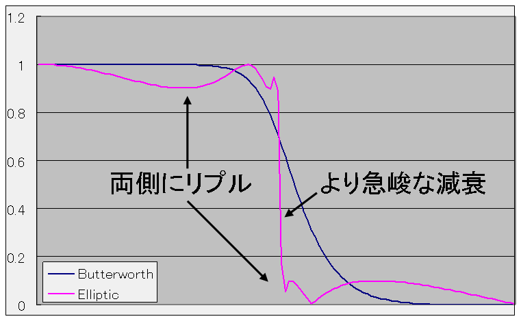
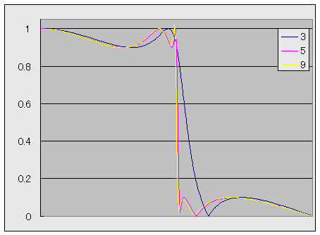
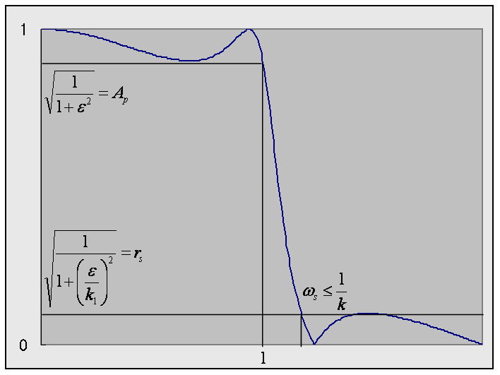

# 楕円フィルタ

## 概要
「[チェビシェフフィルタ](chebyshev.md#chebyshev)」や「[逆チェビシェフフィルタ](chebyshev2.md#chebyshev2)」は、
通過域または阻止域のどちらか一方で等リプルとなるようすることで、
「[バターワースフィルタ](butterworth.md#butterworth)」よりも急峻なカットオフ特性を得ていました。
 
それに対して、
通過域と阻止域の両方で等リプルとなるようにすることで、
より急峻なカットオフ特性を得ようという考え方の基に作られたのが
<strong id="elliptic" class="keyword">楕円フィルタ</strong>（elliptic filter）です。
 
このような特性を持ったフィルタを設計するためには、
楕円関数の知識を要するので、楕円フィルタという名前で呼ばれています。
また、楕円フィルタは、
チェビシェフ特性と逆チェビシェフ特性の考え方を連立して考えるという意味で、
連立チェビシェフフィルタと呼ばれることや、
考案者の名前を取って、Cauerフィルタと呼ばれることもあります。

<figure>
	
	<figcaption>透過域と阻止域の両方にリプル</figcaption>
</figure>

## 基本アイディア
チェビシェフ多項式 Cn(ω) や、
その逆 1 / Cn(1/ω) の代わりに、
表1に示すような特徴を持つn次有理式 Rn, k1(ω) を考えます。

<table summary="チェビシェフ多項式の拡張">
	<caption>
		チェビシェフ多項式の拡張
	</caption>
	<tr>
		<td markdown="1"></td>
		<td markdown="1">Cn(ω)</td>
		<td markdown="1">1 / Cn(1/ω)</td>
		<td markdown="1">Rn, k1(ω)</td>
	</tr>
	<tr>
		<td markdown="1">ω ≦ 1のとき</td>
		<td markdown="1">n個の零点を持っていて、－1 ～ 1の間で振動</td>
		<td markdown="1">緩やかに単調増加</td>
		<td markdown="1">n個の零点を持っていて、－1 ～ 1の間で振動</td>
	</tr>
	<tr>
		<td markdown="1">ω ＞ 1のとき</td>
		<td markdown="1">急激に単調増加</td>
		<td markdown="1">n個の極を持っていて、 絶対値が1 ～ ∞の間で振動</td>
		<td markdown="1">n個の極を持っていて、 絶対値が1/k1 ～ ∞の間で振動 （k1は定数）</td>
	</tr>
</table>

このような有理式 Rn, k1(ω) を使って、
以下のような周波数特性を作ってやれば、
通過域と阻止域の両方で等リプルとなるよな特性が得られます。

      |HE(ω)|
      2
＝
<table class="frac" summary="fraction"><tr><td class="num">1</td></tr><tr><td>1 ＋ (ε Rn, k1(ω))2</td></tr></table>

このようにして得られる周波数特性を<em>楕円特性</em>と呼び、
楕円特性 HE(ω) は、
チェビシェフ特性 HC(ω) や逆チェビシェフ特性 HI(ω) と比べると、表2に示すような特性になります。

<table summary="楕円特性の要点">
	<caption>
		楕円特性の要点
	</caption>
	<tr>
		<td markdown="1"></td>
		<td markdown="1">チェビシェフ特性HC(ω)</td>
		<td markdown="1">逆チェビシェフ特性HI(ω)</td>
		<td markdown="1">楕円特性HE(ω)</td>
	</tr>
	<tr>
		<td markdown="1">ω ≦ 1のとき</td>
		<td markdown="1">1 ～ <table class="frac" summary="fraction"><tr><td class="num">1</td></tr><tr><td>1 ＋ ε2</td></tr></table>の間で振動</td>
		<td markdown="1">緩やかに単調減少(1に近い値)</td>
		<td markdown="1">1 ～ <table class="frac" summary="fraction"><tr><td class="num">1</td></tr><tr><td>1 ＋ ε2</td></tr></table>の間で振動</td>
	</tr>
	<tr>
		<td markdown="1">ω ＞ 1のとき</td>
		<td markdown="1">急激に単調減少</td>
		<td markdown="1">0 ～ <table class="frac" summary="fraction"><tr><td class="num">1</td></tr><tr><td>1 ＋ 1/ε2</td></tr></table>の間で振動</td>
		<td markdown="1">0 ～ <table class="frac" summary="fraction"><tr><td class="num">1</td></tr><tr><td>1 ＋ (ε/k1)2</td></tr></table>の間で振動</td>
	</tr>
</table>

楕円フィルタの発想は極めて単純ですが、
上述のような特長を持つ有理式 Rn, k1(ω) をどのようにして作るかが問題となります。
このような有理式の作り方を次節で説明します。

## チェビシェフ有理関数
以下のようにして有理式 Rn, k1(x) を定義することで、
「[基本アイディア](#idea)」で述べたような特徴を持つ有利式が得られ、
この有理式を「[チェビシェフ有理関数](ellipticrational.md#elliptic_rational)」 と呼びます。

Rn, k1(x)
＝
cd(<table class="frac" summary="fraction"><tr><td class="num">n K1</td></tr><tr><td>K</td></tr></table>cd－1(
  x,
  k
 )
 ,
 k1)

チェビシェフ有理関数は一見すると複雑に見えますが、
n個の零点とn個の極を持ち、
以下のようなn次の有理式で表すことが出来ます。

      Rn, k1(x)
＝
x
<table class="sigma" summary="product"><tr><td class="sigmasub">(n － 1) / 2</td></tr><tr><td class="sigma">∏</td></tr><tr><td class="sigmasub">m ＝ 0</td></tr></table><table class="frac" summary="fraction"><tr><td class="num">k2 ωm, n2 － 1</td></tr><tr><td>1 － ωm, n2</td></tr></table><table class="frac" summary="fraction"><tr><td class="num">x2 － ωm, n2</td></tr><tr><td>k2 ωm, n2 x2 － 1</td></tr></table>
　　　… n が奇数のとき

      Rn, k1(x)
＝
<table class="sigma" summary="product"><tr><td class="sigmasub">n / 2</td></tr><tr><td class="sigma">∏</td></tr><tr><td class="sigmasub">m ＝ 0</td></tr></table><table class="frac" summary="fraction"><tr><td class="num">k2 ωm, n2 － 1</td></tr><tr><td>1 － ωm, n2</td></tr></table><table class="frac" summary="fraction"><tr><td class="num">x2 － ωm, n2</td></tr><tr><td>k2 ωm, n2 x2 － 1</td></tr></table>
　　　… n が偶数のとき

ただし、

ωm, n ＝
sn(<table class="frac" summary="fraction"><tr><td class="num">n － 2m － 1</td></tr><tr><td>n</td></tr></table>K,
  k
)
です。
 
チェビシェフ有理関数の詳細について説明すると長くなりますので、
別項 「[チェビシェフ有理関数](ellipticrational.md#abstract)」 で説明します。
上式中の k, k1 などのパラメータの意味についても
「[チェビシェフ有理関数](ellipticrational.md#abstract)」 を参照してください。

## 周波数特性
以下の図に、例として、3次、5次、9次の楕円フィルタの振幅特性を示します。
この例では、リプル幅は 0.1 で設計しています。

<figure>
	
	<figcaption>3～9次の楕円フィルタの周波数特性</figcaption>
</figure>

## アナログプロトタイプの設計
### 零点配置
Rn, k1(ω) の極が
HE(ω) の零点になります。
cd(u, k) の極は
(2 m ＋ 1) K ＋ i K1' なので、
Rn, k1(ω) の極は、

        <table class="frac" summary="fraction"><tr><td class="num">n K1</td></tr><tr><td>K</td></tr></table>
        cd
        －1
        (ω, k)
＝
(2 m ＋ 1) K1 ＋ i K1'
　　　
（m は任意の自然数。）

の解になります。
これを解くことにより、

        cd
        －1
        (ω, k)
＝
<table class="frac" summary="fraction"><tr><td class="num">2 m ＋ 1</td></tr><tr><td>n</td></tr></table> K
＋ i K'

ω
＝
cd(<table class="frac" summary="fraction"><tr><td class="num">2 m ＋ 1</td></tr><tr><td>n</td></tr></table> K
＋ i K'
, k
)
＝
<table class="frac" summary="fraction"><tr><td class="num">1</td></tr><tr><td>
k
cd(<table class="frac" summary="fraction"><tr><td class="num">2 m ＋ 1</td></tr><tr><td>n</td></tr></table> K
, k
)</td></tr></table>

が得られます。
ラプラス変数 s ＝ i ω で表すと、
伝達関数の零点 s は以下のようになります。
<em>
        

s
＝
± i
<table class="frac" summary="fraction"><tr><td class="num">1</td></tr><tr><td>
k
sn(<table class="frac" summary="fraction"><tr><td class="num">n － 2 m － 1</td></tr><tr><td>n</td></tr></table> K
, k
)</td></tr></table>

      </em>
ただし、kは0～(n－1) / 2までの整数です。

### 極配置
HE(ω) の極は、

Rn, k1(ω)
＝
cd(<table class="frac" summary="fraction"><tr><td class="num">n K1</td></tr><tr><td>K</td></tr></table>cd－1(
  ω,
  k
 )
 ,
 k1)
＝
±i <table class="frac" summary="fraction"><tr><td class="num">1</td></tr><tr><td>ε</td></tr></table>

を解くことで得られます。
cd－1(ω, k)
＝
u ＋ i v

と置くと、

        cd
        (
          <table class="frac" summary="fraction"><tr><td class="num">n K1</td></tr><tr><td>K</td></tr></table>
          (u ＋ i v)
 ,
 k1)
＝
±i <table class="frac" summary="fraction"><tr><td class="num">1</td></tr><tr><td>ε</td></tr></table>

となります。
ここで、

sn ＝
sn(<table class="frac" summary="fraction"><tr><td class="num">n K1</td></tr><tr><td>K</td></tr></table> u － K1 , k1),
　
sn' ＝
sn(<table class="frac" summary="fraction"><tr><td class="num">n K1</td></tr><tr><td>K</td></tr></table> v , k1'
)
などと置くと、ヤコビの楕円関数の加法定理より、

        <table class="frac" summary="fraction"><tr><td class="num">
sn dn' + i cn dn sn' cn'
</td></tr><tr><td>
cn'2 ＋ k12 sn2 sn'2</td></tr></table>
＝
±i <table class="frac" summary="fraction"><tr><td class="num">1</td></tr><tr><td>ε</td></tr></table>

となります。
右辺の実部が0、かつ、
dn' は常に非0なので、

sn ＝
sn(<table class="frac" summary="fraction"><tr><td class="num">n K1</td></tr><tr><td>K</td></tr></table> u － K1 , k1)
＝
0

が得られ、したがって、

        <table class="frac" summary="fraction"><tr><td class="num">n K1</td></tr><tr><td>K</td></tr></table> u － K1
＝
2 m K1
　　　
（m は任意の自然数。）

∴
u
＝
<table class="frac" summary="fraction"><tr><td class="num">2 m ＋ 1</td></tr><tr><td>n</td></tr></table> K

が得られます。
このとき、cn ＝ dn ＝ 0 なので、

        <table class="frac" summary="fraction"><tr><td class="num">
sn' cn'
</td></tr><tr><td>
cn'2</td></tr></table>
＝
<table class="frac" summary="fraction"><tr><td class="num">
sn'
</td></tr><tr><td>
cn'
</td></tr></table>
＝
±<table class="frac" summary="fraction"><tr><td class="num">1</td></tr><tr><td>ε</td></tr></table>

よって、

        <table class="frac" summary="fraction"><tr><td class="num">n K1</td></tr><tr><td>K</td></tr></table> v
＝
±sc(<table class="frac" summary="fraction"><tr><td class="num">1</td></tr><tr><td>ε</td></tr></table>)

∴
v
＝
±
<table class="frac" summary="fraction"><tr><td class="num">K</td></tr><tr><td>n K1</td></tr></table>sc－1(<table class="frac" summary="fraction"><tr><td class="num">1</td></tr><tr><td>ε</td></tr></table>)

これらの結果をら、
cd－1(ω, k)
＝
u ＋ i v

に代入することで、解 ω が得られます。

sn ＝
sn(u, k),
　
sn' ＝
sn(v, k'),

などと置くと、

ω
＝
<table class="frac" summary="fraction"><tr><td class="num">
sn dn' ± i cn dn sn' cn'
</td></tr><tr><td>
1 － dn2 sn'2</td></tr></table>

となります。
この中から安定極のみを選ぶことで、伝達関数の極 s は以下のようになります
<em>
        

s
＝
<table class="frac" summary="fraction"><tr><td class="num">
－ cn dn sn' cn'
± i sn dn'
</td></tr><tr><td>
1 － dn2 sn'2</td></tr></table>

      </em>

sn
＝
sn(<table class="frac" summary="fraction"><tr><td class="num">n － 2m － 1</td></tr><tr><td>n</td></tr></table>
K
,
k
)
　　　
（cn, dn も同様）

sn'
＝
sn(<table class="frac" summary="fraction"><tr><td class="num">K</td></tr><tr><td>n K1</td></tr></table>sc－1(<table class="frac" summary="fraction"><tr><td class="num">1</td></tr><tr><td>ε</td></tr></table>)
,
k'
)
　　　
（cn', dn' も同様）

ただし、kは0～(n－1) / 2までの整数です。

### 設計仕様
透過域/阻止域の周波数/リプル
（Ap, rs, ωs）
を仕様として与えたとき、
仕様を満たす最小の次数 N とパラメータ ε, k1 を求める方法について説明します。
（ωp は 1 で固定。）

<figure>
	
	<figcaption>楕円フィルタの設計仕様</figcaption>
</figure>

まず、透過域リプルから ε を決定します。
図4に示すように、
<table class="frac" summary="fraction"><tr><td class="num">1</td></tr><tr><td>
1 ＋ ε2</td></tr></table>
＝
Ap2
なので、
<em>
        

ε
＝
√<table class="frac" summary="fraction"><tr><td class="num">1</td></tr><tr><td>Ap2</td></tr></table>
－
1

      </em>
が得られます。
 
次に、阻止域リプルから k1 を決定します。
<table class="frac" summary="fraction"><tr><td class="num">1</td></tr><tr><td>
1 ＋
<table class="frac" summary="fraction"><tr><td class="num">
ε2</td></tr><tr><td>
k12</td></tr></table></td></tr></table>
＝
rs2
なので、
<em>
        

k1
＝
<table class="frac" summary="fraction"><tr><td class="num">ε</td></tr><tr><td>√<table class="frac" summary="fraction"><tr><td class="num">1</td></tr><tr><td>
rs2</td></tr></table>
－
1
</td></tr></table>

      </em>
が得られます。
 
また、
ωs ≦ <table class="frac" summary="fraction"><tr><td class="num">1</td></tr><tr><td>k</td></tr></table>
および
楕円積分の性質
（K(x) は単調増加、
K' (x) は単調減少）を用いると、
<em>
        

N
＝
<table class="frac" summary="fraction"><tr><td class="num">K1' K</td></tr><tr><td>K1 K'</td></tr></table>
≧
<table class="frac" summary="fraction"><tr><td class="num">K1' K(1/ωs)</td></tr><tr><td>K1 K' (1/ωs)</td></tr></table>

      </em>
となり、
この式を満たすような最小の N を選びます。
 
そして最後に、

N
＝
<table class="frac" summary="fraction"><tr><td class="num">K1' K</td></tr><tr><td>K1 K'</td></tr></table>
となるような k を求めます。
