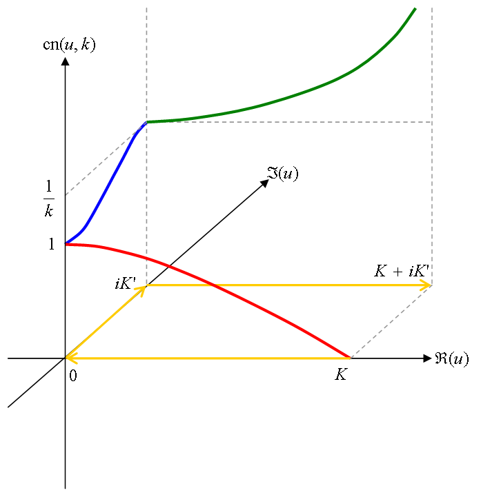
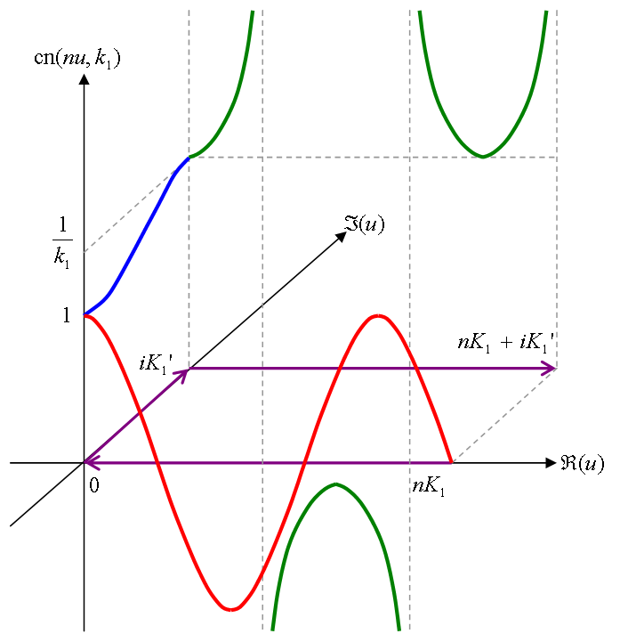
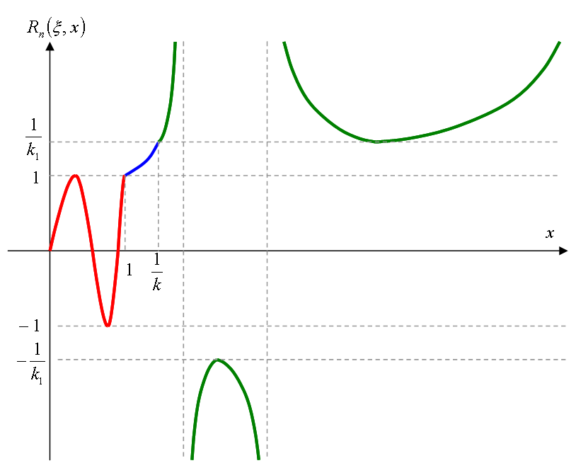

# チェビシェフ有理関数

## <a id="sec-generated-title-1"></a> <a id="abstract"></a>チェビシェフ有理関数

「[ヤコビの楕円関数](../../math/elliptic/jacobi.md#jacobi)」<span class="math"><span class="normal">cd</span><span class="paren" style="font-size:em;">(</span>x, k<span class="paren" style="font-size:em;">)</span></span> を用いて、
以下のように定義される関数を<strong id="elliptic_rational" class="keyword">チェビシェフ有理関数</strong>（elliptic rational function）という。
<div class="math">
R<sub>n, k<sub>1</sub></sub><span class="paren" style="font-size:em;">(</span>x<span class="paren" style="font-size:em;">)</span>
＝
<span class="normal">cd</span><span class="paren" style="font-size:2em;">(</span><table class="frac" summary="fraction"><tr><td class="num">n K<sub>1</sub></td></tr><tr><td>K</td></tr></table><span class="normal">cd</span><sup>－1</sup><span class="paren" style="font-size:em;">(</span>
  x,
  k
 <span class="paren" style="font-size:em;">)</span>
 ,
 k<sub>1</sub><span class="paren" style="font-size:2em;">)</span></div><div class="math">
k<sub>1</sub>' ＝ <span class="normal" style="font-size:em;">√</span><span class="bar">1 － k<sub>1</sub><sup>2</sup></span></div><div class="math">
K<sub>1</sub> ＝ K<span class="paren" style="font-size:em;">(</span>k<sub>1</sub><span class="paren" style="font-size:em;">)</span>, 　
K<sub>1</sub>' ＝ K<span class="paren" style="font-size:em;">(</span>k<sub>1</sub>'<span class="paren" style="font-size:em;">)</span></div><div class="math">
K ＝ K<span class="paren" style="font-size:em;">(</span>k<span class="paren" style="font-size:em;">)</span>, 　
K' ＝ K<span class="paren" style="font-size:em;">(</span>k'<span class="paren" style="font-size:em;">)</span></div><span class="math">k</span> は、<span class="math"><table class="frac" summary="fraction"><tr><td class="num">K K<sub>1</sub>'</td></tr><tr><td>K<sub>1</sub> K'</td></tr></table> ＝ n</span> を満たすように選ぶ（<span class="math">k' ＝ <span class="normal" style="font-size:em;">√</span><span class="bar">1 － k<sup>2</sup></span></span>）。
ただし、<span class="math">K<span class="paren" style="font-size:em;">(</span>k<span class="paren" style="font-size:em;">)</span></span> は第1種完全楕円積分である。

* チェビシェフ多項式を有理式に拡張したようなもの。

* <span class="math">k<sub>1</sub>→0</span>のとき、「[チェビシェフ多項式](chebyshev.md#chebyshev-poly)」に。

* 区間<span class="math"><span class="paren" style="font-size:em;">[</span>0, 1<span class="paren" style="font-size:em;">]</span></span>で<span class="math"><span class="normal">|</span>R<sub>n, k<sub>1</sub></sub><span class="paren" style="font-size:em;">(</span>x<span class="paren" style="font-size:em;">)</span><span class="normal">|</span> ＜ 1</span>

* 区間<span class="math"><span class="paren" style="font-size:em;">[</span>1, 1/k<sub>1</sub><span class="paren" style="font-size:em;">]</span></span>で単調増加

* 区間<span class="math"><span class="paren" style="font-size:em;">[</span>1/k<sub>1</sub>, ∞<span class="paren" style="font-size:em;">]</span></span>で<span class="math"><span class="normal">|</span>R<sub>n, k<sub>1</sub></sub><span class="paren" style="font-size:em;">(</span>x<span class="paren" style="font-size:em;">)</span><span class="normal">|</span> ＞ 1/k<sub>1</sub></span>


数値計算上、<span class="math">k</span> は
<span class="math">
k
＝
q<sup>－1</sup><span class="paren" style="font-size:2em;">(</span>
exp
<span class="paren" style="font-size:1.5em;">(</span>
－
<table class="frac" summary="fraction"><tr><td class="num">π K<sub>1</sub></td></tr><tr><td>n K<sub>1</sub>'</td></tr></table><span class="paren" style="font-size:1.5em;">)</span><span class="paren" style="font-size:2em;">)</span></span>
で求める。
（<span class="math">q<span class="paren" style="font-size:em;">(</span>k<span class="paren" style="font-size:em;">)</span></span> は Jacobi のテータ関数のノーム。）


## <a id="sec-generated-title-2"></a> <a id="plan"></a>執筆予定

ヤコビの楕円関数の詳細は
「[ヤコビの楕円関数](../../math/elliptic/jacobi.md#abstract)」 
参照。
```text
関数のグラフ。
↑の導出の過程。
零点と極 → 有理式で表す。
```

## <a id="sec-generated-title-3"></a> <a id="memo"></a>メモ

### <a id="sec-generated-title-4"></a> <a id="d39e202"></a>基本概念

複素平面状に以下のような経路
<span class="math">C ＝ C<sub>1</sub> ＋ C<sub>2</sub> ＋ C<sub>3</sub></span>
を考える。

* まず、実軸上を<span class="math">K</span>→<span class="math">0</span>と進む（<span class="math">C<sub>1</sub></span>）。

* 次に、虚軸上を<span class="math">0</span>→<span class="math">i K'</span>と進む（<span class="math">C<sub>2</sub></span>）。

* 最後に、<span class="math"><span class="script">Im</span><span class="paren" style="font-size:em;">(</span>u<span class="paren" style="font-size:em;">)</span> ＝ i K'</span>上を<span class="math">i K'</span>→<span class="math">K ＋ i K'</span>と進む（<span class="math">C<sub>3</sub></span>）。


経路 <span class="math">C</span> 上での <span class="math"><span class="normal">cd</span><span class="paren" style="font-size:em;">(</span>u, k<span class="paren" style="font-size:em;">)</span></span> の値の変化の仕方を表1に、値を3次元的にグラフ化したものを図1に示す。
図1中では、
経路 <span class="math">C</span> をオレンジ色、
<span class="math">C<sub>1</sub></span> 上での値を赤色、
<span class="math">C<sub>2</sub></span> 上での値を青色、
<span class="math">C<sub>3</sub></span> 上での値を緑色の線で表す。

<table summary="cn(u, k)の値の変化の仕方">
	<caption>
		cn(u, k)の値の変化の仕方
	</caption>
	<tr>
		<th>経路</th>
		<th>式変形</th>
		<th>値の変化の仕方</th>
	</tr>
	<tr>
		<td markdown="1"><span class="math">C<sub>1</sub></span>（<span class="math">K</span>→<span class="math">0</span>）</td>
		<td markdown="1"><span class="math"><span class="normal">cd</span><span class="paren" style="font-size:em;">(</span>K － u, k<span class="paren" style="font-size:em;">)</span>
＝
<span class="normal">sn</span><span class="paren" style="font-size:em;">(</span>u, k<span class="paren" style="font-size:em;">)</span></span></td>
		<td markdown="1"><span class="math">0</span>→<span class="math">1</span>の間で単調増加。</td>
	</tr>
	<tr>
		<td markdown="1"><span class="math">C<sub>2</sub></span>（<span class="math">0</span>→<span class="math">i K'</span>）</td>
		<td markdown="1"><span class="math"><span class="normal">cd</span><span class="paren" style="font-size:em;">(</span>i u, k<span class="paren" style="font-size:em;">)</span>
＝
<table class="frac" summary="fraction"><tr><td class="num"><span class="normal">1</span></td></tr><tr><td><span class="normal">dn</span><span class="paren" style="font-size:em;">(</span>u, k'<span class="paren" style="font-size:em;">)</span></td></tr></table></span></td>
		<td markdown="1"><span class="math">1</span>→<span class="math"><table class="frac" summary="fraction"><tr><td class="num"><span class="normal">1</span></td></tr><tr><td>k</td></tr></table></span>の間で単調増加。</td>
	</tr>
	<tr>
		<td markdown="1"><span class="math">C<sub>3</sub></span>（<span class="math">i K'</span>→<span class="math">K ＋ i K'</span>）</td>
		<td markdown="1"><span class="math"><span class="normal">cd</span><span class="paren" style="font-size:em;">(</span>u ＋ i K', k<span class="paren" style="font-size:em;">)</span>
＝
<table class="frac" summary="fraction"><tr><td class="num"><span class="normal">1</span></td></tr><tr><td>
k
<span class="normal">cd</span><span class="paren" style="font-size:em;">(</span>u, k<span class="paren" style="font-size:em;">)</span></td></tr></table></span></td>
		<td markdown="1"><span class="math"><table class="frac" summary="fraction"><tr><td class="num"><span class="normal">1</span></td></tr><tr><td>k</td></tr></table></span>→<span class="math">∞</span>の間で単調増加。</td>
	</tr>
</table>


<figure>
	[](../../../../assets/media/ufcpp2000/sp/rational01.png)
	<figcaption>cn(u, k) の C 上での値</figcaption>
</figure>

<span class="math"><span class="normal">cd</span><span class="paren" style="font-size:em;">(</span>u, k<span class="paren" style="font-size:em;">)</span></span> は <span class="math">C</span> 上で単調増加 → 
<span class="math"><span class="normal">cd</span></span> の逆関数
<span class="math"><span class="normal">cd</span><sup>－1</sup><span class="paren" style="font-size:em;">(</span>x, k<span class="paren" style="font-size:em;">)</span></span> の実軸上での値は経路 <span class="math">C</span> に。
 
次に、経路 <span class="math">C</span> に定数 <span class="math"><table class="frac" summary="fraction"><tr><td class="num">n K<sub>1</sub></td></tr><tr><td>K</td></tr></table></span> を掛けた経路
<span class="math">D ＝ D<sub>1</sub> ＋ D<sub>2</sub> ＋ D<sub>3</sub></span>
を考える。

* <span class="math">D<sub>1</sub> ＝ <table class="frac" summary="fraction"><tr><td class="num">n K<sub>1</sub></td></tr><tr><td>K</td></tr></table> C<sub>1</sub></span>… 実軸上を<span class="math">n K<sub>1</sub></span>→<span class="math">0</span>と進む。

* <span class="math">D<sub>2</sub> ＝ <table class="frac" summary="fraction"><tr><td class="num">n K<sub>1</sub></td></tr><tr><td>K</td></tr></table> C<sub>2</sub></span>… 実軸上を<span class="math">0</span>→<span class="math">i K<sub>1</sub>'</span>と進む。 （<span class="math"><table class="frac" summary="fraction"><tr><td class="num">n K<sub>1</sub> K'</td></tr><tr><td>K</td></tr></table> ＝ K<sub>1</sub>'</span>）

* <span class="math">D<sub>3</sub> ＝ <table class="frac" summary="fraction"><tr><td class="num">n K<sub>1</sub></td></tr><tr><td>K</td></tr></table> C<sub>3</sub></span>…<span class="math"><span class="script">Im</span><span class="paren" style="font-size:em;">(</span>u<span class="paren" style="font-size:em;">)</span> ＝ i K<sub>1</sub>'</span>上を<span class="math">i K<sub>1</sub>'</span>→<span class="math">n K<sub>1</sub> ＋ i K<sub>1</sub>'</span>と進む。


この経路 <span class="math">D</span> 上での <span class="math"><span class="normal">cd</span><span class="paren" style="font-size:em;">(</span>u, k<sub>1</sub><span class="paren" style="font-size:em;">)</span></span> の値を3次元的にグラフ化したものを図2に示す。
図2中では、
経路 <span class="math">C</span> を紫色、
<span class="math">C<sub>1</sub></span> 上での値を赤色、
<span class="math">C<sub>2</sub></span> 上での値を青色、
<span class="math">C<sub>3</sub></span> 上での値を緑色の線で表す。

<figure>
	[](../../../../assets/media/ufcpp2000/sp/rational02.png)
	<figcaption>cn(u, k1) の D 上での値</figcaption>
</figure>


「
実軸 <span class="math"><span class="paren" style="font-size:em;">[</span>0, ∞<span class="paren" style="font-size:em;">]</span></span> →
（<span class="math"><span class="normal">cd</span><sup>－1</sup><span class="paren" style="font-size:em;">(</span>x, k<span class="paren" style="font-size:em;">)</span></span>）→
経路 <span class="math">C</span> →
（<span class="math"><table class="frac" summary="fraction"><tr><td class="num">n K<sub>1</sub></td></tr><tr><td>K</td></tr></table></span> を掛ける）→
経路 <span class="math">D</span> →
（<span class="math"><span class="normal">cd</span><span class="paren" style="font-size:em;">(</span>u, k<sub>1</sub><span class="paren" style="font-size:em;">)</span></span>）→
<span class="math">R<sub>n, k<sub>1</sub></sub><span class="paren" style="font-size:em;">(</span>x<span class="paren" style="font-size:em;">)</span></span>」
となるので、チェビシェフ有理関数 <span class="math">R<sub>n, k<sub>1</sub></sub><span class="paren" style="font-size:em;">(</span>x<span class="paren" style="font-size:em;">)</span></span> のグラフは図3のようになる。

<figure>
	[](../../../../assets/media/ufcpp2000/sp/rational03.png)
	<figcaption>チェビシェフ有理関数のグラフ</figcaption>
</figure>


### <a id="sec-generated-title-5"></a> <a id="d39e645"></a>零点/極

<span class="math">R<sub>n, k<sub>1</sub></sub><span class="paren" style="font-size:em;">(</span>x<span class="paren" style="font-size:em;">)</span></span> は <span class="math">n</span> 個の零点と極で表される有理式となる。
まず、<span class="math">R<sub>n, k<sub>1</sub></sub><span class="paren" style="font-size:em;">(</span>x<span class="paren" style="font-size:em;">)</span></span> の零点/極を求める。
<span class="math"><span class="normal">cd</span><span class="paren" style="font-size:em;">(</span>u, k<span class="paren" style="font-size:em;">)</span></span> の零点は
<div class="math">
u ＝ <span class="paren" style="font-size:em;">(</span>2m ＋ 1<span class="paren" style="font-size:em;">)</span>K<span class="paren" style="font-size:em;">(</span>k<span class="paren" style="font-size:em;">)</span></div>
なので、
<span class="math">R<sub>n, k<sub>1</sub></sub><span class="paren" style="font-size:em;">(</span>x<span class="paren" style="font-size:em;">)</span></span> の零点は、
<div class="math"><table class="frac" summary="fraction"><tr><td class="num">n K<sub>1</sub></td></tr><tr><td>K</td></tr></table><span class="normal">cd</span><sup>－1</sup><span class="paren" style="font-size:em;">(</span>
  x,
  k
 <span class="paren" style="font-size:em;">)</span>
＝
<span class="paren" style="font-size:em;">(</span>2m ＋ 1<span class="paren" style="font-size:em;">)</span>K<sub>1</sub></div>
したがって、
<em><div class="math">
x
＝
<span class="normal">cd</span><span class="paren" style="font-size:2em;">(</span><table class="frac" summary="fraction"><tr><td class="num">2m ＋ 1</td></tr><tr><td>n</td></tr></table>K,
  k
<span class="paren" style="font-size:2em;">)</span>
＝
<span class="normal">sn</span><span class="paren" style="font-size:2em;">(</span><table class="frac" summary="fraction"><tr><td class="num">n － 2m － 1</td></tr><tr><td>n</td></tr></table>K,
  k
<span class="paren" style="font-size:2em;">)</span></div></em>
同様に、<span class="math"><span class="normal">cd</span><span class="paren" style="font-size:em;">(</span>u, k<span class="paren" style="font-size:em;">)</span></span> の極は
<div class="math">
u ＝ <span class="paren" style="font-size:em;">(</span>2m ＋ 1<span class="paren" style="font-size:em;">)</span>K<span class="paren" style="font-size:em;">(</span>k<span class="paren" style="font-size:em;">)</span> ＋ i K<span class="paren" style="font-size:em;">(</span>k'<span class="paren" style="font-size:em;">)</span></div>
なので、
<span class="math">R<sub>n, k<sub>1</sub></sub><span class="paren" style="font-size:em;">(</span>x<span class="paren" style="font-size:em;">)</span></span> の極は、
<div class="math"><table class="frac" summary="fraction"><tr><td class="num">n K<sub>1</sub></td></tr><tr><td>K</td></tr></table><span class="normal">cd</span><sup>－1</sup><span class="paren" style="font-size:em;">(</span>
  x,
  k
 <span class="paren" style="font-size:em;">)</span>
＝
<span class="paren" style="font-size:em;">(</span>2m ＋ 1<span class="paren" style="font-size:em;">)</span>K<sub>1</sub> ＋ i K<sub>1</sub>'
</div>
したがって、
<em><div class="math">
x
＝
<span class="normal">cd</span><span class="paren" style="font-size:2em;">(</span><table class="frac" summary="fraction"><tr><td class="num">2m ＋ 1</td></tr><tr><td>n</td></tr></table>K ＋ i K',
  k
<span class="paren" style="font-size:2em;">)</span>
＝
<table class="frac" summary="fraction"><tr><td class="num">1</td></tr><tr><td>
k
<span class="normal">sn</span><span class="paren" style="font-size:2em;">(</span><table class="frac" summary="fraction"><tr><td class="num">n － 2m － 1</td></tr><tr><td>n</td></tr></table>K,
  k
<span class="paren" style="font-size:2em;">)</span></td></tr></table></div></em><div class="math">
ω<sub>m, n</sub> ＝
<span class="normal">sn</span><span class="paren" style="font-size:2em;">(</span><table class="frac" summary="fraction"><tr><td class="num">n － 2m － 1</td></tr><tr><td>n</td></tr></table>K,
  k
<span class="paren" style="font-size:2em;">)</span></div>
と置くと、
<span class="math"><span class="normal">sn</span></span> の性質から、
<span class="math">ω<sub>m, n</sub> ＝ －ω<sub>n － m － 1, n</sub></span> となる。
<span class="math">R<sub>n, k<sub>1</sub></sub><span class="paren" style="font-size:em;">(</span>x<span class="paren" style="font-size:em;">)</span></span>は、
<div class="math"><span class="math">R<sub>n, k<sub>1</sub></sub><span class="paren" style="font-size:em;">(</span>x<span class="paren" style="font-size:em;">)</span></span>
＝
x
<table class="sigma" summary="product"><tr><td class="sigmasub">(n － 1) / 2</td></tr><tr><td class="sigma">∏</td></tr><tr><td class="sigmasub">m ＝ 0</td></tr></table><table class="frac" summary="fraction"><tr><td class="num">k<sup>2</sup> ω<sub>m, n</sub><sup>2</sup> － 1</td></tr><tr><td>1 － ω<sub>m, n</sub><sup>2</sup></td></tr></table><table class="frac" summary="fraction"><tr><td class="num">x<sup>2</sup> － ω<sub>m, n</sub><sup>2</sup></td></tr><tr><td>k<sup>2 </sup>ω<sub>m, n</sub><sup>2</sup> x<sup>2</sup> － 1</td></tr></table>
　　　<span class="normal">… n が奇数のとき</span></div><div class="math"><span class="math">R<sub>n, k<sub>1</sub></sub><span class="paren" style="font-size:em;">(</span>x<span class="paren" style="font-size:em;">)</span></span>
＝
<table class="sigma" summary="product"><tr><td class="sigmasub">n / 2</td></tr><tr><td class="sigma">∏</td></tr><tr><td class="sigmasub">m ＝ 0</td></tr></table><table class="frac" summary="fraction"><tr><td class="num">k<sup>2</sup> ω<sub>m, n</sub><sup>2</sup> － 1</td></tr><tr><td>1 － ω<sub>m, n</sub><sup>2</sup></td></tr></table><table class="frac" summary="fraction"><tr><td class="num">x<sup>2</sup> － ω<sub>m, n</sub><sup>2</sup></td></tr><tr><td>k<sup>2 </sup>ω<sub>m, n</sub><sup>2</sup> x<sup>2</sup> － 1</td></tr></table>
　　　<span class="normal">… n が偶数のとき</span></div>
