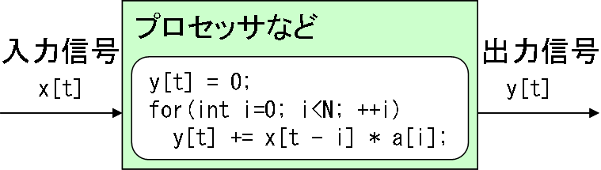
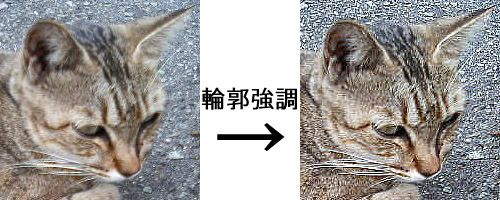
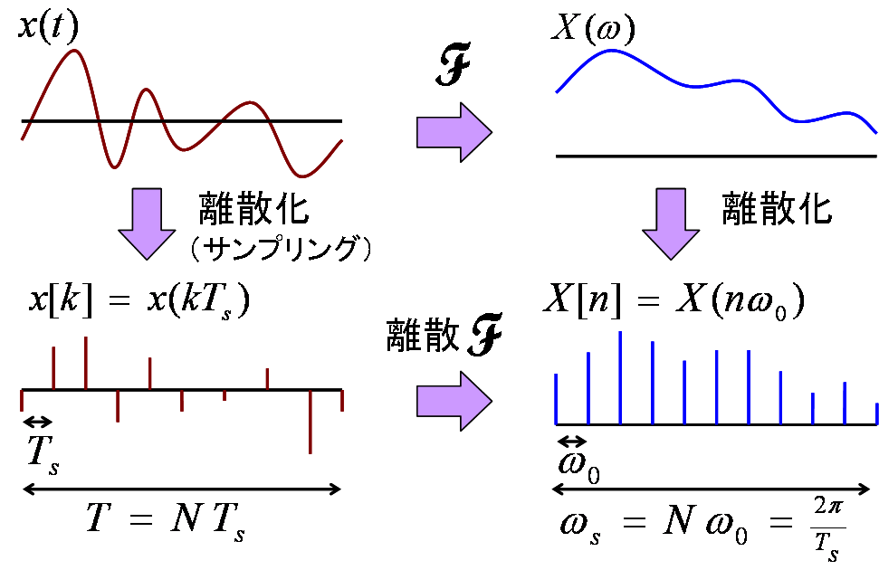

# ディジタルフィルタ

## <a id="sec-generated-title-1"></a> <a id="abstract"></a>概要

ここでは、ディジタルフィルタの設計手法などについて説明していきます。
（筆者の専門の関係で、音声フィルタを前提とした1次元線形フィルタを中心に説明します。）
ディジタル信号処理の知識が必須ですので、
先に「[信号処理](../index.md)」を通読しておいてください。


## <a id="sec-generated-title-2"></a> <a id="introduction"></a>ディジタルフィルタとは

ディジタルフィルタとは、
ディジタル電子計算機などを用いて、
ディジタル信号の特性を変化させるようなもののことを言います。
例えば、信号に混入したノイズを低減させたり、
特定の周波数の信号だけを取り出したりすることが出来ます。

<figure>
	[](../../../../assets/media/ufcpp2000/sp/filter01.png)
	<figcaption>ディジタルフィルタの概念図</figcaption>
</figure>


より具体的な例を挙げると、入出力となる信号の種類として、
画像や音声などがあります。
画像の場合、例えば、
「ぼかし」「輪郭強調」などのフィルタがあります。
また、音声の場合には、
「低音の強調」「エコー・リバーブ」などのフィルタがあります。
下図に、画像に「ぼかし」「輪郭強調」フィルタを掛けた例を示します。

<figure>
	[](../../../../assets/media/ufcpp2000/sp/filter00.jpg)
	<figcaption>画像のぼかし</figcaption>
</figure>


<figure>
	[](../../../../assets/media/ufcpp2000/sp/filter01.jpg)
	<figcaption>画像の輪郭強調</figcaption>
</figure>


## <a id="sec-generated-title-3"></a> <a id="d28e45"></a>ディジタル信号処理おさらい

ディジタルフィルタの話に入る前に、
軽く「[信号処理](../index.md)」のおさらいをしておきましょう。

<figure>
	[](../../../../assets/media/ufcpp2000/sp/filter02.png)
	<figcaption>ディジタル信号</figcaption>
</figure>

```text
連続信号と離散信号の関係
周波数特性
サンプル

ディジタル信号処理では、過去の信号値を記憶しておいて使う
x[k-1] ＝ D x[k]
等と書く。
D … 遅延

現在の時刻を k としたとき、
x[k-N] ＝ D^n x[k] を「N サンプル前の値」という。
```

## <a id="sec-generated-title-4"></a> <a id="plan"></a>執筆予定

```text
電子計算機などを使って信号処理
↓
離散信号
↓
差分方程式

電子計算機上では、いろんなフィルタを簡単に実現可能。
フィルタの特性を容易に計算できる線形フィルタがよく使われる。
線形フィルタ ＝ 線形差分方程式で表すことの出来るフィルタ。

・線形フィルタ ＝ 線形差分方程式
記憶素子(遅延)と加算器・乗算器があれば実現可能。
差分方程式→ブロック図の例を挙げて説明。

大きく分けて
- 線形フィルタ
  - FIR
  - IIR
- 非線形フィルタ
それぞれの長所と短所を。


Z変換の z<sup>－1</sup> は遅延を表す。
伝達関数が z<sup>－1</sup> の整式のとき、ループ（再帰）のないフィルタで実現可能。 → FIR
伝達関数が z<sup>－1</sup> の有理式のとき、再帰構造が必要。 → IIR


サンプルプログラムも出す？
```
