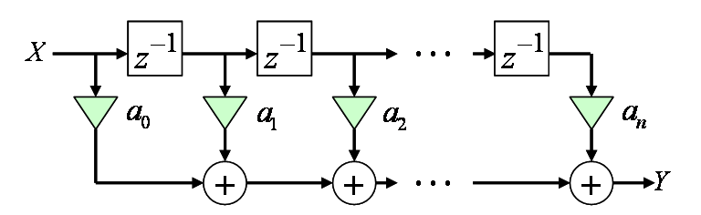

# FIRフィルタ

## <a id="sec-generated-title-1"></a> <a id="plan"></a>執筆予定

<strong id="fir" class="keyword">FIRフィルタ</strong>とは
```text
概要、FIRフィルタの特徴
 フィードバックなし
 IRがかならず有限長
 長所
  (リプルとかを気にしなければ)設計が容易
   （「[線形位相](/study/sp/dsp/phase?key=linear_phase)」とか「[最小位相](/study/sp/dsp/phase?key=minimum_phase)」化も簡単）
  常時安定、誤差蓄積なし
 短所
  次数が高めになりがち

伝達関数、ブロック図を出して説明
 線形位相な場合には、係数の対称性から多少演算量を削れる。

設計
 インパルス応答がそのままフィルタ係数になる。
 有限長で打ち切るため、リプルが生じる。
  リプル軽減のために窓掛けしたりする。
  もしくは、数値解析的な手法（例えば、Remez法）を使って等リプル化したり。

 最小位相化（次数が少なめで済む）したりすることも。
```
伝達関数
<div class="math">
Y
＝
<table class="sigma" summary="sum"><tr><td class="sigmasub">N－1</td></tr><tr><td class="sigma">∑</td></tr><tr><td class="sigmasub">i＝0</td></tr></table>
a<sub>i</sub>
z<sup>－i</sup>
X
</div>
ブロック図

<figure>

[](../../../../assets/media/ufcpp2000/sp/fir01.png)

<figcaption>FIRフィルタ</figcaption>
</figure>


サンプルソース: 
[FirFilter.cs](../../../../assets/media/ufcpp2000/sp/src/FirFilter.cs)
