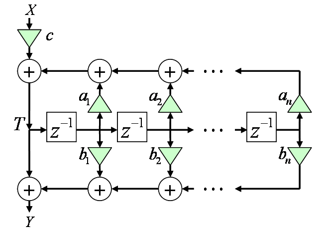
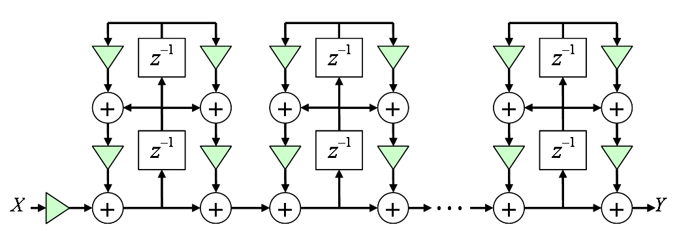

# IIRフィルタ

##  執筆予定

<pre>
概要、IIRフィルタの特徴
 フィードバックあり
 IRが無限に続く
 長所
  FIRより低次でいい特性がえられる
 短所
  設計が難しい
  不安定になることもあり
  誤差が蓄積

伝達関数、ブロック図を出して説明
 素直に実装すると・・・
 記憶領域削減のために中間変数を導入して・・・

次数が高くなると誤差とかオーバーフローの問題が顕著になってくるので、
通常は因数分解して2次ずつに分ける。
2次IIRを直列接続したり、
部分分数分解して並列接続して実装。

設計
 アナログで設計(アナログプロトタイプ)。
 s→z変換でディジタルに。
</pre>

##  概要

<strong id="iir" class="keyword">IIRフィルタ</strong>とは

##  フィルタ設計

IIR フィルタの設計手法は大きく分けて2種類あります。

1. アナログフィルタ設計手法に基づいてフィルタ設計を行う。 その後、s→z変換でディジタルフィルタに変換する。

2. 任意の周波数特性を与えて、その特性に近づくように数値計算でフィルタ設計。

ローパスフィルタなど、
特によく用いられるフィルタは、アナログ信号処理の時代から設計手法が確立されています。
そのため、アナログフィルタ設計手法を用いて設計し、
アナログ領域からディジタル領域に変換する手法と組み合わせてディジタルフィルタを設計することができます（1. の手法）。
 
これに対し、ディジタルフィルタでは、数値解析的な反復計算手法により、
任意の周波数特性を近似するようなフィルタ設計も存在します（2. の手法）。
フィルタの振幅特性のみを近似する手法（Yule-Walker 法）や、
フィルタのインパルス応答の時間波形を近似する手法（Prony 法、Steiglitz-McBride反復法）
などがあります。

###  アナログプロトタイプ設計

アナログ設計手法に基づくディジタル設計手法（1. の手法）で、
ディジタルフィルタの元となるアナログフィルタのことをアナログプロトタイプと呼びます。
有名なものとしては、以下のようなアナログフィルタがあります。
詳細は次章以降で説明します。

* 双2次（Biquadratic）フィルタ

* ローパスフィルタ

    * Butterworthフィルタ

    * Chebyshevフィルタ（Chebyshev I型フィルタ）

    * 逆Chebyshevフィルタ（Chebyshev II型フィルタ）

    * 連立Chebyshevフィルタ（楕円フィルタ）

通常、カットオフ周波数を 1 として設計して、 s → z 変換時にカットオフ周波数を変える。

###  s→z変換

通常、アナログフィルタ設計はs領域で、ディジタルフィルタ設計はz領域で行う。 s領域とは、連続信号f(t)をラプラス変換し、伝達関数F(s)で表したものをさし、 z領域とは、離散信号f[t]をZ変換し、伝達関数F(z)で表したものをさす。
 
双1次変換などがある。

##  伝達関数とブロック図

伝達関数

Y
＝
<table class="frac" summary="fraction"><tr><td class="num"><table class="sigma" summary="sum"><tr><td class="sigmasub">N－1</td></tr><tr><td class="sigma">∑</td></tr><tr><td class="sigmasub">i＝0</td></tr></table>
Bi
z－i</td></tr><tr><td><table class="sigma" summary="sum"><tr><td class="sigmasub">N－1</td></tr><tr><td class="sigma">∑</td></tr><tr><td class="sigmasub">i＝0</td></tr></table>
Ai
z－i</td></tr></table>
X

実装の都合上、式を以下のように変形。

Y
＝
c
<table class="frac" summary="fraction"><tr><td class="num">
1 ＋
<table class="sigma" summary="sum"><tr><td class="sigmasub">N－1</td></tr><tr><td class="sigma">∑</td></tr><tr><td class="sigmasub">i＝1</td></tr></table>
bi
z－i</td></tr><tr><td>
1 －
<table class="sigma" summary="sum"><tr><td class="sigmasub">N－1</td></tr><tr><td class="sigma">∑</td></tr><tr><td class="sigmasub">i＝1</td></tr></table>
ai
z－i</td></tr></table>
X

中間変数 T を導入。

T
＝
c X
＋
<table class="sigma" summary="sum"><tr><td class="sigmasub">N－1</td></tr><tr><td class="sigma">∑</td></tr><tr><td class="sigmasub">i＝1</td></tr></table>
ai
z－i
T

Y
＝
T
＋
<table class="sigma" summary="sum"><tr><td class="sigmasub">N－1</td></tr><tr><td class="sigma">∑</td></tr><tr><td class="sigmasub">i＝1</td></tr></table>
bi
z－i
T

これで、図1みたいなブロック図で実装可能に。
（省メモリ。）

<figure>
	
	<figcaption>IIRフィルタ</figcaption>
</figure>

2次ずつに分解

Y
＝
c
<table class="sigma" summary="sum"><tr><td class="sigmasub">K－1</td></tr><tr><td class="sigma">∑</td></tr><tr><td class="sigmasub">k＝0</td></tr></table><table class="frac" summary="fraction"><tr><td class="num">
1 ＋ bk,1 z－1 ＋ bk,2 z－2</td></tr><tr><td>
1 － ak,1 z－1 － ak,2 z－2</td></tr></table>
X

この式で、図2みたいになる。
この方は演算誤差の蓄積が少ないらしい。

<figure>
	
	<figcaption>直列接続2次IIRフィルタ</figcaption>
</figure>

伝達関数を部分分数分解してIIRフィルタを並列接続することもある。
直列接続よりももっと誤差蓄積少。
 
図1の方式での実装: 
[IirFilter.cs](../../../../assets/media/ufcpp2000/sp/src/IirFilter.cs)

図2の方式での実装: 
[SerialIirFilter.cs](../../../../assets/media/ufcpp2000/sp/src/SerialIirFilter.cs)
