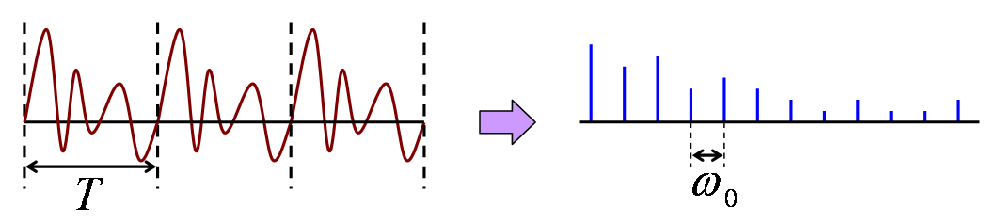
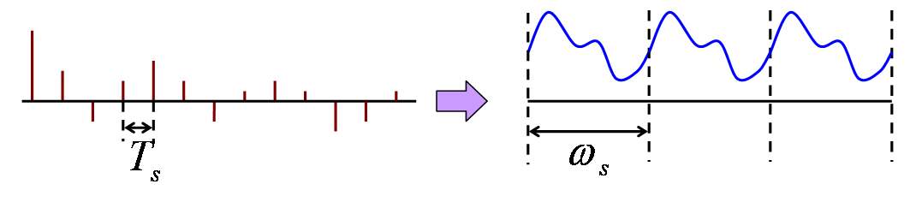
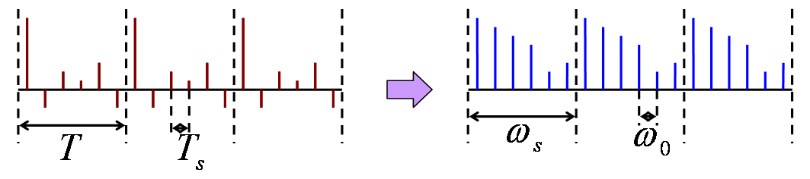
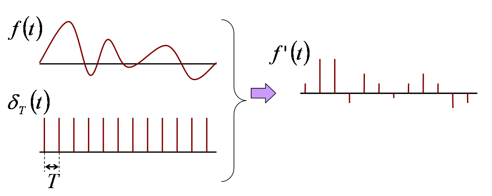
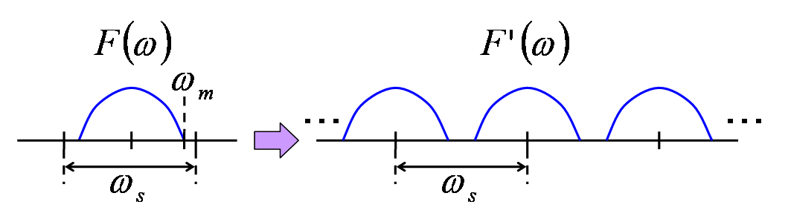
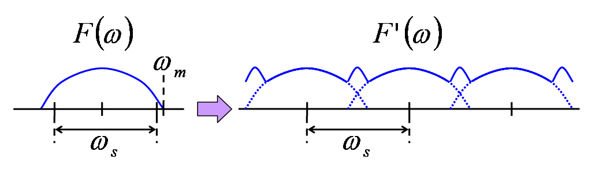
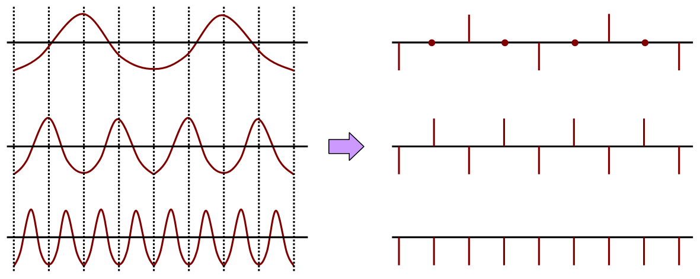

# 離散フーリエ変換

##  概要

アナログとディジタルの違いを大雑把に説明すると、

* アナログは連続量を取り扱う

* ディジタルは離散量を取り扱う

となります。
 
ここでは、連続関数と離散関数の間の関係および離散関数に対するフーリエ変換（離散フーリエ変換）について説明します。

##  周期関数のフーリエ変換

「[フーリエ変換](fourier.md#transform)」では、
非周期関数を、「関数の周期TをT→∞としたものである」とみなすことで、
「[フーリエ級数展開](fourierseries.md#series)」を拡張し、「[フーリエ変換](fourier.md#f-trans)」を導き出しました。
これとは逆、すなわち、フーリエ変換の式に周期関数を代入することでフーリエ級数展開の式を導き出すことを考えてみます。
 
それでは早速、周期Tを持つ関数、すなわち、f(t＋T) ＝ f(t)を満たす関数f(t)に対してフーリエ変換を行なってみましょう。

F(ω) ＝
∫<table class="integral" summary="integral"><tr><td class="intsup"> ∞</td></tr><tr><td style="font-size:30%;"> </td></tr><tr><td class="intsub">－∞</td></tr></table> f(t)exp(－iωt)dt ＝

<table class="sigma" summary="sum"><tr><td class="sigmasub">∞</td></tr><tr><td class="sigma">∑</td></tr><tr><td class="sigmasub">k=－∞</td></tr></table>∫<table class="integral" summary="integral"><tr><td class="intsup"> (k+1)T</td></tr><tr><td style="font-size:30%;"> </td></tr><tr><td class="intsub">kT</td></tr></table>
f(t＋kT)exp(－iωt)dt

この式中のtをt＋kTと置いて変数変換すると以下のようになります。

F(ω) ＝
<table class="sigma" summary="sum"><tr><td class="sigmasub">∞</td></tr><tr><td class="sigma">∑</td></tr><tr><td class="sigmasub">k=－∞</td></tr></table>∫<table class="integral" summary="integral"><tr><td class="intsup"> T</td></tr><tr><td style="font-size:30%;"> </td></tr><tr><td class="intsub">0</td></tr></table>
f(t)exp(－iωt＋iωkT)dt

さらに、
exp(iωkT)を積分の前に括りだすことで以下の式が得られます。

F(ω) ＝
(<table class="sigma" summary="sum"><tr><td class="sigmasub">∞</td></tr><tr><td class="sigma">∑</td></tr><tr><td class="sigmasub">k=－∞</td></tr></table>exp(iωkT))
×
∫<table class="integral" summary="integral"><tr><td class="intsup"> T</td></tr><tr><td style="font-size:30%;"> </td></tr><tr><td class="intsub">0</td></tr></table>
f(t)exp(－iωt)dt

ここで、
<table class="sigma" summary="sum"><tr><td class="sigmasub">∞</td></tr><tr><td class="sigma">∑</td></tr><tr><td class="sigmasub">k=－∞</td></tr></table>exp(iωkT)は、ω＝<table class="frac" summary="fraction"><tr><td class="num">2πn</td></tr><tr><td>T</td></tr></table>（nは整数）のときに∞、それ以外の時には0となるような関数になります。
すなわち、「[δ関数](../../math/distribution/distribution-e_distribution.md#delta)」を用いて以下のように表すことが出来ます。
（詳しくは、「[δ関数級数](appendix.md#delta-series)」参照。）

      <table class="sigma" summary="sum"><tr><td class="sigmasub">∞</td></tr><tr><td class="sigma">∑</td></tr><tr><td class="sigmasub">k=－∞</td></tr></table>
      exp
      (iωkT) ＝
ω0<table class="sigma" summary="sum"><tr><td class="sigmasub">∞</td></tr><tr><td class="sigma">∑</td></tr><tr><td class="sigmasub">n=－∞</td></tr></table>δ(ω － nω0)

ただし、ω0 ＝ <table class="frac" summary="fraction"><tr><td class="num">2π</td></tr><tr><td>T</td></tr></table>です。
 
また、∫<table class="integral" summary="integral"><tr><td class="intsup"> T</td></tr><tr><td style="font-size:30%;"> </td></tr><tr><td class="intsub">0</td></tr></table>f(t)exp(－iωt)dtは、ω ＝ nω0 ＝ <table class="frac" summary="fraction"><tr><td class="num">2πn</td></tr><tr><td>T</td></tr></table>のとき、「[複素形フーリエ級数展開](fourierseries.md#complexfourier)」におけるフーリエ係数F[n]にTを掛けたものと一致します。
 
以上のことから、周期関数に対するフーリエ変換の式は以下のように書き換えることが出来ます。
      

F(ω) ＝
<table class="sigma" summary="sum"><tr><td class="sigmasub">∞</td></tr><tr><td class="sigma">∑</td></tr><tr><td class="sigmasub">n=－∞</td></tr></table>
T F[n]×ω0 δ(ω － nω0)
＝
2π<table class="sigma" summary="sum"><tr><td class="sigmasub">∞</td></tr><tr><td class="sigma">∑</td></tr><tr><td class="sigmasub">n=－∞</td></tr></table>
F[n]×δ(ω － nω0)

このように、周期関数に対するフーリエ変換F(ω)の結果は、
ω ＝ nω0（nは整数）という離散的な点でしか値を持たず、
その値はフーリエ級数展開係数F[n]にδ関数を掛けたものになります。

##  離散関数のフーリエ変換

「[周期関数のフーリエ変換](#periodic)」の結果から、離散関数と連続関数はδ関数を用いて関係付けることで、離散関数に対するフーリエ変換が定義可能ではないかという類推が出来ます。
すなわち、離散関数f[k]に対して、

f(t) ＝ 
<table class="sigma" summary="sum"><tr><td class="sigmasub">∞</td></tr><tr><td class="sigma">∑</td></tr><tr><td class="sigmasub">k=－∞</td></tr></table>f[k]
×δ(t － kTs)
と置いて、この連続関数f(t)をフーリエ変換したものを、
離散関数f[k]のフーリエ変換として定義します。

「[フーリエ変換](fourier.md#f-trans)」の式にこのf(t)を代入した結果は以下のようになります。

F(ω) ＝
∫<table class="integral" summary="integral"><tr><td class="intsup"> ∞</td></tr><tr><td style="font-size:30%;"> </td></tr><tr><td class="intsub">－∞</td></tr></table> f(t)exp(－iωt)dt
＝
<table class="sigma" summary="sum"><tr><td class="sigmasub">∞</td></tr><tr><td class="sigma">∑</td></tr><tr><td class="sigmasub">k=－∞</td></tr></table>∫<table class="integral" summary="integral"><tr><td class="intsup"> ∞</td></tr><tr><td style="font-size:30%;"> </td></tr><tr><td class="intsub">－∞</td></tr></table>
f[k]δ(t － kTs)exp(－iωt)dt
＝
<table class="sigma" summary="sum"><tr><td class="sigmasub">∞</td></tr><tr><td class="sigma">∑</td></tr><tr><td class="sigmasub">k=－∞</td></tr></table>f[k]exp(－ikTsω)

このF(ω)は周期ωs ＝ <table class="frac" summary="fraction"><tr><td class="num">2π</td></tr><tr><td>Ts</td></tr></table>を持つ周期関数になっています。
そのため、逆変換の式は以下のようになります。

f(t)
＝
<table class="frac" summary="fraction"><tr><td class="num">1</td></tr><tr><td>2π</td></tr></table><table class="sigma" summary="sum"><tr><td class="sigmasub">∞</td></tr><tr><td class="sigma">∑</td></tr><tr><td class="sigmasub">n=－∞</td></tr></table>∫<table class="integral" summary="integral"><tr><td class="intsup"> (n+1)ωs</td></tr><tr><td style="font-size:30%;"> </td></tr><tr><td class="intsub">nωs</td></tr></table>
F(ω＋nωs)exp(iωt)dω

　
＝
(<table class="sigma" summary="sum"><tr><td class="sigmasub">∞</td></tr><tr><td class="sigma">∑</td></tr><tr><td class="sigmasub">n=－∞</td></tr></table>exp(inωst))
×
<table class="frac" summary="fraction"><tr><td class="num">1</td></tr><tr><td>2π</td></tr></table>∫<table class="integral" summary="integral"><tr><td class="intsup"> ωs</td></tr><tr><td style="font-size:30%;"> </td></tr><tr><td class="intsub">0</td></tr></table>
F(ω)exp(iωt)dω

　
＝
(
Ts<table class="sigma" summary="sum"><tr><td class="sigmasub">∞</td></tr><tr><td class="sigma">∑</td></tr><tr><td class="sigmasub">k=－∞</td></tr></table>
δ(t － kTs))
×
<table class="frac" summary="fraction"><tr><td class="num">1</td></tr><tr><td>2π</td></tr></table>∫<table class="integral" summary="integral"><tr><td class="intsup"> ωs</td></tr><tr><td style="font-size:30%;"> </td></tr><tr><td class="intsub">0</td></tr></table>
F(ω)exp(iωt)dω

以上のことをまとめると、離散関数f[k]のフーリエ変換は以下のようになります。
<em>
      

F(ω) ＝
<table class="sigma" summary="sum"><tr><td class="sigmasub">∞</td></tr><tr><td class="sigma">∑</td></tr><tr><td class="sigmasub">k=－∞</td></tr></table>
f[k]exp(－ikTsω)

      

f[k]
＝
<table class="frac" summary="fraction"><tr><td class="num">Ts</td></tr><tr><td>2π</td></tr></table>∫<table class="integral" summary="integral"><tr><td class="intsup"> ωs</td></tr><tr><td style="font-size:30%;"> </td></tr><tr><td class="intsub">0</td></tr></table>
F(ω)exp(ikTsω)dω

    </em>

##  離散フーリエ変換

これまでの話から、
周期関数のフーリエ変換は離散関数になり、
離散関数のフーリエ変換は周期関数になるということがいえます。
となると、周期離散関数のフーリエ変換は周期離散関数になるということを容易に察することが出来ると思います。
この様子を以下の図に示します。ただし、ω0 ＝ <table class="frac" summary="fraction"><tr><td class="num">2π</td></tr><tr><td>T</td></tr></table>、ωs ＝ <table class="frac" summary="fraction"><tr><td class="num">2π</td></tr><tr><td>Ts</td></tr></table>です。

<figure>

<figcaption>周期関数のフーリエ変換</figcaption>
</figure>

<figure>

<figcaption>離散関数のフーリエ変換</figcaption>
</figure>

<figure>

<figcaption>周期離散関数のフーリエ変換</figcaption>
</figure>

この周期離散関数のフーリエ変換の公式を導き出して見ましょう。
離散関数f[k]が周期Nを持つ、
すなわち、f[k ＋ N] ＝ f[k]が成り立つとき、「[離散関数のフーリエ変換 離散フーリエ変換](#discrete)」の結果から、この関数のフーリエ変換は以下のようになります。

F(ω) ＝
<table class="sigma" summary="sum"><tr><td class="sigmasub">∞</td></tr><tr><td class="sigma">∑</td></tr><tr><td class="sigmasub">k＝－∞</td></tr></table>
f[k]exp(－ikTsω)

　
＝
<table class="sigma" summary="sum"><tr><td class="sigmasub">∞</td></tr><tr><td class="sigma">∑</td></tr><tr><td class="sigmasub">n ＝ －∞</td></tr></table><table class="sigma" summary="sum"><tr><td class="sigmasub">N－1</td></tr><tr><td class="sigma">∑</td></tr><tr><td class="sigmasub">k ＝ 0</td></tr></table>
f[k ＋ nN]exp(－i(k ＋ nN)Tsω)

　
＝
<table class="sigma" summary="sum"><tr><td class="sigmasub">∞</td></tr><tr><td class="sigma">∑</td></tr><tr><td class="sigmasub">n ＝ －∞</td></tr></table><table class="sigma" summary="sum"><tr><td class="sigmasub">N－1</td></tr><tr><td class="sigma">∑</td></tr><tr><td class="sigmasub">k ＝ 0</td></tr></table>
f[k]exp(－ikTsω)
×
exp(－inNTsω)

式中の2つの∑は分離することができ、上式は以下のように変形することができます。

F(ω) ＝
<table class="sigma" summary="sum"><tr><td class="sigmasub">N－1</td></tr><tr><td class="sigma">∑</td></tr><tr><td class="sigmasub">k ＝ 0</td></tr></table>
f[k]exp(－ikTsω)
×
<table class="sigma" summary="sum"><tr><td class="sigmasub">∞</td></tr><tr><td class="sigma">∑</td></tr><tr><td class="sigmasub">n ＝ －∞</td></tr></table>exp(－inNTsω)

ω0 ＝ <table class="frac" summary="fraction"><tr><td class="num">2π</td></tr><tr><td>N Ts</td></tr></table> 
と置くと、右辺の×以降は以下のように書き換えることができます。
（詳しくは、「[δ関数級数](appendix.md#delta-series)」参照。）

      <table class="sigma" summary="sum"><tr><td class="sigmasub">∞</td></tr><tr><td class="sigma">∑</td></tr><tr><td class="sigmasub">k=－∞</td></tr></table>
      exp
      (inNTs)
＝
<table class="frac" summary="fraction"><tr><td class="num">2π</td></tr><tr><td>N Ts</td></tr></table><table class="sigma" summary="sum"><tr><td class="sigmasub">∞</td></tr><tr><td class="sigma">∑</td></tr><tr><td class="sigmasub">n=－∞</td></tr></table>
δ(ω － nω0)

また、
ω ＝ <table class="frac" summary="fraction"><tr><td class="num">2π</td></tr><tr><td>N Ts</td></tr></table>n ＝ n ω0とおき、
離散関数F[n]を

F[n]
＝
<table class="sigma" summary="sum"><tr><td class="sigmasub">N－1</td></tr><tr><td class="sigma">∑</td></tr><tr><td class="sigmasub">k ＝ 0</td></tr></table>
f[k]exp(－ikTsω)
＝
<table class="sigma" summary="sum"><tr><td class="sigmasub">N－1</td></tr><tr><td class="sigma">∑</td></tr><tr><td class="sigmasub">k ＝ 0</td></tr></table>
f[k]exp(－i <table class="frac" summary="fraction"><tr><td class="num">2πkn</td></tr><tr><td>N</td></tr></table>)

として定義します。
これらを踏まえて、先ほどの式を変形すると以下のようになります。

F(ω)
＝
<table class="frac" summary="fraction"><tr><td class="num">2π</td></tr><tr><td>N Ts</td></tr></table><table class="sigma" summary="sum"><tr><td class="sigmasub">∞</td></tr><tr><td class="sigma">∑</td></tr><tr><td class="sigmasub">n=－∞</td></tr></table>
F[n]
δ(ω － nω0)

この式を離散関数の逆フーリエ変換の式に代入することで、
以下の式が得られます。

f[k]
＝
<table class="frac" summary="fraction"><tr><td class="num">Ts</td></tr><tr><td>2π</td></tr></table>
×
<table class="frac" summary="fraction"><tr><td class="num">2π</td></tr><tr><td>N Ts</td></tr></table>∫<table class="integral" summary="integral"><tr><td class="intsup"> ωs</td></tr><tr><td style="font-size:30%;"> </td></tr><tr><td class="intsub">0</td></tr></table><table class="sigma" summary="sum"><tr><td class="sigmasub">∞</td></tr><tr><td class="sigma">∑</td></tr><tr><td class="sigmasub">n=－∞</td></tr></table>
F[n]
δ(ω － nω0)exp(ikTsω)dω

　
＝
<table class="frac" summary="fraction"><tr><td class="num">1</td></tr><tr><td>N</td></tr></table><table class="sigma" summary="sum"><tr><td class="sigmasub">N－1</td></tr><tr><td class="sigma">∑</td></tr><tr><td class="sigmasub">n ＝ 0</td></tr></table>
F[n]exp(i Tsω0 kn)

　
＝
<table class="frac" summary="fraction"><tr><td class="num">1</td></tr><tr><td>N</td></tr></table><table class="sigma" summary="sum"><tr><td class="sigmasub">N－1</td></tr><tr><td class="sigma">∑</td></tr><tr><td class="sigmasub">n ＝ 0</td></tr></table>
F[n]exp(i <table class="frac" summary="fraction"><tr><td class="num">2πkn</td></tr><tr><td>N</td></tr></table>)

以上のことをまとめると、以下の式が得られます。
<em>
      

F[n]
＝
<table class="sigma" summary="sum"><tr><td class="sigmasub">N－1</td></tr><tr><td class="sigma">∑</td></tr><tr><td class="sigmasub">k ＝ 0</td></tr></table>
f[k]exp(－i <table class="frac" summary="fraction"><tr><td class="num">2πkn</td></tr><tr><td>N</td></tr></table>)

      

f[k]
＝
<table class="frac" summary="fraction"><tr><td class="num">1</td></tr><tr><td>N</td></tr></table><table class="sigma" summary="sum"><tr><td class="sigmasub">N－1</td></tr><tr><td class="sigma">∑</td></tr><tr><td class="sigmasub">n ＝ 0</td></tr></table>
F[n]exp(i <table class="frac" summary="fraction"><tr><td class="num">2πkn</td></tr><tr><td>N</td></tr></table>)

    </em>
この式を<strong id="dft" class="keyword">離散フーリエ変換</strong>と呼びます。

##  離散フーリエ変換の性質

離散フーリエ変換はフーリエ変換に離散信号を代入し、式変形しただけのものなので、
フーリエ変換と同様に以下のような性質を持っています。

###  線形性

        ℱ[
a f[k]
＋
b g[k]]
        [n]
＝
a
ℱ[
f[k]][n]
＋
b
ℱ[
g[k]][n]

###  時間シフト

        ℱ[
f(t±T)]
        [n]
      

　
＝
∫<table class="integral" summary="integral"><tr><td class="intsup"> ∞</td></tr><tr><td style="font-size:30%;"> </td></tr><tr><td class="intsub">－∞</td></tr></table>
f(t±T)exp(－iωt)dt

　
＝
∫<table class="integral" summary="integral"><tr><td class="intsup"> ∞</td></tr><tr><td style="font-size:30%;"> </td></tr><tr><td class="intsub">－∞</td></tr></table>
f[k]exp(－iωt±T)dt

　
＝
exp(±iTω)∫<table class="integral" summary="integral"><tr><td class="intsup"> ∞</td></tr><tr><td style="font-size:30%;"> </td></tr><tr><td class="intsub">－∞</td></tr></table>
f[k]exp(－iωt)dt

　
＝
exp(±iTω)ℱ[
f[k]][n]

###  積のフーリエ変換

f＊g[k]
＝
<table class="sigma" summary="sum"><tr><td class="sigmasub">N－1</td></tr><tr><td class="sigma">∑</td></tr><tr><td class="sigmasub">l＝0</td></tr></table>
f[l]
g[k－l]
　（ただし、k－l＜0のとき、g[k－l]＝g[k－l＋N]であるものとする）

        ℱ[
f＊g[k]]
        [n]
＝
ℱ[
f[k]][n]
×
ℱ[
g[k]][n]

畳込み積f＊gの定義の仕方が連続関数のフーリエ変換の場合と微妙に異なっていることに注意してください。

##  アナログ信号→ディジタル信号

ここでは、アナログ信号（連続関数で表される）からディジタル信号（離散関数）を得る方法について説明します。

###  標本化

通常、連続関数f(t)で表されるアナログ信号を一定周期Tsで<strong id="d20e1330" class="keyword">標本化</strong>（サンプリング: sampling）することでディジタル信号（離散関数f[k]）を得ます。

f[n] ＝ f(nTs)

当然、このような方法でディジタル信号（離散関数）を得ると、
標本点の間の情報が抜け落ちてしまいます。
そのため、一般的にはディジタル信号から元のアナログ信号（連続関数）を復元することはできません。
 
しかしながら、一定の条件下では標本化して得た離散関数から元の連続関数を完全に復元することができます。
以下では、このために必要となる条件について説明していきます。

###  標本化関数

「[離散関数のフーリエ変換 離散フーリエ変換](#discrete)」で説明したように、離散関数と連続関数の間はδ関数を用いて関連付けることができます。
そこで、
連続関数f(t)
標本化して得た離散関数f[k]を用いて、
以下のような連続関数f'(t)を定義します。

f'(t)
＝
<table class="sigma" summary="sum"><tr><td class="sigmasub">∞</td></tr><tr><td class="sigma">∑</td></tr><tr><td class="sigmasub">k ＝ －∞</td></tr></table>
f[k]
δ(t － nTs)
＝
<table class="sigma" summary="sum"><tr><td class="sigmasub">∞</td></tr><tr><td class="sigma">∑</td></tr><tr><td class="sigmasub">k ＝ －∞</td></tr></table>
f(nT)
δ(t － nTs)
＝
f(t)<table class="sigma" summary="sum"><tr><td class="sigmasub">∞</td></tr><tr><td class="sigma">∑</td></tr><tr><td class="sigmasub">k ＝ －∞</td></tr></table>
δ(t － nTs)
＝
f(t)
δTs(t)

このことはすなわち、「標本化とは、「[インパルス列](appendix.md#i-series)」を掛け合わせることに相当する」とみなすことができます。

<figure>

<figcaption>標本化</figcaption>
</figure>

「[インパルス列](appendix.md#i-series)」のフーリエ変換が「[インパルス列](appendix.md#i-series)」となることおよび、
積のフーリエ変換が「[畳込み積](fourier.md#convolution)」となることから、
標本化関数のフーリエ変換F'(ω)は以下のようになります。

F'(ω)
＝
ω0
F＊δωs(ω)

ちなみに、Tsを<strong id="d20e1482" class="keyword">標本化周期</strong>、
その逆数fs ＝ <table class="frac" summary="fraction"><tr><td class="num">1</td></tr><tr><td>Ts</td></tr></table>を<strong id="d20e1495" class="keyword">標本化周波数</strong>、
標本化周波数に2πを掛けたものωs ＝ 2πfs ＝ <table class="frac" summary="fraction"><tr><td class="num">2π</td></tr><tr><td>Ts</td></tr></table>を<strong id="d20e1518" class="keyword">標本化角周波数</strong>といいます。

###  シャノンの標本化定理

前節で示したように、関数f(t)のフーリエ変換F(ω)と、それを標本化したものf'(t)のフーリエ変換F’(ω)の間には以下のような関係が成り立っています。

F'(ω)
＝
ω0
F＊δωs(ω)

δ関数の性質から、この式は以下のように表すことができます。

F'(ω)
＝
ωs<table class="sigma" summary="sum"><tr><td class="sigmasub">∞</td></tr><tr><td class="sigma">∑</td></tr><tr><td class="sigmasub">n ＝ －∞</td></tr></table>
F(ω － nωs)

この関数F'(ω)は離散化前の関数F(ω)をωsおきに複数ならべたものになっています。
そのため、F(ω)が非0となるような最大の周波数ωm（F(ω)がωm以下の周波数成分を含まない）がωsの半分より小さい場合（2ωm＜ωs）には、
下図のように、元の関数の形が崩れません。
したがって、低周波数成分のみを通過させるようなフィルタ（ローパスフィルタ）を通すことで、元の連続関数を完全に再現することができます。

<figure>

<figcaption>標本化関数のフーリエ変換（低周波）</figcaption>
</figure>

ところが、ωmがそれ以上の場合（（2ωm≧ωs））、
下図のように、関数の形に歪みが生じます。
そして、この歪みが原因で元の連続関数を再現することができなくなります。
このような関数形の歪みを<strong id="d20e1654" class="keyword">エイリアシング</strong>（aliasing）と呼びます。

<figure>

<figcaption>標本化関数のフーリエ変換（高周波）</figcaption>
</figure>

このような、
「2ωm＜ωsの場合には、
標本化関数から元の連続関数を完全に再現できる」
という結論は、発見者の名前を取ってシャノンの<strong id="d20e1673" class="keyword">標本化定理</strong>と呼ばれています。

<figure>

<figcaption>高周波数の関数を標本化すると</figcaption>
</figure>

##  まとめ

<table summary="離散フーリエ変換の公式">
	<caption>
		離散フーリエ変換の公式
	</caption>
	<tr>
		<td markdown="1">離散フーリエ変換</td>
		<td markdown="1">

F[n]
＝
<table class="sigma" summary="sum"><tr><td class="sigmasub">N－1</td></tr><tr><td class="sigma">∑</td></tr><tr><td class="sigmasub">k ＝ 0</td></tr></table>
f[k]exp(－i <table class="frac" summary="fraction"><tr><td class="num">2πkn</td></tr><tr><td>N</td></tr></table>)

f[k]
＝
<table class="frac" summary="fraction"><tr><td class="num">1</td></tr><tr><td>N</td></tr></table><table class="sigma" summary="sum"><tr><td class="sigmasub">N－1</td></tr><tr><td class="sigma">∑</td></tr><tr><td class="sigmasub">n ＝ 0</td></tr></table>
F[n]exp(i <table class="frac" summary="fraction"><tr><td class="num">2πkn</td></tr><tr><td>N</td></tr></table>)
</td>
	</tr>
</table>

<table summary="離散フーリエ変換の性質">
	<caption>
		離散フーリエ変換の性質
	</caption>
	<tr>
		<td markdown="1">線形性</td>
		<td markdown="1">

            ℱ[
a f[k]
＋
b g[k]]
            [n]
＝
a
ℱ[
f[k]][n]
＋
b
ℱ[
g[k]][n]
</td>
	</tr>
	<tr>
		<td markdown="1">時間シフト</td>
		<td markdown="1">

            ℱ[
f(t±T)]
            [n]
＝
exp(±iTω)ℱ[
f[k]][n]
</td>
	</tr>
	<tr>
		<td markdown="1">積のフーリエ変換</td>
		<td markdown="1">

f＊g[k]
＝
<table class="sigma" summary="sum"><tr><td class="sigmasub">N－1</td></tr><tr><td class="sigma">∑</td></tr><tr><td class="sigmasub">l＝0</td></tr></table>
f[l]
g[k－l]
（ただし、k－l＜0のとき、g[k－l]＝g[k－l＋N]であるものとする）
ℱ[
f＊g[k]][n]
＝
ℱ[
f[k]][n]
×
ℱ[
g[k]][n]
</td>
	</tr>
</table>

<table summary="標本化定理">
	<caption>
		標本化定理
	</caption>
	<tr>
		<td markdown="1">標本化定理</td>
		<td markdown="1">
「2ωm＜ωsの場合には、
標本化関数から元の連続関数を完全に再現できる」
</td>
	</tr>
</table>
