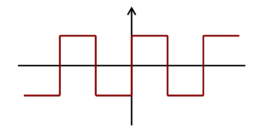
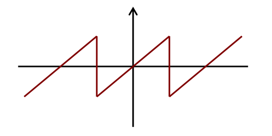
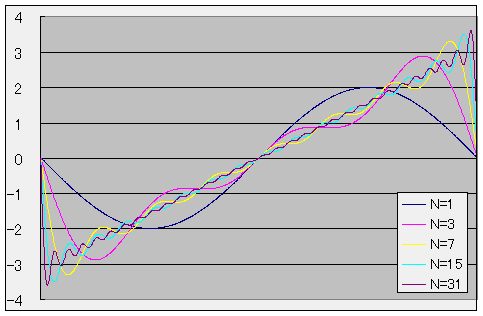
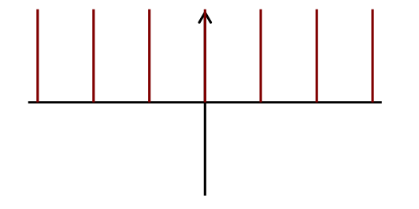
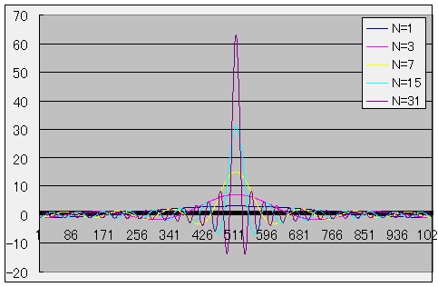

# フーリエ級数展開

##  概要

フーリエ級数展開の基本となる概念は19世紀の前半にフランスの数学者 フーリエ（Fourier、1764-1830）が熱伝導問題の解析の過程で考え出したものです。
そして、その基本アイディアは「<em>任意の周期関数は三角関数の和で表される</em>」というものです。
 
フーリエ級数展開（および、フーリエ変換）について詳細に説明しようとすると、それだけで本が1冊書けるほどになってしまいます。
そのため、ディジタル信号処理などの工学的な応用に必要になる部分に絞って説明していきたいと思います。

##  基本アイディア

フーリエは「任意の周期関数は三角関数の和で表される」という仮定の下で、
周期関数を三角関数を使って級数展開する方法(<strong id="f-series" class="keyword">フーリエ級数展開</strong>と呼ばれています)を考案しました。
すなわち、周期Tの関数f(t)は

f(t) ＝ 
a0 ＋
<table class="sigma" summary="sum"><tr><td class="sigmasub">∞</td></tr><tr><td class="sigma">∑</td></tr><tr><td class="sigmasub">n=1</td></tr></table>(
 ancos<table class="frac" summary="fraction"><tr><td class="num">2πnt</td></tr><tr><td>T</td></tr></table> ＋
 bnsin<table class="frac" summary="fraction"><tr><td class="num">2πnt</td></tr><tr><td>T</td></tr></table>)

というように、三角関数の和で表すことができると主張し、
係数an, bnを求める方法を導き出したわけです。
 
もちろん、厳密には「任意の周期関数は三角関数の和で表される」という仮定が正しいかどうかをまず議論する必要がありますが、この議論には少し難しい知識が必要とされます。
一方、厳密な議論は後回しにして、とりあえずこの仮定が正しいとした上で話を進めるなら、高校レベルの知識でも十分に理解できます。
また、工学的な応用に用いる限りには厳密な議論は後回しにしても全く差し支えありません。
 
実際、歴史的にも、厳密な議論よりも物理学への応用が先になされ、
その後から「任意の周期関数は三角関数の和で表される」という仮定に関する厳密な議論が行なわれました。
 
以上のことから、ここでは厳密な議論は抜きにして（知りたい人は専門書を読んで自分で勉強してもらうものとして）説明していきます。

##  三角関数の直交性

三角関数の性質として、任意の自然数m, nに対して以下の式が成り立つというものがあります。

      ∫<table class="integral" summary="integral"><tr><td class="intsup"> π</td></tr><tr><td style="font-size:30%;"> </td></tr><tr><td class="intsub">－π</td></tr></table>
      sin
      (mt)
      dt ＝ 0

      ∫<table class="integral" summary="integral"><tr><td class="intsup"> π</td></tr><tr><td style="font-size:30%;"> </td></tr><tr><td class="intsub">－π</td></tr></table>
      cos
      (mt)
      dt ＝ 0

      ∫<table class="integral" summary="integral"><tr><td class="intsup"> π</td></tr><tr><td style="font-size:30%;"> </td></tr><tr><td class="intsub">－π</td></tr></table>
      sin
      (mt)
      sin
      (nt)
      dt ＝ 
{<table class="branch" summary="conditional"><tr><td>π  </td><td>(m ＝ n のとき)</td></tr><tr><td>0  </td><td>(m ≠ n のとき)</td></tr></table>

      ∫<table class="integral" summary="integral"><tr><td class="intsup"> π</td></tr><tr><td style="font-size:30%;"> </td></tr><tr><td class="intsub">－π</td></tr></table>
      cos
      (mt)
      cos
      (nt)
      dt ＝ 
{<table class="branch" summary="conditional"><tr><td>π  </td><td>(m ＝ n のとき)</td></tr><tr><td>0  </td><td>(m ≠ n のとき)</td></tr></table>

      ∫<table class="integral" summary="integral"><tr><td class="intsup"> π</td></tr><tr><td style="font-size:30%;"> </td></tr><tr><td class="intsub">－π</td></tr></table>
      sin
      (mt)
      cos
      (nt)
      dt ＝ 0

すなわち、三角関数の積分値は、
sinどうし、またはcosどうしを掛けた物で、
m ＝ nの場合にのみ非0となり、
その他の場合には必ず0になります。
このような性質は<em>三角関数の直交性</em>と呼ばれています。

##  フーリエ級数展開

説明を単純化するため、まずは周期2πの関数に絞って説明していきたいと思います。
このとき、「[基本アイディア](#idea)」で示した式は以下のようになります。

f(t) ＝ 
a0 ＋
<table class="sigma" summary="sum"><tr><td class="sigmasub">∞</td></tr><tr><td class="sigma">∑</td></tr><tr><td class="sigmasub">n=1</td></tr></table>(
 ancos nt ＋
 bnsin nt
)

「[三角関数の直交性](#orthogonal)」で示した式から、この両辺を－π～πの範囲で積分すると、a0の項だけが残ります。

      ∫<table class="integral" summary="integral"><tr><td class="intsup"> π</td></tr><tr><td style="font-size:30%;"> </td></tr><tr><td class="intsub">－π</td></tr></table> f(t)dt ＝
∫<table class="integral" summary="integral"><tr><td class="intsup"> π</td></tr><tr><td style="font-size:30%;"> </td></tr><tr><td class="intsub">－π</td></tr></table> a0dt ＝ 2π a0

同様に、
両辺にcos(nt) を掛けてから積分するとamの項だけが、
sin(nt) を掛けてから積分するとbmの項だけがのこります。

      ∫<table class="integral" summary="integral"><tr><td class="intsup"> π</td></tr><tr><td style="font-size:30%;"> </td></tr><tr><td class="intsub">－π</td></tr></table> f(t)cos(nt)dt ＝
∫<table class="integral" summary="integral"><tr><td class="intsup"> π</td></tr><tr><td style="font-size:30%;"> </td></tr><tr><td class="intsub">－π</td></tr></table> amcos2(nt)dt ＝ π an

      ∫<table class="integral" summary="integral"><tr><td class="intsup"> π</td></tr><tr><td style="font-size:30%;"> </td></tr><tr><td class="intsub">－π</td></tr></table> f(t)sin(nt)dt ＝
∫<table class="integral" summary="integral"><tr><td class="intsup"> π</td></tr><tr><td style="font-size:30%;"> </td></tr><tr><td class="intsub">－π</td></tr></table> bmsin2(nt)dt ＝ π bn

したがって、以下の計算式で係数an, bnを計算できます。

a0 ＝ <table class="frac" summary="fraction"><tr><td class="num">1</td></tr><tr><td>2π</td></tr></table>∫<table class="integral" summary="integral"><tr><td class="intsup"> π</td></tr><tr><td style="font-size:30%;"> </td></tr><tr><td class="intsub">－π</td></tr></table> f(t)dt

an ＝ <table class="frac" summary="fraction"><tr><td class="num">1</td></tr><tr><td>π</td></tr></table>∫<table class="integral" summary="integral"><tr><td class="intsup"> π</td></tr><tr><td style="font-size:30%;"> </td></tr><tr><td class="intsub">－π</td></tr></table> f(t)cos(nt)dt

bn ＝ <table class="frac" summary="fraction"><tr><td class="num">1</td></tr><tr><td>π</td></tr></table>∫<table class="integral" summary="integral"><tr><td class="intsup"> π</td></tr><tr><td style="font-size:30%;"> </td></tr><tr><td class="intsub">－π</td></tr></table> f(t)sin(nt)dt

このようにして得られた級数

f(t) = 
a0 ＋
<table class="sigma" summary="sum"><tr><td class="sigmasub">∞</td></tr><tr><td class="sigma">∑</td></tr><tr><td class="sigmasub">n=1</td></tr></table>(
 ancos t ＋
 bnsin t
)
をフーリエ級数、係数an, bnをフーリエ係数などといいます。
また、このように、周期関数をフーリエ級数に展開することをフーリエ級数展開といいます。
 
周期Tが2π以外の関数に関しては、変数tを<table class="frac" summary="fraction"><tr><td class="num">2πt</td></tr><tr><td>T</td></tr></table>で置き換えることにより、
<em>
      

a0 ＝ <table class="frac" summary="fraction"><tr><td class="num">1</td></tr><tr><td>T</td></tr></table>∫<table class="integral" summary="integral"><tr><td class="intsup"> T/2</td></tr><tr><td style="font-size:30%;"> </td></tr><tr><td class="intsub">－T/2</td></tr></table> f(t)dt

      

an ＝ <table class="frac" summary="fraction"><tr><td class="num">2</td></tr><tr><td>T</td></tr></table>∫<table class="integral" summary="integral"><tr><td class="intsup"> T/2</td></tr><tr><td style="font-size:30%;"> </td></tr><tr><td class="intsub">－T/2</td></tr></table> f(t)cos(<table class="frac" summary="fraction"><tr><td class="num">2πnt</td></tr><tr><td>T</td></tr></table>)dt

      

bn ＝ <table class="frac" summary="fraction"><tr><td class="num">2</td></tr><tr><td>T</td></tr></table>∫<table class="integral" summary="integral"><tr><td class="intsup"> T/2</td></tr><tr><td style="font-size:30%;"> </td></tr><tr><td class="intsub">－T/2</td></tr></table> f(t)sin(<table class="frac" summary="fraction"><tr><td class="num">2πnt</td></tr><tr><td>T</td></tr></table>)dt

      

f(t) ＝ 
a0 ＋
<table class="sigma" summary="sum"><tr><td class="sigmasub">∞</td></tr><tr><td class="sigma">∑</td></tr><tr><td class="sigmasub">n=1</td></tr></table>(
 ancos<table class="frac" summary="fraction"><tr><td class="num">2πnt</td></tr><tr><td>T</td></tr></table> ＋
 bnsin<table class="frac" summary="fraction"><tr><td class="num">2πnt</td></tr><tr><td>T</td></tr></table>)

    </em>
となる。

##  複素形フーリエ級数展開

三角関数と指数関数の間には、

      e
      ix ＝ cosx ＋ i sinx

      cosx ＝ <table class="frac" summary="fraction"><tr><td class="num">eix ＋ e－ix</td></tr><tr><td>2</td></tr></table>

      sinx ＝ <table class="frac" summary="fraction"><tr><td class="num">eix － e－ix</td></tr><tr><td>2i</td></tr></table>

という関係式があります。
この関係式を用いて、先ほどのフーリエ級数展開の式を以下のように書き換えることが出来ます。

cn ＝ <table class="frac" summary="fraction"><tr><td class="num">1</td></tr><tr><td>T</td></tr></table>∫<table class="integral" summary="integral"><tr><td class="intsup"> T/2</td></tr><tr><td style="font-size:30%;"> </td></tr><tr><td class="intsub">－T/2</td></tr></table> f(t)exp(－i<table class="frac" summary="fraction"><tr><td class="num">2πnt</td></tr><tr><td>T</td></tr></table>)dt

f(t) ＝ 
<table class="sigma" summary="sum"><tr><td class="sigmasub">∞</td></tr><tr><td class="sigma">∑</td></tr><tr><td class="sigmasub">n=－∞</td></tr></table>
 cnexp( i<table class="frac" summary="fraction"><tr><td class="num">2πnt</td></tr><tr><td>T</td></tr></table>)

この式を<strong id="complexfourier" class="keyword">複素形フーリエ級数展開</strong>、係数cnを複素フーリエ係数などと呼びます。
(フーリエ級数展開という呼称で複素形の方をさす場合もあります。)
複素形では、複素数が出てきてしまう代わりに、式をシンプルに書き表すことが出来ます。
 
ちなみに、この係数cnと先ほどの係数an, bnとの間には、以下のような関係が成り立っています。

c0 ＝ a0

cn ＝ <table class="frac" summary="fraction"><tr><td class="num">an － i bn</td></tr><tr><td>2</td></tr></table>

c－n ＝ <table class="frac" summary="fraction"><tr><td class="num">an ＋ i bn</td></tr><tr><td>2</td></tr></table>

また、この係数cnを、整数から複素数への写像(離散関数)とみなしてF[n]と書き表すこともあります。

F[n] ＝ <table class="frac" summary="fraction"><tr><td class="num">1</td></tr><tr><td>T</td></tr></table>∫<table class="integral" summary="integral"><tr><td class="intsup"> T/2</td></tr><tr><td style="font-size:30%;"> </td></tr><tr><td class="intsub">－T/2</td></tr></table> f(t)exp(－i<table class="frac" summary="fraction"><tr><td class="num">2πnt</td></tr><tr><td>T</td></tr></table>)dt

f(t) ＝ 
<table class="sigma" summary="sum"><tr><td class="sigmasub">∞</td></tr><tr><td class="sigma">∑</td></tr><tr><td class="sigmasub">n=－∞</td></tr></table>
 F[n]exp( i<table class="frac" summary="fraction"><tr><td class="num">2πnt</td></tr><tr><td>T</td></tr></table>)

以後、特に断りのない限り、
f(t)のように()付き表記の関数は連続関数を、
f[n]のように[]付き表記の関数は離散関数を表すものとします。

##  フーリエ級数展開の例

いくつか、フーリエ級数展開の例を挙げます。

###  矩形波

以下のような周期関数のフーリエ変換を考えてみましょう。

f(t)
＝
{<table class="branch" summary="conditional"><tr><td>－1  </td><td>(π≦x＜0)</td></tr><tr><td>1  </td><td>(0≦x＜π)</td></tr></table>
,
f(t＋2π) ＝ f(t)

この周期関数で表されるような信号は（周期πの）矩形波と呼ばれ、下図のような波形を示します。

<figure>

<figcaption>矩形波の波形</figcaption>
</figure>

矩形波のフーリエ係数は以下のようになります。

an
＝
<table class="frac" summary="fraction"><tr><td class="num">1</td></tr><tr><td>π</td></tr></table>∫<table class="integral" summary="integral"><tr><td class="intsup"> π</td></tr><tr><td style="font-size:30%;"> </td></tr><tr><td class="intsub">－π</td></tr></table>
f(t)cos(nt)dt
＝ 0

bn
＝
<table class="frac" summary="fraction"><tr><td class="num">1</td></tr><tr><td>π</td></tr></table>∫<table class="integral" summary="integral"><tr><td class="intsup"> π</td></tr><tr><td style="font-size:30%;"> </td></tr><tr><td class="intsub">－π</td></tr></table>
f(t)sin(nt)dt
＝
<table class="frac" summary="fraction"><tr><td class="num">2</td></tr><tr><td>π</td></tr></table>∫<table class="integral" summary="integral"><tr><td class="intsup"> π</td></tr><tr><td style="font-size:30%;"> </td></tr><tr><td class="intsub">0</td></tr></table>sin(nt)dt
＝
{<table class="branch" summary="conditional"><tr><td><table class="frac" summary="fraction"><tr><td class="num">4</td></tr><tr><td>π n</td></tr></table>  </td><td>(nが奇数)</td></tr><tr><td>0  </td><td>(nが偶数)</td></tr></table>

したがって、矩形波のフーリエ級数展開は以下のようになります。

f(t)
＝
<table class="frac" summary="fraction"><tr><td class="num">4</td></tr><tr><td>π</td></tr></table><table class="sigma" summary="sum"><tr><td class="sigmasub">∞</td></tr><tr><td class="sigma">∑</td></tr><tr><td class="sigmasub">k＝0</td></tr></table><table class="frac" summary="fraction"><tr><td class="num">1</td></tr><tr><td>2k ＋ 1</td></tr></table>sin(2k ＋ 1)t

この式は無限級数になっていますが、
実用上は級数を途中までで打ち切って近似式として利用します（フーリエ級数近似）。

f(t)
≒
<table class="frac" summary="fraction"><tr><td class="num">4</td></tr><tr><td>π</td></tr></table><table class="sigma" summary="sum"><tr><td class="sigmasub">K</td></tr><tr><td class="sigma">∑</td></tr><tr><td class="sigmasub">k＝0</td></tr></table><table class="frac" summary="fraction"><tr><td class="num">1</td></tr><tr><td>2k ＋ 1</td></tr></table>sin(2k ＋ 1)t

K の値が大きいほど近似の精度は高くなりますが、
計算手間が増大します。
以下にK ＝ 0, 1, 3, 7, 15の場合のフーリエ級数近似の1周期分のグラフを示します。

<figure>

<figcaption>矩形波のフーリエ級数近似</figcaption>
</figure>

###  鋸波

以下の周期関数で表される信号を（周期πの）鋸（のこぎり）波と呼びます。

f(t)
＝
t,
f(t＋2π) ＝ f(t)

<figure>

<figcaption>鋸波の波形</figcaption>
</figure>

鋸波のフーリエ係数は以下のようになります。

an
＝
<table class="frac" summary="fraction"><tr><td class="num">1</td></tr><tr><td>π</td></tr></table>∫<table class="integral" summary="integral"><tr><td class="intsup"> π</td></tr><tr><td style="font-size:30%;"> </td></tr><tr><td class="intsub">－π</td></tr></table>
t
cos(nt)dt
＝ 0

bn
＝
<table class="frac" summary="fraction"><tr><td class="num">1</td></tr><tr><td>π</td></tr></table>∫<table class="integral" summary="integral"><tr><td class="intsup"> π</td></tr><tr><td style="font-size:30%;"> </td></tr><tr><td class="intsub">－π</td></tr></table>
t
sin(nt)dt
＝
<table class="frac" summary="fraction"><tr><td class="num">1</td></tr><tr><td>π</td></tr></table>[
－x
<table class="frac" summary="fraction"><tr><td class="num">cos(nx)</td></tr><tr><td>n</td></tr></table>]<table class="subsup" summary="sub / sup"><tr><td>π</td></tr><tr><td style="font-size:30%;"> </td></tr><tr><td>－π</td></tr></table>
＋
<table class="frac" summary="fraction"><tr><td class="num">1</td></tr><tr><td>π</td></tr></table>∫<table class="integral" summary="integral"><tr><td class="intsup"> π</td></tr><tr><td style="font-size:30%;"> </td></tr><tr><td class="intsub">－π</td></tr></table><table class="frac" summary="fraction"><tr><td class="num">cos(nx)</td></tr><tr><td>n</td></tr></table>dt
＝
(－1)n＋1<table class="frac" summary="fraction"><tr><td class="num">2</td></tr><tr><td>π</td></tr></table>

したがって、鋸波のフーリエ級数近似式は以下のようになります。

f(t)
≒
<table class="sigma" summary="sum"><tr><td class="sigmasub">N</td></tr><tr><td class="sigma">∑</td></tr><tr><td class="sigmasub">n＝0</td></tr></table>(－1)n＋1<table class="frac" summary="fraction"><tr><td class="num">2</td></tr><tr><td>n</td></tr></table>sin(nt)

以下にN ＝ 1, 3, 7, 15, 31の場合のフーリエ級数近似の1周期分のグラフを示します。

<figure>

<figcaption>矩形波のフーリエ級数近似</figcaption>
</figure>

###  インパルス列

以下の周期関数で表される信号を（周期πの）インパルス列と呼びます。

f(t)
＝
δ(t),
f(t＋2π) ＝ f(t)

<figure>

<figcaption>インパルス列</figcaption>
</figure>

δ関数の性質から、インパルス列の複素形フーリエ係数は全て1となり、
フーリエ級数近似式は以下のようになります。

f(t)
≒
<table class="sigma" summary="sum"><tr><td class="sigmasub">N</td></tr><tr><td class="sigma">∑</td></tr><tr><td class="sigmasub">n＝－N</td></tr></table>exp(－i n t)
＝
1＋
<table class="sigma" summary="sum"><tr><td class="sigmasub">N</td></tr><tr><td class="sigma">∑</td></tr><tr><td class="sigmasub">n＝0</td></tr></table>
2 cos(n t)

以下にN ＝ 1, 3, 7, 15, 31の場合のフーリエ級数近似の1周期分のグラフを示します。

<figure>

<figcaption>矩形波のフーリエ級数近似</figcaption>
</figure>

##  まとめ

<table summary="フーリエ級数展開の公式">
	<caption>
		フーリエ級数展開の公式
	</caption>
	<tr>
		<td markdown="1">フーリエ級数展開</td>
		<td markdown="1">

a0 ＝ <table class="frac" summary="fraction"><tr><td class="num">1</td></tr><tr><td>2π</td></tr></table>∫<table class="integral" summary="integral"><tr><td class="intsup"> π</td></tr><tr><td style="font-size:30%;"> </td></tr><tr><td class="intsub">－π</td></tr></table> f(t)dt

an ＝ <table class="frac" summary="fraction"><tr><td class="num">1</td></tr><tr><td>π</td></tr></table>∫<table class="integral" summary="integral"><tr><td class="intsup"> π</td></tr><tr><td style="font-size:30%;"> </td></tr><tr><td class="intsub">－π</td></tr></table> f(t)cos(nt)dt

bn ＝ <table class="frac" summary="fraction"><tr><td class="num">1</td></tr><tr><td>π</td></tr></table>∫<table class="integral" summary="integral"><tr><td class="intsup"> π</td></tr><tr><td style="font-size:30%;"> </td></tr><tr><td class="intsub">－π</td></tr></table> f(t)sin(nt)dt

f(t) ＝ 
a0 ＋
<table class="sigma" summary="sum"><tr><td class="sigmasub">∞</td></tr><tr><td class="sigma">∑</td></tr><tr><td class="sigmasub">n=1</td></tr></table>(
 ancos nt ＋
 bnsin nt
)
</td>
	</tr>
	<tr>
		<td markdown="1">フーリエ級数展開（複素形）</td>
		<td markdown="1">

cn ＝
<table class="frac" summary="fraction"><tr><td class="num">1</td></tr><tr><td>T</td></tr></table>∫<table class="integral" summary="integral"><tr><td class="intsup"> T/2</td></tr><tr><td style="font-size:30%;"> </td></tr><tr><td class="intsub">－T/2</td></tr></table> f(t)exp(－i<table class="frac" summary="fraction"><tr><td class="num">2πnt</td></tr><tr><td>T</td></tr></table>)dt

f(t) ＝ 
<table class="sigma" summary="sum"><tr><td class="sigmasub">∞</td></tr><tr><td class="sigma">∑</td></tr><tr><td class="sigmasub">n=－∞</td></tr></table>
 cnexp( i<table class="frac" summary="fraction"><tr><td class="num">2πnt</td></tr><tr><td>T</td></tr></table>)
</td>
	</tr>
</table>
