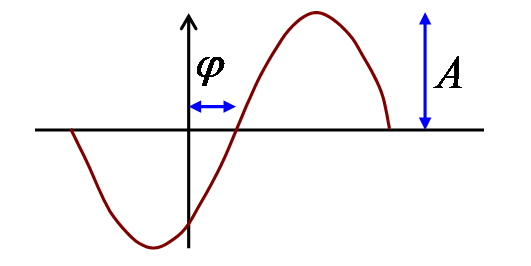
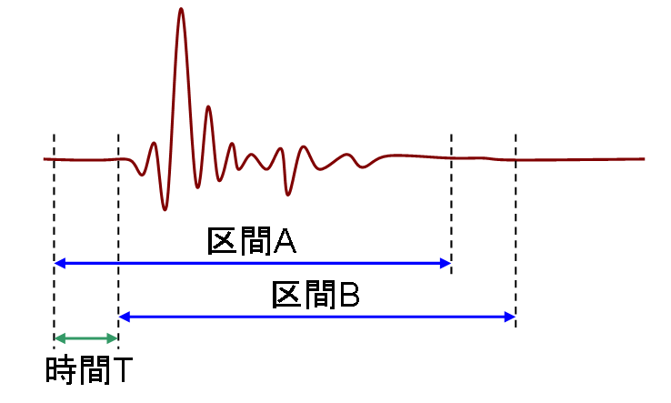
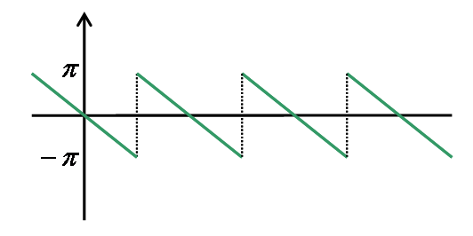
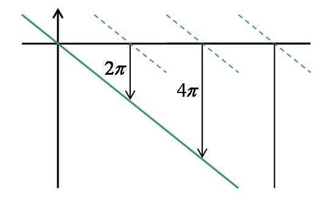

# 周波数特性

## <a id="sec-generated-title-1"></a> <a id="property"></a>周波数特性

信号処理の分野では、時間領域信号をフーリエ変換したもの、
要するに周波数領域信号を<strong id="property" class="keyword">周波数特性</strong>（frequency property）と呼びます。
周波数領域信号を、信号やシステムの周波数的な特性を表す物理量だとみなすわけです。
（他にも、自然科学や数学の他の分野でも通じる一般的な呼称として、スペクトル（spectrum、複数形は spectra）というものもあります。）

「[フーリエ変換](fourier.md#transform)」で示したように、
時間信号 <span class="math">f<span class="paren" style="font-size:em;">(</span>t<span class="paren" style="font-size:em;">)</span></span> のフーリエ変換・逆変換の式は以下のようになります。
<div class="math">
F<span class="paren" style="font-size:em;">(</span>ω<span class="paren" style="font-size:em;">)</span>
＝
<span class="integral">∫</span><table class="integral" summary="integral"><tr><td class="intsup"> ∞</td></tr><tr><td style="font-size:30%;"> </td></tr><tr><td class="intsub">－∞</td></tr></table> f<span class="paren" style="font-size:em;">(</span>t<span class="paren" style="font-size:em;">)</span><span class="normal">exp</span><span class="paren" style="font-size:1em;">(</span>－iωt<span class="paren" style="font-size:1em;">)</span><span class="normal">d</span>t
</div><div class="math">
f(t)
＝
<table class="frac" summary="fraction"><tr><td class="num"><span class="normal">1</span></td></tr><tr><td>2π</td></tr></table><span class="integral">∫</span><table class="integral" summary="integral"><tr><td class="intsup"> ∞</td></tr><tr><td style="font-size:30%;"> </td></tr><tr><td class="intsub">－∞</td></tr></table> F<span class="paren" style="font-size:em;">(</span>ω<span class="paren" style="font-size:em;">)</span><span class="normal">exp</span><span class="paren" style="font-size:1em;">(</span>iωt<span class="paren" style="font-size:1em;">)</span><span class="normal">d</span>ω
</div>
この、逆変換公式に出てくる積分中の項
<span class="math">F<span class="paren" style="font-size:em;">(</span>ω<span class="paren" style="font-size:em;">)</span><span class="normal">exp</span><span class="paren" style="font-size:1em;">(</span>iωt<span class="paren" style="font-size:1em;">)</span></span>
ですが、
<span class="math">F<span class="paren" style="font-size:em;">(</span>ω<span class="paren" style="font-size:em;">)</span></span> を絶対値 <span class="math">A<span class="paren" style="font-size:em;">(</span>ω<span class="paren" style="font-size:em;">)</span></span> と、
偏角 <span class="math">φ<span class="paren" style="font-size:em;">(</span>ω<span class="paren" style="font-size:em;">)</span></span> に分けることで、
以下のように表すことができます。
<div class="math">
F<span class="paren" style="font-size:em;">(</span>ω<span class="paren" style="font-size:em;">)</span><span class="normal">exp</span><span class="paren" style="font-size:1em;">(</span>iωt<span class="paren" style="font-size:1em;">)</span>
＝
A<span class="paren" style="font-size:em;">(</span>ω<span class="paren" style="font-size:em;">)</span><span class="normal">exp</span> i<span class="paren" style="font-size:1.2em;">(</span>ωt ＋ φ<span class="paren" style="font-size:em;">(</span>ω<span class="paren" style="font-size:em;">)</span><span class="paren" style="font-size:1.2em;">)</span></div><div class="math">
A<span class="paren" style="font-size:em;">(</span>ω<span class="paren" style="font-size:em;">)</span> 
＝
<span class="normal">|</span>F<span class="paren" style="font-size:em;">(</span>ω<span class="paren" style="font-size:em;">)</span><span class="normal">|</span></div><div class="math">
φ<span class="paren" style="font-size:em;">(</span>ω<span class="paren" style="font-size:em;">)</span>
＝
<span class="normal">arg</span>F<span class="paren" style="font-size:em;">(</span>ω<span class="paren" style="font-size:em;">)</span></div>
<span class="math">
        <span class="normal">exp</span> iωt</span> というのは、虚部（あるいは実部）を見ると、
正弦波（余弦波）になっています。
なので、
<span class="math">A<span class="paren" style="font-size:em;">(</span>ω<span class="paren" style="font-size:em;">)</span><span class="normal">exp</span> i<span class="paren" style="font-size:1.2em;">(</span>ωt ＋ φ<span class="paren" style="font-size:em;">(</span>ω<span class="paren" style="font-size:em;">)</span><span class="paren" style="font-size:1.2em;">)</span></span>
という式は、振幅 <span class="math">A</span>、位相<span class="math">φ</span> の正弦波だと考えることができます（図1）。
要するに、フーリエ逆変換の式は、
角周波数 <span class="math">ω</span>、
振幅 <span class="math">A<span class="paren" style="font-size:em;">(</span>ω<span class="paren" style="font-size:em;">)</span></span>、
位相 <span class="math">φ<span class="paren" style="font-size:em;">(</span>ω<span class="paren" style="font-size:em;">)</span></span>
の正弦波を幾重にも重ね合わせたものだと考えることが出来ます。

<figure>

[](../../../../assets/media/ufcpp2000/sp/freq01.png)

<figcaption>振幅と位相</figcaption>
</figure>


周波数領域信号 <span class="math">F<span class="paren" style="font-size:em;">(</span>ω<span class="paren" style="font-size:em;">)</span></span> は複素数値関数ですので、
グラフ化するのも面倒ですし、
<span class="math">F<span class="paren" style="font-size:em;">(</span>ω<span class="paren" style="font-size:em;">)</span></span> そのものが物理的にいったい何を表すものなのかいまいちピンと来ません。
それに対して、<span class="math">A<span class="paren" style="font-size:em;">(</span>ω<span class="paren" style="font-size:em;">)</span></span> および <span class="math">φ<span class="paren" style="font-size:em;">(</span>ω<span class="paren" style="font-size:em;">)</span></span> は、実関数ですし、上述のように、振幅や位相として考えればイメージが沸きやすいと思います。
 
そのため、
<span class="math">A<span class="paren" style="font-size:em;">(</span>ω<span class="paren" style="font-size:em;">)</span> ＝ <span class="normal">|</span>F<span class="paren" style="font-size:em;">(</span>ω<span class="paren" style="font-size:em;">)</span><span class="normal">|</span></span>
を<strong id="amp" class="keyword">振幅特性</strong>（amplitude property, magnitude property）あるいは振幅スペクトル（amplitude spectrum）と、
<span class="math">φ<span class="paren" style="font-size:em;">(</span>ω<span class="paren" style="font-size:em;">)</span> ＝ <span class="normal">arg</span>F<span class="paren" style="font-size:em;">(</span>ω<span class="paren" style="font-size:em;">)</span></span>
を<strong id="phase" class="keyword">位相特性</strong>（phase property, phase property）あるいは位相スペクトル（phase spectrum）と呼び、
非常によく利用されます。


## <a id="sec-generated-title-2"></a> <a id="dB"></a>対数振幅

振幅特性は、周波数ごとにどのくらいの振幅＝信号の強さを持っているかを示す関数です。
音ならば振幅が大きいほど音の強さも大きく聞こえますし、
光ならば明るく見えます。
 
ところで、音にしろ光にしろ、人間の感覚は、
刺激の強さ（intensity）に対して線形ではなく、むしろ対数に近い反応を示します。
要するに、振幅が2, 3, 4, 5・・・になったときに2, 3, 4, 5・・・の大きさに感じるのではなく、
10, 100, 1000, 10000・・・倍になったときに2, 3, 4, 5・・・倍の大きさに感じます。
（大体です。ぴったり対数になるわけではない。）
 
なので、振幅特性
<span class="math">A<span class="paren" style="font-size:em;">(</span>ω<span class="paren" style="font-size:em;">)</span> ＝ <span class="normal">|</span>F<span class="paren" style="font-size:em;">(</span>ω<span class="paren" style="font-size:em;">)</span><span class="normal">|</span></span>
そのものではなく、振幅の対数を取ったものがよく用いられます。
数学的には、
<span class="math">g<span class="paren" style="font-size:em;">(</span>ω<span class="paren" style="font-size:em;">)</span> ＝ <span class="normal">log</span><span class="normal">|</span>F<span class="paren" style="font-size:em;">(</span>ω<span class="paren" style="font-size:em;">)</span><span class="normal">|</span></span>
というように、自然対数を用いるのが式変形等が楽でいいのですが、
自然対数だと、<span class="math">F</span> の振幅が 2.71828・・・ 倍になったときに
<span class="math">g</span> が 1 増えるというように、数値的に分かりづらいという問題があります。
そのため、工学系の分野では<strong id="dB" class="keyword">デシベル</strong>[dB]（deci Bell、deci は1/10を表す補助単位、Bell は人名から付けられた単位名。デシを付けない場合は [Bel] と書く）という単位がよく用いられます。
デシベル値は以下のような式で定義されます。
<div class="math">
g<span class="paren" style="font-size:em;">(</span>ω<span class="paren" style="font-size:em;">)</span>
＝
10
<span class="normal">log</span><sub>10</sub><span class="normal">|</span>F<span class="paren" style="font-size:em;">(</span>ω<span class="paren" style="font-size:em;">)</span><span class="normal">|</span></div>
要するに
<span class="math">F</span> の振幅が1桁増えた（10倍）ときに
<span class="math">g</span> の値が10[dB]増えます。
（振幅が1桁増えると 1[Bel] 増える。
10デシリットルで1リットルというのと同じ理屈で、
10[dB] ＝ 1[Bel] です。）
 
ここで、もう1点、注意しておくことがあります。
工学の分野では、振幅特性よりも、振幅を2乗したものをよく使います。
信号の振幅を電気的に測定した場合、
その値は電圧[V]という形で得られます。
要するに、振幅の2乗というのは、電圧の2乗 ＝ 電力[W]を表す値と言うことになります。
そのため、振幅特性を2乗したものはパワースペクトル（power spectrum）あるいは、
単に<strong id="power" class="keyword">パワー</strong>（power）と呼ばれています。
そして、振幅特性と同様に、パワー <span class="math">p</span> もデシベルで表します。
<div class="math">
p<span class="paren" style="font-size:em;">(</span>ω<span class="paren" style="font-size:em;">)</span>
＝
10
<span class="normal">log</span><sub>10</sub><span class="normal">|</span>F<span class="paren" style="font-size:em;">(</span>ω<span class="paren" style="font-size:em;">)</span><span class="normal">|</span><sup>2</sup>
＝
20
<span class="normal">log</span><sub>10</sub><span class="normal">|</span>F<span class="paren" style="font-size:em;">(</span>ω<span class="paren" style="font-size:em;">)</span><span class="normal">|</span></div>
元の値が2乗なので、対数を取った値は2倍になります。
したがって、
<em><span class="math">F</span> の振幅が1桁増えたときに
<span class="math">p</span> の値が20[dB]増えます。
</em>
工学の分野で＋20[dB]と言われた場合、値が1桁上がった（10倍になった）と思ってください。
あと、覚えておくと便利な値として、
「＋6[dB] で約2倍」というものがあります。
（<span class="math"><span class="normal">log</span><sub>10</sub>2 ≒ 0.3010</span>。）
その他、倍率とパワー[dB]の関係をいくつか表1に示します。

<table summary="倍率とパワー[dB]の関係">
	<caption>
		倍率とパワー[dB]の関係
	</caption>
	<tr>
		<th>パワー[dB]</th>
		<th>倍率</th>
	</tr>
	<tr>
		<td markdown="1">＋60</td>
		<td markdown="1">×1,000</td>
	</tr>
	<tr>
		<td markdown="1">＋40</td>
		<td markdown="1">×100</td>
	</tr>
	<tr>
		<td markdown="1">＋20</td>
		<td markdown="1">×10</td>
	</tr>
	<tr>
		<td markdown="1">＋14</td>
		<td markdown="1">×5 （近似）</td>
	</tr>
	<tr>
		<td markdown="1">＋8</td>
		<td markdown="1">×2.5 （近似）</td>
	</tr>
	<tr>
		<td markdown="1">＋6</td>
		<td markdown="1">×2 （近似）</td>
	</tr>
	<tr>
		<td markdown="1">±0</td>
		<td markdown="1">×1</td>
	</tr>
	<tr>
		<td markdown="1">－6</td>
		<td markdown="1">×0.5 （÷2） （近似）</td>
	</tr>
	<tr>
		<td markdown="1">－8</td>
		<td markdown="1">×0.4 （÷2.5） （近似）</td>
	</tr>
	<tr>
		<td markdown="1">－14</td>
		<td markdown="1">×0.2 （÷5） （近似）</td>
	</tr>
	<tr>
		<td markdown="1">－20</td>
		<td markdown="1">×0.1 （÷10）</td>
	</tr>
	<tr>
		<td markdown="1">－40</td>
		<td markdown="1">×0.01 （÷100）</td>
	</tr>
	<tr>
		<td markdown="1">－60</td>
		<td markdown="1">×0.001 （÷1,000）</td>
	</tr>
</table>


## <a id="sec-generated-title-3"></a> <a id="cut"></a>信号の切り出し

測定により、図2に示すような信号ご得られたとします。
無限長の信号を解析することは出来ませんから、
信号の一部分を切り出して解析することになります。

<figure>

[](../../../../assets/media/ufcpp2000/sp/freq02.png)

<figcaption>信号の切り出し</figcaption>
</figure>


このとき、信号をどこから切り出すかによって、
すなわち、信号に時間的なずれが生じたときに、
周波数特性がどう変わるかを見てみましょう。
信号が 0 でなくなる所から信号を切り出せばいいんじゃないのかと思う方もいるかと思いますが、
測定には雑音や誤差がつき物ですから、
信号がどこまで 0 で、どこから非 0 なのかを判断するのは容易ではありません。
 
例えば、図2において、
区間 A で切り出した信号を <span class="math">f<sub>A</sub><span class="paren" style="font-size:em;">(</span>t<span class="paren" style="font-size:em;">)</span></span>、
区間 B で切り出した信号を <span class="math">f<sub>B</sub><span class="paren" style="font-size:em;">(</span>t<span class="paren" style="font-size:em;">)</span></span>
とすると、
<div class="math">
f<sub>A</sub><span class="paren" style="font-size:em;">(</span>t<span class="paren" style="font-size:em;">)</span> ＝ f<sub>B</sub><span class="paren" style="font-size:em;">(</span>t － T<span class="paren" style="font-size:em;">)</span></div>
という関係が成り立ちます。
これらの信号をフーリエ変換したものをそれぞれ
<span class="math">F<sub>A</sub><span class="paren" style="font-size:em;">(</span>ω<span class="paren" style="font-size:em;">)</span></span>, 
<span class="math">F<sub>B</sub><span class="paren" style="font-size:em;">(</span>ω<span class="paren" style="font-size:em;">)</span></span>
とすると、
フーリエ変換の性質より（「[フーリエ変換の性質](fourier.md#property)」参照）、
これらの間には以下のような関係式が成り立ちます。
<div class="math">
F<sub>A</sub><span class="paren" style="font-size:em;">(</span>ω<span class="paren" style="font-size:em;">)</span>
＝
<span class="normal">exp</span><span class="paren" style="font-size:em;">(</span>－ T ω<span class="paren" style="font-size:em;">)</span>・
F<sub>B</sub><span class="paren" style="font-size:em;">(</span>ω<span class="paren" style="font-size:em;">)</span></div>
では、これらの信号の振幅特性および位相特性がどうなっているのかを見てみましょう。
<span class="math">F<sub>A</sub></span>, 
<span class="math">F<sub>B</sub></span> の振幅特性および位相特性をそれぞれ
<span class="math">A<sub>A</sub></span>, 
<span class="math">A<sub>B</sub></span>, 
<span class="math">φ<sub>A</sub></span>, 
<span class="math">φ<sub>B</sub></span> とすると、
<div class="math">
F<sub>A</sub><span class="paren" style="font-size:em;">(</span>ω<span class="paren" style="font-size:em;">)</span>
＝
A<sub>A</sub><span class="paren" style="font-size:em;">(</span>ω<span class="paren" style="font-size:em;">)</span>
・
<span class="normal">exp</span>
φ<sub>A</sub><span class="paren" style="font-size:em;">(</span>ω<span class="paren" style="font-size:em;">)</span></div><div class="math">
F<sub>B</sub><span class="paren" style="font-size:em;">(</span>ω<span class="paren" style="font-size:em;">)</span>
＝
A<sub>B</sub><span class="paren" style="font-size:em;">(</span>ω<span class="paren" style="font-size:em;">)</span>
・
<span class="normal">exp</span>
φ<sub>B</sub><span class="paren" style="font-size:em;">(</span>ω<span class="paren" style="font-size:em;">)</span></div>
なので、先ほどの関係式は、
<div class="math">
A<sub>A</sub><span class="paren" style="font-size:em;">(</span>ω<span class="paren" style="font-size:em;">)</span>
・
<span class="normal">exp</span>
φ<sub>A</sub><span class="paren" style="font-size:em;">(</span>ω<span class="paren" style="font-size:em;">)</span>
＝
A<sub>B</sub><span class="paren" style="font-size:em;">(</span>ω<span class="paren" style="font-size:em;">)</span>
・
<span class="normal">exp</span><span class="paren" style="font-size:1.2em;">(</span>
φ<sub>B</sub><span class="paren" style="font-size:em;">(</span>ω<span class="paren" style="font-size:em;">)</span>
－ T ω
<span class="paren" style="font-size:1.2em;">)</span></div>
となります。
この式から、以下のようなことがいえます。

* 振幅特性は時間的なずれに対して不変。

* 時間<span class="math">T</span>の遅延に対して、位相特性は<span class="math">－T ω</span>だけ変化する。


信号の切り出し位置が変わっても（信号の両端が 0 ならば）、
振幅特性は変化しないので、
振幅特性の解析は細かいことはあまり気にせず適当に信号を切り出しても大丈夫です。
 
これに対して、位相特性は切り出し位置が変わると値が変わってしまいますから、
2つの信号の位相特性を比較仕様と思うと、切り出し位置を正しく合わせるための工夫が必要になります。
例えば、比較したい2つの信号を同時に測定するとか、
測定の開始時間を表すトリガー信号を記録しておくなどの工夫をします。


## <a id="sec-generated-title-4"></a> <a id="indefinite"></a>位相特性の不定性

指数関数は、<span class="math"><span class="normal">exp</span> jx ＝ <span class="normal">exp</span> j<span class="paren" style="font-size:em;">(</span>x ＋ 2πn<span class="paren" style="font-size:em;">)</span></span>（<span class="math">n</span> は任意の整数）という性質を持っています。
したがって、振幅および位相特性 <span class="math">A, φ</span> に関して、以下のような式が成り立ちます。
<div class="math">
A <span class="normal">exp</span> j<span class="paren" style="font-size:em;">(</span>Tω ＋ φ<span class="paren" style="font-size:em;">)</span>
＝
A <span class="normal">exp</span> j<span class="paren" style="font-size:em;">(</span>Tω ＋ φ ＋ 2πn<span class="paren" style="font-size:em;">)</span></div>
この式から、位相 <span class="math">φ</span> と <span class="math">φ ＋ 2πn</span> の間には区別が付かないということが言えます。
すなわち、
<em>位相特性には <span class="math">2π</span> の不定性がある</em>ということになります。
 
位相特性は、<span class="math">φ<span class="paren" style="font-size:em;">(</span>ω<span class="paren" style="font-size:em;">)</span> ＝ <span class="normal">arg</span>F<span class="paren" style="font-size:em;">(</span>ω<span class="paren" style="font-size:em;">)</span></span> 周波数特性の偏角として定義されるわけですが、
複素数の偏角は
<div class="math">
      <span class="normal">arg</span>α
＝
<span class="normal">tan</span><sup>－1</sup><span class="paren" style="font-size:2em;">(</span><table class="frac" summary="fraction"><tr><td class="num"><span class="script">Re</span> α</td></tr><tr><td><span class="script">Im</span> α</td></tr></table><span class="paren" style="font-size:2em;">)</span></div>
というように、<span class="math"><span class="normal">tan</span></span> の逆関数で表されるわけですが、
数値計算上、この式の値は <span class="math">－π ～ π</span> の範囲で出てくるのが普通です。
したがって、計算機上で位相特性を求めると、
図3に示すように細切れにされた状態になります。

<figure>

[](../../../../assets/media/ufcpp2000/sp/freq03.png)

<figcaption>位相特性</figcaption>
</figure>


で、位相には <span class="math">2πn</span> の不定性があるわけですから、
<span class="math">2π</span> の整数倍だけずらしても構わないわけです。
通常は、<span class="math">ω ＝ 0</span> 付近での位相が 0 になるようにして、
図4 に示すような感じで位相特性を繋げていきます。
このようにして、位相特性を連続的に繋いでいく処理を、
位相の<strong id="unwrap" class="keyword">アンラッピング</strong>（unwrapping）処理といいます。

<figure>

[](../../../../assets/media/ufcpp2000/sp/freq04.png)

<figcaption>位相特性</figcaption>
</figure>


## <a id="sec-generated-title-5"></a> <a id="delay"></a>遅延

「[周波数特性](#property)」で述べましたが、
位相特性は正弦波信号の時間的なずれになります。
「時間的な」と書きましたが、
信号に遅延時間を与えたとき、その遅延時間 <span class="math">T</span> がそのまま位相になるわけではありません。
「[信号の切り出し](#cut)」で述べましたが、
信号に遅延時間 <span class="math">T</span> を与えると、
位相が  <span class="math">－ T ω</span> だけ変化します。
すなわち、
<span class="math">φ<span class="paren" style="font-size:em;">(</span>ω<span class="paren" style="font-size:em;">)</span> ＝ － T ω</span> は、
遅延時間 <span class="math">T</span> に相当する位相だといえます。
 
これとは逆に、位相から遅延時間に相当するものを求めようとすると、
位相遅延と呼ばれるものと、群遅延と呼ばれるものの2通りの方法があります。


### <a id="sec-generated-title-6"></a> <a id="phasedelay"></a>位相遅延特性

まず、1つ目は位相遅延と呼ばれるものです。
先ほど述べたとおり、周波数によらない一定の遅延を与えた場合には、
<span class="math">φ<span class="paren" style="font-size:em;">(</span>ω<span class="paren" style="font-size:em;">)</span> ＝ － T ω</span> という関係式が成り立ちます。
そこで、この両辺を <span class="math">ω</span> で割って、
<div class="math">
T<sub>p</sub><span class="paren" style="font-size:em;">(</span>ω<span class="paren" style="font-size:em;">)</span>
＝
－
<table class="frac" summary="fraction"><tr><td class="num">φ<span class="paren" style="font-size:em;">(</span>ω<span class="paren" style="font-size:em;">)</span></td></tr><tr><td>ω</td></tr></table></div>
という式で遅延を定義するのが<strong id="pd" class="keyword">位相遅延特性</strong>（phase delay property）です。
 
位相遅延特性は、直感的には分かりやすくて、
ピークの位置の時間差・遅延を表すものです。
角周波数 <span class="math">ω</span> の2つの正弦波の間の位相遅延差が
<span class="math">T<sub>p</sub><span class="paren" style="font-size:em;">(</span>ω<span class="paren" style="font-size:em;">)</span></span> だということは、
2つの正弦波のピークの位置の時間差が <span class="math">T<sub>p</sub><span class="paren" style="font-size:em;">(</span>ω<span class="paren" style="font-size:em;">)</span></span> であるということです。
 
ところが、計算上の面から見えると、位相遅延特性は非常に面倒な問題を抱えています。
位相には <span class="math">2πn</span> の不定性があり、
位相 <span class="math">φ<span class="paren" style="font-size:em;">(</span>ω<span class="paren" style="font-size:em;">)</span></span> と <span class="math">φ<span class="paren" style="font-size:em;">(</span>ω<span class="paren" style="font-size:em;">)</span> ＋ 2πn</span> の間には区別が付かないわけですが、これら2つの位相特性から位相遅延特性を求めると、
前者は
<div class="math">
T<sub>p</sub><span class="paren" style="font-size:em;">(</span>ω<span class="paren" style="font-size:em;">)</span>
＝
－
<table class="frac" summary="fraction"><tr><td class="num">φ<span class="paren" style="font-size:em;">(</span>ω<span class="paren" style="font-size:em;">)</span></td></tr><tr><td>ω</td></tr></table></div>
となる一方で、後者は
<div class="math">
T<sub>p</sub>'<span class="paren" style="font-size:em;">(</span>ω<span class="paren" style="font-size:em;">)</span>
＝
－
<table class="frac" summary="fraction"><tr><td class="num">φ<span class="paren" style="font-size:em;">(</span>ω<span class="paren" style="font-size:em;">)</span></td></tr><tr><td>ω</td></tr></table>
－
<table class="frac" summary="fraction"><tr><td class="num">2πn</td></tr><tr><td>ω</td></tr></table></div>
となります。
<em>区別が付かないはずの2つの位相から、異なる遅延が得られてしまう</em>わけで、
これはあまり都合のいいことではありません。
 
まず第一に、正しく位相を「[アンラッピング](#unwrap)」してから求めないと、
位相遅延の値が不連続になってしまいます。
また、アンラッピングを正しく行ったとしても、
位相の不定性がなくなるわけではなく、
位相遅延の考え方により求めた遅延時間は必ずしも正しいものであるとはいえません。


### <a id="sec-generated-title-7"></a> <a id="groupdelay"></a>群遅延特性

もう1つの遅延は群遅延と呼ばれるものです。
位相遅延が <span class="math">ω</span> で割るという方法を取るのに対して、
<div class="math">
T<sub>g</sub><span class="paren" style="font-size:em;">(</span>ω<span class="paren" style="font-size:em;">)</span>
＝
－
<table class="frac" summary="fraction"><tr><td class="num"><span class="normal">d</span></td></tr><tr><td><span class="normal">d</span>ω</td></tr></table>
φ<span class="paren" style="font-size:em;">(</span>ω<span class="paren" style="font-size:em;">)</span></div>
というように、<span class="math">ω</span> で微分するのが<strong id="gd" class="keyword">群遅延特性</strong>（group delay property）です。
 
位相遅延と違って、こちらはイメージ的には少し分かりにくくなっています。
位相遅延が単純に2つの正弦波の「ピークの差」なのに対して、
群遅延は「うなりのピークの差」になります。
周波数がほんの少しだけ違う2つの波を重ねると、うなりが生じるわけですが、
式で表すのなら、
<div class="math">
        <span class="normal">cos</span>
        <span class="paren" style="font-size:1.5em;">{</span>
          <span class="paren" style="font-size:em;">(</span>ω ＋ Δω<span class="paren" style="font-size:em;">)</span> t
 ＋
 <span class="paren" style="font-size:em;">(</span>φ ＋ Δφ<span class="paren" style="font-size:em;">)</span><span class="paren" style="font-size:1.5em;">}</span>
＋
<span class="normal">cos</span><span class="paren" style="font-size:1.5em;">{</span><span class="paren" style="font-size:em;">(</span>ω － Δω<span class="paren" style="font-size:em;">)</span> t
 ＋
 <span class="paren" style="font-size:em;">(</span>φ － Δφ<span class="paren" style="font-size:em;">)</span><span class="paren" style="font-size:1.5em;">}</span></div>
という感じになります。
この式を、加法定理を用いて書き換えると、
<div class="math">
2
<span class="normal">cos</span><span class="paren" style="font-size:1.5em;">{</span>
 Δω t
 ＋
 Δφ
<span class="paren" style="font-size:1.5em;">}</span><span class="normal">cos</span><span class="paren" style="font-size:1.5em;">{</span>
 ω t
 ＋
 φ
<span class="paren" style="font-size:1.5em;">}</span></div>
となるわけで、
この 
<span class="math"><span class="normal">cos</span><span class="paren" style="font-size:1.5em;">{</span>
 Δω t
 ＋
 Δφ
<span class="paren" style="font-size:1.5em;">}</span></span>
の部分がうなりです。
そして、うなりの部分の位相遅延に相当するものが、
<span class="math">
T<sub>p</sub><span class="paren" style="font-size:em;">(</span>ω<span class="paren" style="font-size:em;">)</span>
＝
－
<table class="frac" summary="fraction"><tr><td class="num">Δφ</td></tr><tr><td>Δω</td></tr></table></span>
なわけですが、この式に対して、<span class="math">Δω → 0</span> の極限を取ると、
群遅延特性が得られます。
 
なぜこんなイメージの掴みにくいものをわざわざ定義するかというと、
群遅延には計算上、有利な点があるからです。
まず、位相の不定性の影響を受けないというのが最大の利点です。
2つの位相 <span class="math">φ<span class="paren" style="font-size:em;">(</span>ω<span class="paren" style="font-size:em;">)</span></span> と <span class="math">φ<span class="paren" style="font-size:em;">(</span>ω<span class="paren" style="font-size:em;">)</span> ＋ 2πn</span> の間には区別が付かないわけですが、
群遅延の場合、<span class="math">ω</span> で微分するので、定数である <span class="math">2πn</span> の部分は消えてしまいます。
この利点は非常に大きなものですので、
位相遅延よりも群遅延の方がよく使われます。
 
さらに、位相遅延特性には「[アンラッピング](#unwrap)」処理すら必要としない求め方があります。
周波数特性 <span class="math">F</span> に対して、位相 <span class="math">φ</span> は、
<span class="math">φ ＝ <span class="normal">arg</span>F</span> で定義されるわけですが、
複素数の偏角に関して、以下のような公式があります（「[対数関数](../../math/hs/m2.md#logarithm)」参照）。
<div class="math">
        <span class="normal">log</span>F ＝ <span class="normal">log</span><span class="normal">|</span>F<span class="normal">|</span> ＋ i <span class="normal">arg</span>F
</div><div class="math">
∴ φ ＝ <span class="normal">arg</span>F ＝ <span class="script">Im</span><span class="paren" style="font-size:1.5em;">[</span><span class="normal">log</span>F<span class="paren" style="font-size:1.5em;">]</span></div>
この両辺を <span class="math">ω</span> で微分すると、
<div class="math">
        <table class="frac" summary="fraction"><tr><td class="num">
            <span class="normal">d</span>
          </td></tr><tr><td>
            <span class="normal">d</span>ω</td></tr></table>
φ<span class="paren" style="font-size:em;">(</span>ω<span class="paren" style="font-size:em;">)</span>
＝
<span class="script">Im</span><span class="paren" style="font-size:2em;">[</span><table class="frac" summary="fraction"><tr><td class="num"><span class="normal">d</span></td></tr><tr><td><span class="normal">d</span>ω</td></tr></table><span class="normal">log</span>F
<span class="paren" style="font-size:2em;">]</span>
＝
<span class="script">Im</span><span class="paren" style="font-size:2em;">[</span><table class="frac" summary="fraction"><tr><td class="num"><span class="normal">1</span></td></tr><tr><td>F</td></tr></table><table class="frac" summary="fraction"><tr><td class="num"><span class="normal">d</span></td></tr><tr><td><span class="normal">d</span>ω</td></tr></table>
F
<span class="paren" style="font-size:2em;">]</span></div>
という式が得られます。
すなわち、周波数特性 <span class="math">F</span> と、その導関数から直接、群遅延特性を計算することができます。
（微分演算をしないといけないので、多少数値計算が面倒ではありますが。）


## <a id="sec-generated-title-8"></a> <a id="d22e1165"></a>余談

### <a id="sec-generated-title-9"></a> <a id="d22e1167"></a>スペクトル

信号処理の分野に限らず、
自然科学・数学では、一般的に、
時間や位置（あるいはその両方）で表される関数を場（field）と呼びます。
これに対して、
（フーリエ変換の結果得られる）周波数で表される関数をスペクトル（spectrum）と呼びます。
 
時間で表される信号をフーリエ変換したときの変数を時間周波数、
位置で表される信号をフーリエ変換したときの変数を空間周波数と呼び、
両者を区別することもあります。
あるいは、時間に対して角周波数（周波数×2π）、
空間に対して波数（空間周波数×2π）というものを使う場合もあります。
「波数」という言葉は、「単位長さあたりに正弦波の1周期分の波がいくつ入っているか」という意味です。
 
例えば、時間 <span class="math">t</span> と位置 <span class="math"><span class="vector">r</span> ＝ <span class="paren" style="font-size:em;">(</span>x, y, z<span class="paren" style="font-size:em;">)</span></span> で表される場
<span class="math">f<span class="paren" style="font-size:em;">(</span>t, <span class="vector">r</span><span class="paren" style="font-size:em;">)</span></span> に対して、
そのスペクトルは、
<div class="math">
F<span class="paren" style="font-size:em;">(</span>ω, <span class="vector">k</span><span class="paren" style="font-size:em;">)</span>
＝
<span class="integral">∫</span><table class="integral" summary="integral"><tr><td class="intsup"> </td></tr><tr><td style="font-size:30%;"> </td></tr><tr><td class="intsub"></td></tr></table><span class="integral">∫</span><table class="integral" summary="integral"><tr><td class="intsup"> </td></tr><tr><td style="font-size:30%;"> </td></tr><tr><td class="intsub"></td></tr></table><span class="integral">∫</span><table class="integral" summary="integral"><tr><td class="intsup"> </td></tr><tr><td style="font-size:30%;"> </td></tr><tr><td class="intsub"></td></tr></table><span class="integral">∫</span><table class="integral" summary="integral"><tr><td class="intsup"> </td></tr><tr><td style="font-size:30%;"> </td></tr><tr><td class="intsub"></td></tr></table>
f<span class="paren" style="font-size:em;">(</span>t, <span class="vector">r</span><span class="paren" style="font-size:em;">)</span><span class="normal">exp</span> i
<span class="paren" style="font-size:em;">(</span>
ωt － <span class="vector">k</span>・<span class="vector">r</span><span class="paren" style="font-size:em;">)</span><span class="normal">d</span>t
<span class="normal">d</span>x
<span class="normal">d</span>y
<span class="normal">d</span>z
</div>
で表され、
<span class="math">ω</span> が角周波数、
<span class="math"><span class="vector">k</span></span> が波数になります
（位置がベクトル（2次元以上）で表されるとき、空間周波数や波数もベクトルになる）。


### <a id="sec-generated-title-10"></a> <a id="d22e1241"></a>phase と topology

数学の集合論なんかでも位相という言葉が出てきますが、
この数学の位相と、このページで説明した位相はまったく別物になります。
信号処理・物理学における位相が phase なのに対して、
集合論の位相は topology。
 
phase は局面とか段階という意味の単語で、物理学では正弦波の時間的なずれを表します。
topology は場所を意味するギリシャ語 topos を起源とする数学用語で、
空間上の2点が遠いか近いか、連続かどうかなどを論じるための概念です。
 
位相という単語を構成する漢字の意味を考えると、
「位」は場所・位置・順位を、
「相」は形・ありさま・様子を表す文字です。
このことを踏まえて、位相という日本語を見てみると、
phase は正弦波のずれ（位置）の様子を、
topology は空間（場所）の幾何学的性質（ありさま）を現す言葉ということでしょうか。
なんとなくどっちも意味は分からなくもないんですが、
同じ訳語を使われるとややこしいです。
 
まあ、混乱を避けるために、
phase は「相」と訳し、
topology の方だけ「位相」と呼ぶ流儀もあるんですが、
あまり定着はしていません
（多分、相だけだと、（音が同じなので）層（layer）とかの別の単語を連想するからだと思います）。


## <a id="sec-generated-title-11"></a> <a id="plan"></a>執筆予定

```text
・対数振幅
[余談]
通常、物理量の対数をとる場合、
対数関数の中身は無明数（次元を持たない値）にしておく必要がある。

例えば、化学で使われるモルやpHがそう。
モル ＝ 原子数（単位が[個]＝次元を持たない）の対数

なので、本当は

g(ω) ＝ 10 log_10 A(ω)/A_0
と言うように、ある値 A_0 との<em>比の対数を取る必要がある</em>。
A(ω)の次元が[V]ならA_0も[V]、他も同様。

A_0 = 1[V] としたものが
g(ω) ＝ 10 log_10 A(ω)

ちなみに、A_0 を何にするかでdBの意味が変わってくるので、
これを明記するために、
A_0 ＝ 1[mV] の場合は [dBm] と言うように表す。


・周波数特性の補間

ある周波数特性が位置に依存するとき、
ある点 A, B における周波数特性 F<sub>A</sub>, F<sub>B</sub> を測定などによって得て、
A, B の間の点における周波数特性 F を補間によって求めることを考える。

振幅特性と位相特性をそれぞれ補間する手法が一般的。
対数振幅の所で説明したような理由から、振幅特性は対数領域で補完する。

例えば、補間手法として線形補間を用いる場合、
F<sub>A</sub> の対数振幅、位相を g<sub>A</sub>, φ<sub>A</sub>、
F<sub>B</sub> の対数振幅、位相を g<sub>B</sub>, φ<sub>B</sub>
とすると、
A, B 間を n : m に内分する点における周波数特性 F は

g ＝ (m g<sub>A</sub> ＋ n g<sub>B</sub>) / (m ＋ n)
φ ＝ (mφ<sub>A</sub> ＋ nφ<sub>B</sub>) / (m ＋ n)
F ＝ exp(g ＋ iφ)

で求める。

対数領域・位相の相加平均なので、相乗平均を意味する。


自己相関とかも説明する？
```
