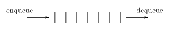

# queue

## queueとは
queue(キュー)とは、「行列」という意味の単語です。
ただ、「行列」だと、matrixと区別がつかなくなるので、日本語では待ち行列といいます。
(ちなみに、matrixの英語本来の意味は母体・基盤・鋳型)
 
キューは「要素の挿入は末尾から、取り出し・削除は先頭から行うデータ構造」です。
後ろから並んで前に出て行くという意味でこの名前がつきました。
FIFO(first-in first-out)と呼ばれることもあります。
キューでは要素を追加することをenqueue、要素を取り出すことをdequeueといいます。
(ただし、STLでは他のコンテナと名前をあわせるためにpush,popという用語を用います)  	

キューは末尾への要素の挿入と先頭からの要素の削除が可能なデータ構造なら何を使っても実装することができます。
普通はリングバッファや双方向循環連結リストを用いて実装します。

## STLにおけるqueue
STLのqueueは何を使って実装するかをdeque,listのいずれかから選べます。
キューの要素の型をTとすると、

<table summary="">

	<tr>
		<td markdown="1"><code>queue&lt;T, deque&lt;T&gt; &gt;</code></td>
		<td markdown="1">dequeによるqueue</td>
	</tr>
	<tr>
		<td markdown="1"><code>queue&lt;T, list&lt;T&gt; &gt;</code></td>
		<td markdown="1">listによるqueue</td>
	</tr>
	<tr>
		<td markdown="1"><code>queue&lt;T&gt;</code></td>
		<td markdown="1">queue&lt;T, deque&lt;T&gt; &gt;と同じ意味</td>
	</tr>
</table>

他にも、<code>push_back, pop_front, front, back, size</code>などのメソッドを適当に定義したクラスなら
何でもキューの実装に使えます。
