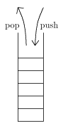

# stack

## stackとは
スタックは末尾(または先頭)に限って要素の追加削除を行うことのできるデータ構造です。
末尾からしか要素を取り出せないので、
必然的に「後に入れたものから先に取り出さなくてなはならない」ということになります。
そのため、スタックはLIFO(last-in first-out)とも呼ばれます。
スタックに新しい要素を挿入することをpush、要素を取り出すことをpopといいます。  	

スタックは末尾への要素の挿入・削除ができるデータ構造なら何を使っても実装することができます。
普通は配列や単方向連結リストを用いて実装します。

## STLにおけるstack
STLのstackは何を使って実装するかをvector,deque,listの中から選べます。
スタックの要素の型をTとすると、

<table summary="">

	<tr>
		<td markdown="1"><code>stack&lt;T, vector&lt;T&gt; &gt;</code></td>
		<td markdown="1">vectorによるstack</td>
	</tr>
	<tr>
		<td markdown="1"><code>stack&lt;T, deque&lt;T&gt; &gt;</code></td>
		<td markdown="1">dequeによるstack</td>
	</tr>
	<tr>
		<td markdown="1"><code>stack&lt;T, list&lt;T&gt; &gt;</code></td>
		<td markdown="1">listによるstack</td>
	</tr>
	<tr>
		<td markdown="1"><code>stack&lt;T&gt;</code></td>
		<td markdown="1">stack&lt;T, vector&lt;T&gt; &gt;と同じ意味</td>
	</tr>
</table>

他にも、<code>push_back, pop_back, back, size</code>などのメソッドを適当に定義したクラスなら
何でもスタックの実装に使えます。
