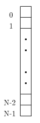
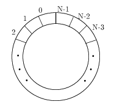

# deque

## deque とは
<strong id="deque" class="keyword">deque</strong>とはDouble Ended Queue、つまり両端キューのことです。
 
ちなみに、queue(待ち行列、キュー)に格納された要素の取り出しのことをdequeue(デキュー)といいます。
非常に紛らわしいネーミングですが、別物です。気をつけましょう。
 
話を元に戻して、両端キューというものが何かというと、

* 先頭に要素を挿入する

* 先頭の要素を削除する

* 末尾に要素を挿入する

* 末尾の要素を削除する

という4つの操作が許されるデータ構造のことで、dequeはこれらの操作を O(1) で行うことができます。
 
dequeは内部的にはリングバッファというデータ構造になっています。
リングバッファとは配列の先頭と末尾をつないで環状にしたものだと思ってください。

<table summary="">

	<tr>
		<td markdown="1">配列</td>
		<td markdown="1">リングバッファ</td>
	</tr>
	<tr>
		<td markdown="1">	
</td>
		<td markdown="1">	
</td>
	</tr>
</table>

リングバッファの実装には配列を用います。
普通、配列の末尾(<code>rear</code>)に要素を加えるとき、

<pre class="source" title="" lang="">
<code>int array[SIZE];
int rear;

void push_back(int data)
{
  if(rear==SIZE)//full
    return;

  array[rear] = data;
  rear++;
}
</code></pre>

という風にします。
これに対し、リングバッファでは

<pre class="source" title="" lang="">
<code>void push_back(int data)
{
  array[rear] = data;
  rear = (rear+1)%SIZE;
}
</code></pre>

とします。
こうすると、<code>rear</code>が確保した領域の後ろに越えてしまったときに
<code>rear</code>は領域の一番前に戻ります。
ここで、<code>rear</code>の他に、先頭の場所を記憶しておく変数(<code>front</code>)も用意します。

<pre class="source" title="" lang="">
<code>int array[SIZE];
int rear, front;

void push_back(int data)
{
  if(rear==front)//full
    return;

  array[rear] = data;
  rear = (rear+1)%SIZE;
}

void pop_front()
{
  int data;

  if(rear==front)//empty
    return;

  data = array[front];
  front = (front+1)%SIZE;
}
</code></pre>

これでリングバッファを用いたキューが完成します(ここではrear,frontの初期化を行っていませんが、本来は初期化の必要あり)。
同様にして、<code>push_front</code>, <code>pop_back</code>も定義すれば両端キューになります。

## dequeの特徴
* ランダムアクセス(<code>[]</code>を使って添え字を指定してのアクセス)が O(1) で行える

* 先頭および末尾への要素の追加、削除は O(1) で行える

* それ以外への場所の要素の追加は O(n) かかる
