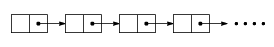
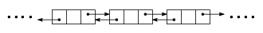

# list

##  listとは

STLのlistはいわゆる双方向連結リストと言われているものです。

双方向連結リストを言うものを説明する前に、まずリストについての説明をします。
リストとは任意の位置への要素の挿入・削除を要素の順序を変えることなく行うことにできるデータ構造のことです。
このような操作を配列を用いてやろうとすると、

<pre class="source" title="" lang="">
<code>int array[SIZE];
int rear;//データの末尾

//ポインターpの指す位置に新しいデータを挿入する。
void insert(int* p, int data)
{
  int* q;
  rear++;
  if(rear==SIZE)//full
    return;

  for(q=array+rear; q&gt;p; q--)
    *q = *(q-1); //要素を1つずつずらす

  *p =data; //そして、空いた場所に新しいデータを挿入
}

//ポインターpの指す位置のデータを削除する
void erase(int* p)
{
  int* q;
  for(q=p; q&lt;array+rear; q++)
    *q = *(a+1); //要素を1つずつ詰める
  rear--;
}
</code></pre>

という風になります。
しかし、この方法では配列が満員になった場合に、それ以上要素の追加ができなくなります。また、挿入・削除が行われるたびに要素をずらしていく必要があるので
かなりの時間が(平均時間計算量 O(SIZE) )かかります。

そこで、連結リストというものを使います。
連結リストには線形リスト(linear list、または単方向リスト(one-way list))と呼ばれるものと
双方向リスト(doubly linked list、two-way list)と呼ばれるものがあります。

線形リストから説明します。
まず、ノード(node:節目、結び目)といわれる構造体を定義します。

<pre class="source" title="" lang="">
<code>struct node
{
  node* next;
  int data;
};
</code></pre>

そして、このノードを数珠繋ぎしていくと線形リストになります。  	
  
この際、一番後ろのノードの<code>next</code>にはNULLポインターを入れておきます。

<pre class="source" title="" lang="">
<code>node *root, *rear;

void insert(node* p, int data)
{
  node* prev;
  for(prev=root; prev-&gt;next!=p &amp;&amp; prev-&gt;next!=NULL; prev=prev-&gt;next);

  if(prev-&gt;next == NULL)//p don't exist;
    return;

  node* tmp = new node;
  tmp-&gt;data = data;
  tmp-&gt;next = p;
  prev-&gt;next = tmp;
}

void erase(node* p);
{
  node* prev;
  for(prev=root; prev-&gt;next!=p &amp;&amp; prev-&gt;next!=NULL; prev=prev-&gt;next);

  if(prev-&gt;next == NULL)//p don't exist;
    return;

  prev-&gt;next = p-&gt;next;
  delete p;
}
</code></pre>

これで要素をいくらでも追加できるようになりました。
しかし、先頭以外への要素の挿入・削除にはやはり時間がかかります(平均時間計算量O(N))。

次は双方向リストについて。
双方向リストでも線形リストと同様にまずノードという構造体を定義します。
線形リストと違うところは、次の要素を指すポインター<code>next</code>の他に、
一つ前の要素を指すポインターも持っていることです。

<pre class="source" title="" lang="">
<code>struct node
{
  node *next, *prev;
  int data;
};
</code></pre>

そして、このノードをつないでいくことで双方向リストになります。  	
  

<pre class="source" title="" lang="">
<code>void insert_prev(node* p, int data)
{
  node* q = new node;
  q-&gt;prev = p-&gt;prev;
  q-&gt;next = p;
  p-&gt;prev = q;
  q-&gt;prev-&gt;next = q;
  q-&gt;data = data;
}

void insert_next(node* p, int data)
{
  node* q = new node;
  q-&gt;next = p-&gt;next;
  q-&gt;prev = p;
  p-&gt;next = q;
  q-&gt;next-&gt;prev = q;
  q-&gt;data = data;
}

void erase(node* p)
{
  node* next = p-&gt;next;
  p-&gt;next-&gt;prev = p-&gt;prev;
  p-&gt;prev-&gt;next = p-&gt;next;
  delete p;
}
</code></pre>

これで、任意の位置への要素の挿入がO(1)で行えるようになります。

ところで、リストの先頭の<code>prev</code>、末尾の<code>next</code>を<code>NULL</code>にしていると、
リストの先頭への要素の挿入がうまくいきません。

<pre class="source" title="" lang="">
<code>node* root=NULL;

void insert_prev(node* p, int data)
{
  if(p==root)//挿入位置が先頭の場合、特別な処理が必要。
  {
    root = new node;
    root-&gt;prev = NULL;
    root-&gt;next = p;
    p-&gt;prev = root;
    return;
  }

  node* q = new node;
  q-&gt;prev = p-&gt;prev;
  q-&gt;next = p;
  p-&gt;prev = q;
  q-&gt;prev-&gt;next = q;
  q-&gt;data = data;
}

void erase(node* p)
{
  if(p==root)//挿入位置が先頭の場合、特別な処理が必要。
  {
    p = p-&gt;next;
    delete root;
    root = p;
    return;
  }

  node* next = p-&gt;next;
  p-&gt;next-&gt;prev = p-&gt;prev;
  p-&gt;prev-&gt;next = p-&gt;next;
  delete p;
}
</code></pre>

ここで、リストの先頭<code>root</code>には要素を格納しないダミーノードを付けておき、
リストの末尾の<code>next</code>には<code>NULL</code>ではなく、<code>root</code>を代入しておきます。

<pre class="source" title="" lang="">
<code>node* root;//ダミーノード

void init()
{
  root = new node;
  root-&gt;next = root;
  root-&gt;prev = root;
}
</code></pre>

こうすることで、先頭、末尾への要素の追加が簡単になり、
<code>
        if(p==root)
      </code>の部分を書く必要がなくなります。
また、リストの末尾(<code>root-&gt;prev</code>はリストの末尾を指している)へのアクセスも容易になります。
こういう構造のリストを循環リストといいます。

##  listの特徴

* 先頭から順番にしかアクセスできない(<code>[]</code>を使って添え字を指定してのアクセスができない)

* 任意の箇所への要素の追加、削除が O(1) で行える

* 常にリスト中の要素数分のメモリだけを利用(vectorやdequeは、コンテナ中の要素数よりも多目のメモリを確保し、足りなくなったときにメモリを確保しなおす)
