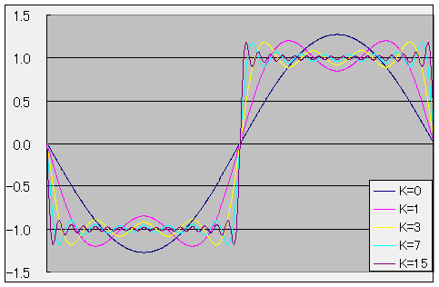

# 図表

##  概要

[<code>figure.xsl</code>](../../../../assets/media/ufcpp2000/xml/xslfiles/figure.xsl) には、図表用の template が記述されています。

##  ソース

<pre class="xsource" title="ソース">
<code>&lt;figure&gt;
  &lt;image src="test.png" width="200" height="200" /&gt;
  &lt;legend&gt;テスト用の画像&lt;/legend&gt;
&lt;/figure&gt;
&lt;figure&gt;
  &lt;image src="test.png" width="100" height="100" /&gt;
  &lt;legend&gt;←通し番号も付きます&lt;/legend&gt;
&lt;/figure&gt;
&lt;table&gt;
  &lt;tr&gt;
    &lt;td&gt;&lt;/td&gt;
    &lt;th&gt;i&lt;/th&gt;
    &lt;th&gt;ii&lt;/th&gt;
  &lt;/tr&gt;
  &lt;tr&gt;
    &lt;th&gt;A&lt;/th&gt;
    &lt;td&gt;10&lt;/td&gt;
    &lt;td&gt;15&lt;/td&gt;
  &lt;/tr&gt;
  &lt;tr&gt;
    &lt;th&gt;B&lt;/th&gt;
    &lt;td&gt;25&lt;/td&gt;
    &lt;td&gt;50&lt;/td&gt;
  &lt;/tr&gt;
  &lt;caption&gt;表も書けます&lt;/caption&gt;
&lt;/table&gt;
&lt;table&gt;
  &lt;thead&gt;
    &lt;tr&gt;
      &lt;td&gt;&lt;/td&gt;
      &lt;th&gt;あ&lt;/th&gt;
      &lt;th&gt;い&lt;/th&gt;
    &lt;/tr&gt;
  &lt;/thead&gt;
  &lt;tbody&gt;
    &lt;tr&gt;
      &lt;th&gt;イ&lt;/th&gt;
      &lt;td&gt;三&lt;/td&gt;
      &lt;td&gt;五&lt;/td&gt;
    &lt;/tr&gt;
    &lt;tr&gt;
      &lt;th&gt;ロ&lt;/th&gt;
      &lt;td&gt;八&lt;/td&gt;
      &lt;td&gt;四&lt;/td&gt;
    &lt;/tr&gt;
  &lt;/tbody&gt;
  &lt;caption&gt;←表も同様に通し番号が付きます&lt;/caption&gt;
&lt;/table&gt;
</code></pre>

##  結果

<figure>
	
	<figcaption>テスト用の画像</figcaption>
</figure>

<figure>
	
	<figcaption>←通し番号も付きます</figcaption>
</figure>

<table summary="表も書けます">
	<caption>
		表も書けます
	</caption>
	<tr>
		<td markdown="1"></td>
		<th>i</th>
		<th>ii</th>
	</tr>
	<tr>
		<th>A</th>
		<td markdown="1">10</td>
		<td markdown="1">15</td>
	</tr>
	<tr>
		<th>B</th>
		<td markdown="1">25</td>
		<td markdown="1">50</td>
	</tr>
</table>

<table summary="←表も同様に通し番号が付きます">
	<caption>
		←表も同様に通し番号が付きます
	</caption>
<thead>	<tr>
		<td markdown="1"></td>
		<th>あ</th>
		<th>い</th>
	</tr>
</thead><tbody>	<tr>
		<th>イ</th>
		<td markdown="1">三</td>
		<td markdown="1">五</td>
	</tr>
	<tr>
		<th>ロ</th>
		<td markdown="1">八</td>
		<td markdown="1">四</td>
	</tr>
</tbody></table>
