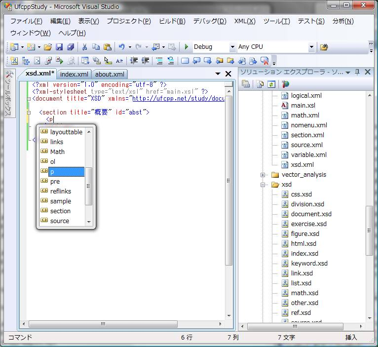

# XSD

## 概要
XSD を書いておけば、XML エディタで補完機能が働くようになります。

たとえば、Visual Studio の場合、
XML と同じプロジェクト内か、
Visual Studio のインストールフォルダの下の「xml\Schemas」フォルダに XSD ファイルを置くことで、
XML の IntelliSense が効くようになります。
（ただし、XML 名前空間の設定が必須。）

<figure>
	
	<figcaption>Visual Studio で XML の編集</figcaption>
</figure>

サンプルとして、勉強用ページで使っている XML の XSD を公開↓。

[XSD 一覧](../../../../assets/media/ufcpp2000/xsd/xsd.zip)
